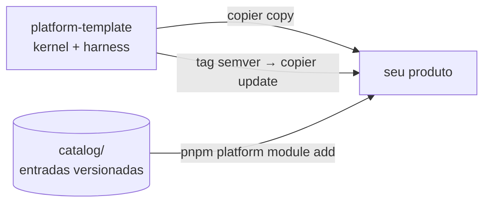

<p align="center">
  
</p>

<p align="center">
  <a href="https://github.com/EmanuelVogt/platform-template/actions/workflows/ci.yml"></a>
  <a href="https://github.com/EmanuelVogt/platform-template/tags"></a>
  <a href="/LICENSE"></a>
  
  
  
</p>

<p align="center">
  Template <a href="https://copier.readthedocs.io">copier</a> de uma plataforma de produto: monorepo pnpm + Turbo com
  <strong>kernel NestJS</strong>, <strong>front React/Vite headless</strong>, <strong>catálogo de módulos versionado</strong>
  e <strong>harness de agentes</strong>. Um comando gera o produto; uma tag semver o atualiza.
</p>

---

## Visão geral

O template distribui **só o kernel** — a parte que todo produto precisa e nenhum deveria
reescrever. O que é específico de cada produto (módulos de negócio, telas, kit de UI,
ADRs) nasce no repositório gerado e nunca colide com as atualizações da plataforma.

| Pilar                   | O que entrega                                                                                                                                            |
| ----------------------- | -------------------------------------------------------------------------------------------------------------------------------------------------------- |
| **Kernel da API**       | Monólito modular NestJS 11: transação, outbox, ator via ALS, tracing OpenTelemetry, idempotência, listagem, health, storage S3, guard de acesso.         |
| **Contrato HTTP**       | Zod é a verdade → `openapi.json` → cliente TypeScript gerado (Kubb) consumido pelo front. Nunca se retipa um contrato à mão.                             |
| **Front headless**      | React 19 + Vite 8, TanStack Router/Query, Zustand: transporte, CSRF, guard de acesso e layout sem estilo. O kit de UI é decisão do produto.              |
| **Catálogo de módulos** | Entradas versionadas em `catalog/` (identity, attachment, audit, notification, tag…), instaladas com `pnpm platform module add`. Correção vira advisory. |
| **Harness de agentes**  | `AGENTS.md`, hooks, skills e agentes para Claude Code/Cursor, com handbooks de arquitetura, testes e workflow.                                           |
| **Operação**            | CI em GitHub Actions (lint, typecheck, unit, integração e e2e com testcontainers), Dockerfiles, Docker Compose local e guia de deploy.                   |



## Começar

### Requisitos

- **Node 22** (`.nvmrc`) e **pnpm 10** via corepack (`corepack enable`)
- **Docker** para Postgres e Redis locais
- **copier ≥ 9.4**: `uv tool install copier` ou `pipx install copier`

O repositório é público: `copier` e o instalador do catálogo clonam por **HTTPS** — não é
preciso configurar chave SSH nem token.

### Gerar o produto

```bash
copier copy --trust gh:EmanuelVogt/platform-template ./meu-produto
```

O `--trust` autoriza as tarefas pós-cópia (`git init`, `pnpm install`, sync das skills).
Por padrão o copier usa a **última tag** publicada; `--vcs-ref HEAD` pega o `main`.

O copier pergunta nome do produto, slug, organização/repositório no GitHub e domínios —
tudo com defaults sensatos. Depois:

```bash
cd meu-produto
cp apps/api/.env.example apps/api/.env        # preencha os segredos
docker compose up -d                           # Postgres + Redis
pnpm --filter api db:migrate:run
pnpm --filter api db:bootstrap
pnpm dev
```

Front em `http://localhost:5173`, API em `http://localhost:3000`, referência da API
(Scalar) em `/docs`.

### O que nasce no produto

```
meu-produto/
├── apps/
│   ├── api/                 # NestJS — kernel em src/shared, módulos em src/modules
│   └── web/                 # React/Vite headless — transporte, guard, layout sem estilo
├── packages/
│   └── api-client/          # cliente gerado a partir de openapi.json
├── docs/                    # handbooks, ADRs, advisories
├── .claude/  .agents/       # harness de agentes (hooks, skills, agentes)
├── AGENTS.md                # regras de leitura obrigatória (CLAUDE.md é symlink)
└── .copier-answers.yml      # versão do template — nunca editar à mão
```

A regra que mantém o `copier update` sem conflito: **o produto adiciona arquivos; não
edita arquivos da plataforma**. Onde a plataforma precisa ser estendida, ela expõe uma
entrada do catálogo ou uma porta do kernel — nunca um ponto de edição.

## Catálogo de módulos

Os módulos de plataforma não vêm copiados: vivem como entradas versionadas em
`catalog/<entrada>[/<variante>]/` e entram no produto sob demanda.

| Comando                                          | O que faz                                                                                                            |
| ------------------------------------------------ | -------------------------------------------------------------------------------------------------------------------- |
| `pnpm platform module add <entrada> [--variant]` | copia a entrada para o produto, resolve `dependsOn`, gera as migrations, roda `pnpm contract` e os testes da entrada |
| `pnpm platform module list`                      | compara a versão instalada (`.platform-modules.lock`) com a HEAD do catálogo                                         |
| `pnpm platform module update <entrada>`          | imprime o roteiro de porte — a atualização de uma entrada é tarefa de agente, guiada pela skill `port-module-update` |
| `pnpm platform module adopt <entrada>`           | registra no lock uma entrada que o produto já tinha antes do catálogo existir                                        |

Correções em entradas já publicadas viram **advisories** (`docs/advisories/ADV-*.md`);
o produto recebe o arquivo no `copier update` e um hook de início de sessão avisa o que
ainda não foi aplicado. Detalhes em [`docs/catalog/catalog.md`](/docs/catalog/catalog.md).

## Receber atualizações da plataforma

Toda mudança que os produtos devem receber vira uma tag semver neste repositório. No
produto, com a working tree limpa:

```bash
copier update                       # template@_commit → última tag, merge de 3 vias
copier update --vcs-ref vX.Y.Z      # pular para uma versão específica
copier update --pretend --diff      # ver o que mudaria sem tocar no disco
```

Mudanças que exigem ação do produto estão listadas, por versão, em
[`docs/dev/template-changelog.md`](/docs/dev/template-changelog.md).

## Stack

| Camada      | Tecnologias                                                                                                    |
| ----------- | -------------------------------------------------------------------------------------------------------------- |
| API         | NestJS 11 · Express 5 · Drizzle ORM + PostgreSQL · Redis (ioredis) · Zod 4 / nestjs-zod · OpenTelemetry · pino |
| Front       | React 19 · Vite 8 · TanStack Router + Query · Zustand · react-hook-form + Zod                                  |
| Contrato    | Zod → OpenAPI 3 → Kubb (`packages/api-client`) · Scalar em `/docs`                                             |
| Testes      | Jest + supertest + testcontainers (API) · Vitest + Testing Library + MSW (web)                                 |
| Ferramental | pnpm 10 · Turbo 2 · TypeScript 6 · ESLint 10 · Prettier · lefthook                                             |
| Operação    | Docker · GitHub Actions · Dokploy (guia em `docs/dev/deploy.md`)                                               |

## Documentação

| Para…                                           | Leia                                                                |
| ----------------------------------------------- | ------------------------------------------------------------------- |
| Fronteira plataforma × produto, `copier update` | [`docs/dev/template.md`](/docs/dev/template.md)                     |
| Catálogo, advisories, autoria de entrada        | [`docs/catalog/catalog.md`](/docs/catalog/catalog.md)               |
| Arquitetura da API                              | [`docs/back/back-arch.md`](/docs/back/back-arch.md)                 |
| Arquitetura do front                            | [`docs/front/front-arch.md`](/docs/front/front-arch.md)             |
| Testes                                          | [`docs/test/testing.md`](/docs/test/testing.md)                     |
| Qualidade de código                             | [`docs/code-quality.md`](/docs/code-quality.md)                     |
| Agentes: workflow, harness, comunicação, infra  | [`docs/agents/`](/docs/agents)                                      |
| Deploy                                          | [`docs/dev/deploy.md`](/docs/dev/deploy.md)                         |
| Changelog do template                           | [`docs/dev/template-changelog.md`](/docs/dev/template-changelog.md) |

## Manutenção do template

Quem evolui o template (e não um produto) lê [`TEMPLATE.md`](/TEMPLATE.md). O essencial:

```bash
pnpm template:smoke                 # renderiza um produto kernel-only e roda check + testes
pnpm catalog:check [entrada…]       # gate pré-tag do catálogo: instala cada entrada e testa
git tag vX.Y.Z && git push --tags   # publica a versão que os produtos vão receber
```

Regras da casa: nada de produto entra no template (sem marca, domínio ou negócio fora
dos placeholders Jinja); só docs e manifests levam `.jinja`; o kernel nunca importa uma
entrada do catálogo; correção em `catalog/**` sem advisory não é aceita.

## Licença

Distribuído sob a licença [MIT](/LICENSE). O produto gerado **não** recebe este arquivo:
a licença do seu produto é decisão sua.
