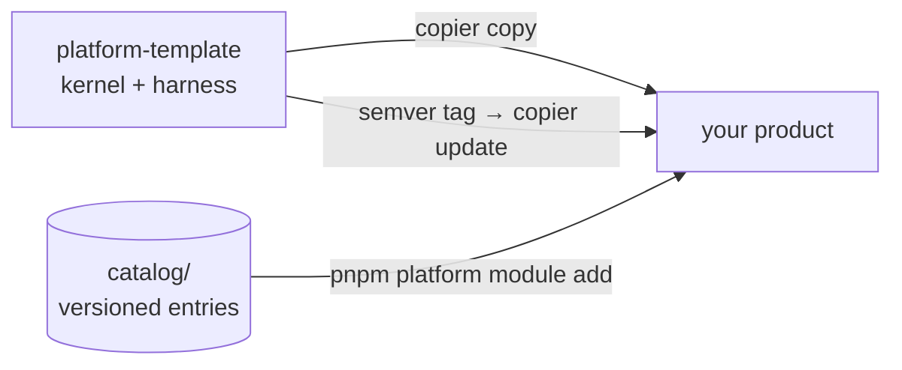

<p align="center">
  
</p>

<p align="center">
  <a href="https://github.com/EmanuelVogt/platform-template/actions/workflows/ci.yml"></a>
  <a href="https://github.com/EmanuelVogt/platform-template/tags"></a>
  <a href="/LICENSE"></a>
  
  
  
</p>

<p align="center">
  A <a href="https://copier.readthedocs.io">copier</a> template for a product platform: a pnpm + Turbo monorepo with a
  <strong>NestJS kernel</strong>, a <strong>headless React/Vite front end</strong>, a <strong>versioned module catalog</strong>
  and an <strong>agent harness</strong>. One command generates the product; one semver tag updates it.
</p>

---

## Overview

The template ships **only the kernel** — the part every product needs and none should
rewrite. Whatever is specific to a product (business modules, screens, UI kit, ADRs) is
born in the generated repository and never collides with platform updates.

| Pillar             | What it delivers                                                                                                                                             |
| ------------------ | ------------------------------------------------------------------------------------------------------------------------------------------------------------ |
| **API kernel**     | NestJS 11 modular monolith: transactions, outbox, actor via ALS, OpenTelemetry tracing, idempotency, listing, health, S3 storage, access guard.              |
| **HTTP contract**  | Zod is the source of truth → `openapi.json` → generated TypeScript client (Kubb) consumed by the front end. A contract is never retyped by hand.             |
| **Headless front** | React 19 + Vite 8, TanStack Router/Query, Zustand: transport, CSRF, access guard and an unstyled layout. The UI kit is the product's choice.                 |
| **Module catalog** | Versioned entries in `catalog/` (identity, attachment, audit, notification, tag…), installed with `pnpm platform module add`. Every fix becomes an advisory. |
| **Agent harness**  | `AGENTS.md`, hooks, skills and agents for Claude Code/Cursor, plus handbooks for architecture, testing and workflow.                                         |
| **Operations**     | GitHub Actions CI (lint, typecheck, unit, integration and e2e with testcontainers), Dockerfiles, local Docker Compose and a deploy guide.                    |



## Getting started

### Requirements

- **Node 22** (`.nvmrc`) and **pnpm 10** via corepack (`corepack enable`)
- **Docker** for local Postgres and Redis
- **copier ≥ 9.4**: `uv tool install copier` or `pipx install copier`

The repository is public: `copier` and the catalog installer clone over **HTTPS** — no
SSH key or token to configure.

### Generate the product

```bash
copier copy --trust gh:EmanuelVogt/platform-template ./my-product
```

`--trust` authorizes the post-copy tasks (`git init`, `pnpm install`, skills sync). By
default copier uses the **latest published tag**; `--vcs-ref HEAD` takes `main`.

Copier asks for the product name, slug, GitHub organization/repository and domains — all
with sensible defaults. Then:

```bash
cd my-product
cp apps/api/.env.example apps/api/.env        # fill in the secrets
docker compose up -d                           # Postgres + Redis
pnpm --filter api db:migrate:run
pnpm --filter api db:bootstrap
pnpm dev
```

Front end at `http://localhost:5173`, API at `http://localhost:3000`, API reference
(Scalar) at `/docs`.

### What the product is born with

```
my-product/
├── apps/
│   ├── api/                 # NestJS — kernel in src/shared, modules in src/modules
│   └── web/                 # headless React/Vite — transport, guard, unstyled layout
├── packages/
│   └── api-client/          # client generated from openapi.json
├── docs/                    # handbooks, ADRs, advisories
├── .claude/  .agents/       # agent harness (hooks, skills, agents)
├── AGENTS.md                # mandatory-reading rules (CLAUDE.md is a symlink)
└── .copier-answers.yml      # template version — never edit by hand
```

The rule that keeps `copier update` conflict-free: **the product adds files; it never
edits platform files**. Where the platform needs extending, it exposes a catalog entry or
a kernel port — never an edit point.

## Module catalog

Platform modules are not copied in: they live as versioned entries in
`catalog/<entry>[/<variant>]/` and enter the product on demand.

| Command                                        | What it does                                                                                                              |
| ---------------------------------------------- | ------------------------------------------------------------------------------------------------------------------------- |
| `pnpm platform module add <entry> [--variant]` | copies the entry into the product, resolves `dependsOn`, generates migrations, runs `pnpm contract` and the entry's tests |
| `pnpm platform module list`                    | compares the installed version (`.platform-modules.lock`) with the catalog HEAD                                           |
| `pnpm platform module update <entry>`          | prints the porting guide — updating an entry is an agent task, driven by the `port-module-update` skill                   |
| `pnpm platform module adopt <entry>`           | records in the lock an entry the product already had before the catalog existed                                           |

Fixes to already-published entries become **advisories** (`docs/advisories/ADV-*.md`);
the product receives the file on `copier update`, and a session-start hook reports what
has not been applied yet. Details in [`docs/catalog/catalog.md`](/docs/catalog/catalog.md).

## Receiving platform updates

Every change products should receive becomes a semver tag in this repository. In the
product, with a clean working tree:

```bash
copier update                       # template@_commit → latest tag, three-way merge
copier update --vcs-ref vX.Y.Z      # jump to a specific version
copier update --pretend --diff      # see what would change without touching disk
```

Changes that require action from the product are listed, per version, in
[`docs/dev/template-changelog.md`](/docs/dev/template-changelog.md).

## Stack

| Layer      | Technologies                                                                                                   |
| ---------- | -------------------------------------------------------------------------------------------------------------- |
| API        | NestJS 11 · Express 5 · Drizzle ORM + PostgreSQL · Redis (ioredis) · Zod 4 / nestjs-zod · OpenTelemetry · pino |
| Front end  | React 19 · Vite 8 · TanStack Router + Query · Zustand · react-hook-form + Zod                                  |
| Contract   | Zod → OpenAPI 3 → Kubb (`packages/api-client`) · Scalar at `/docs`                                             |
| Tests      | Jest + supertest + testcontainers (API) · Vitest + Testing Library + MSW (web)                                 |
| Tooling    | pnpm 10 · Turbo 2 · TypeScript 6 · ESLint 10 · Prettier · lefthook                                             |
| Operations | Docker · GitHub Actions · Dokploy (guide in `docs/dev/deploy.md`)                                              |

## Documentation

| For…                                            | Read                                                                |
| ----------------------------------------------- | ------------------------------------------------------------------- |
| Platform × product boundary, `copier update`    | [`docs/dev/template.md`](/docs/dev/template.md)                     |
| Catalog, advisories, authoring an entry         | [`docs/catalog/catalog.md`](/docs/catalog/catalog.md)               |
| API architecture                                | [`docs/arch/back.md`](/docs/arch/back.md)                           |
| Front-end architecture                          | [`docs/arch/front.md`](/docs/arch/front.md)                         |
| Testing                                         | [`docs/test/testing.md`](/docs/test/testing.md)                     |
| Code quality                                    | [`docs/code-quality.md`](/docs/code-quality.md)                     |
| Agents: workflow, harness, communication, infra | [`docs/agents/`](/docs/agents)                                      |
| Deploy                                          | [`docs/dev/deploy.md`](/docs/dev/deploy.md)                         |
| Template changelog                              | [`docs/dev/template-changelog.md`](/docs/dev/template-changelog.md) |

Handbooks and changelog are written in English; code comments, test names and
user-facing strings follow the product's locale (pt-BR by default).

## Maintaining the template

Whoever evolves the template (rather than a product) reads [`TEMPLATE.md`](/TEMPLATE.md).
The essentials:

```bash
pnpm template:smoke                 # renders a kernel-only product and runs check + tests
pnpm catalog:check [entry…]         # catalog pre-tag gate: installs each entry and tests it
git tag vX.Y.Z && git push --tags   # publishes the version products will receive
```

House rules: nothing product-specific enters the template (no brand, domain or business
outside the Jinja placeholders); only docs and manifests carry `.jinja`; the kernel never
imports a catalog entry; a fix in `catalog/**` without an advisory is not accepted.

## License

Released under the [MIT](/LICENSE) license. The generated product does **not** receive
this file: your product's license is your decision.
