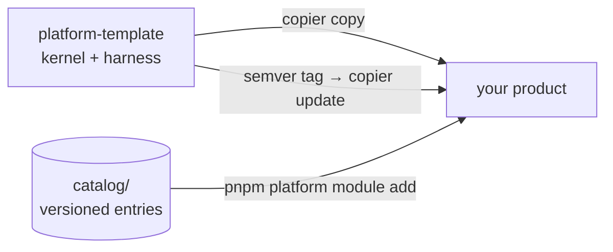

<p align="center">
  
</p>

<p align="center">
  <a href="https://github.com/EmanuelVogt/platform-template/actions/workflows/ci.yml"></a>
  <a href="https://github.com/EmanuelVogt/platform-template/tags"></a>
  <a href="/LICENSE"></a>
  
  
  
  
</p>

<p align="center">
  A production-grade <strong>NestJS modular monolith</strong> and a <strong>headless React front end</strong> whose
  architecture is <strong>executable</strong>: layer boundaries, authorization, transaction participation, the HTTP
  contract and the migration journal are enforced by specs, lint and the type checker — not by convention or code
  review. Delivered as a kernel, extended through a versioned module catalog, updated with a semver tag.
</p>

---

## Why it is different

Most starters give you a folder layout and a list of rules. This one ships the rules as tests that fail the build,
and a kernel that makes the expensive things — transactions, outbox, idempotency, request context, observability,
authorization — correct by default and hard to get wrong.

| Guarantee                           | How it is enforced                                                                                                                                                                                                                                                    |
| ----------------------------------- | --------------------------------------------------------------------------------------------------------------------------------------------------------------------------------------------------------------------------------------------------------------------- |
| **Layer boundaries are real**       | `module-boundaries.spec.ts` resolves every production import and fails any crossing the layer table forbids. Across modules the only legal targets are another module's `api/facades`, `api/events` and `*.module.ts` — never a repository, use case or table.        |
| **Authorization is fail-closed**    | Every route declares exactly one access mode (`@Public`, `@Authenticated`, `@RequirePermission`…). No declaration → authenticated; no policy provider → `403 access-policy-missing`. `authz-coverage` fails an undeclared route.                                      |
| **Transactions are declared**       | A use case is `@Transactional`, `@ReadOnly` or `@NonTransactional("reason")` — `transactional-coverage` fails the omission. The pool is private to the kernel: a module reaches Postgres only through `TransactionManager`, whose executor travels in ALS.            |
| **Events cannot be lost**           | Transactional outbox in `_kernel`: publishing outside a transaction throws; at-least-once delivery with backoff, dead-letter after the retry budget, per-aggregate FIFO, Postgres-clock leases, replay, graceful drain. Direct `EventEmitter.emit` is forbidden.      |
| **Mutations are idempotent**        | `Idempotency-Key` store keyed by `(scope, key)` with request hash and response snapshot: same key + payload replays, same key + different payload is rejected, a stored server failure is retryable.                                                                  |
| **Context is never a parameter**    | `RequestContext` over AsyncLocalStorage carries correlation/causation (ULID), actor (set once — a second set throws) and tenant. Every dispatcher — HTTP, outbox, job — opens one before working.                                                                     |
| **The HTTP contract has one truth** | Zod schemas → DTOs, use-case types, `openapi.json` and the Kubb-generated client. CI fails on an uncommitted `openapi.json`; a contract change breaks on the front end, never silently in the API.                                                                    |
| **Errors are a contract too**       | Every error extends `DomainError` and renders as RFC 7807 `application/problem+json` with `correlationId` and `Retry-After` on 429/503 — never a stack, SQL or path. `error-namespace` pins the `type` to the owning module.                                          |
| **Jobs cannot collide**             | `@MaintenanceJob` takes a session advisory lock on a dedicated client off the pool; a duplicate name or `lockId` throws at boot instead of silencing a job forever.                                                                                                   |
| **Schemas stay complete**           | One Postgres schema per module. `schema-completeness` fails a table the aggregator cannot reach; `db:check:journal` fails a migration "born in the past" — the class of bug that only shows at environment boot.                                                      |
| **Observability is free**           | pino JSON with request, correlation, causation, tenant and actor ids on every line; OpenTelemetry auto-instrumentation with `trace_id` in the logs even with no exporter; an event consumer starts a new trace linked via `traceparent`; PII redacted at every depth. |

## Architecture as executable specs

Every rule in the handbooks has a spec next to the code it guards. All share one mould — filesystem sweep, a sanity
`it` on the glob, offenders `toEqual([])`, an allowlist with a reason per entry and a dead-entry `it` — so bypassing a
rule without a justified allowlist entry fails the PR.

| Spec                                                         | Enforces                                                                                                                            |
| ------------------------------------------------------------ | ----------------------------------------------------------------------------------------------------------------------------------- |
| `module-boundaries`                                          | the layer table; cross-module surface; no root-connection import; `shared/**` never imports `modules/**` (type imports included)    |
| `authz-coverage` · `operation-id` · `transactional-coverage` | one access mode per route; explicit, unique, camelCase `operationId`; declared transaction participation                            |
| `schema-completeness` · `check-journal`                      | every `*.table.ts` reachable from the aggregator; journal ↔ SQL pairing, monotonic `when`, nothing born in the past                 |
| `error-namespace` · `maintenance-registry`                   | `TYPE_BASE` = module folder, 403 only in the kernel; unique job name and `lockId`, an atomic job never calls `outsideTransaction()` |
| `template-kernel-only`                                       | the kernel boots with no module installed — deleted by the first `module add`                                                       |
| `contract-enums` (web)                                       | no hand-typed value set duplicating a contract enum                                                                                 |

## Quality gates

- **TypeScript 6** with `strict`, `noUncheckedIndexedAccess`, `noImplicitOverride` and `exactOptionalPropertyTypes`
  on both apps, no exception. `any` is a lint error. `eslint-disable` is forbidden in any form.
- **ESLint 10** flat config: `typescript-eslint` strictTypeChecked + stylisticTypeChecked, `import-x`,
  `unused-imports`; `eslint-plugin-boundaries` turns the front-end layer direction into a lint error; `@vitest/eslint-plugin`
  plus 12 error-level rules ban `.only`, `.skip`, assertion-less and duplicate-title tests.
- **Vitest 4** is the only runner, one process over four projects — `api` (unit), `api-int` (integration), `api-e2e`
  (serial e2e) and `web` (jsdom) — against **real Postgres and Redis** via testcontainers, one database clone per
  worker.
- **Coverage floor of 90 % on statements, branches, functions and lines**, global and per app; the floor is never
  lowered to make a push pass.
- **Pre-push pipeline** (`lefthook`): `db:check:journal` → `turbo typecheck` → `test:coverage`. The cheapest check
  runs first and is the only one that catches a migration born in the past.
- **CI** (`ci.yml`): lint + typecheck + build, unit tests, then the full coverage run with containers. A second
  workflow installs every catalog entry into a freshly rendered product and runs its tests, smoke-tests a kernel-only
  render, and fails any commit that fixes `catalog/**` without an advisory.

## Headless front end

`apps/web` ships transport, routing, environment and error helpers — **no** session screens, no UI kit, no styling
decisions. The product picks those.

- **Feature-Sliced Design** layers (`app` → `pages` → `widgets` → `features` → `entities` → `shared`), no barrels,
  deep imports through `@/`; layer direction and sibling-slice imports are lint errors.
- **TanStack Router** with code-based route trees; `staticData.access` is mandatory on every route and enforced by the
  type checker, so an unguarded screen does not compile.
- **TanStack Query** wrapped per entity (invalidation, `select`, `staleTime`); Zustand only for shared client state,
  never server data.
- **One axios instance** (`@platform/api-client`): credentials, CSRF double-submit header on mutations, correlation
  id captured from RFC 7807 bodies, `Idempotency-Key` generated once and reused on retries. The front end never writes
  an HTTP client — hooks, Zod schemas and models are generated from `openapi.json` by Kubb.
- **Forms** with react-hook-form + `zodResolver`, reusing the contract schema whenever the form is the request body.

## Operations

- **Dockerfiles** pruned with `turbo prune --docker`, multi-stage, production dependencies only, **non-root**
  (`USER node` under `tini`; `nginx-unprivileged` for the web), health checks on `/health` and `/healthz`, migrations
  applied by the entrypoint.
- **Local stack** with one `docker compose up -d`: Postgres 16, password-protected Redis 7, optional hot-reload API.
- **Boot order** that fails fast: env validated and OpenTelemetry started before `NestFactory`; every module config is
  a Zod schema validated at boot.
- A deploy guide for Dokploy (`docs/dev/deploy.md`) — the platform does not assume a cloud.

## Agent harness

The repository is built to be worked on by coding agents without degrading: `AGENTS.md` (also `CLAUDE.md`) with
tripwires, **15 hooks** that enforce a context budget (navigation is delegated to a scout subagent, huge reads are
blocked), surface unapplied advisories at session start, list the front-end consumers of an edited contract and police
the comment policy; **4 specialised agents** (scout, shell runner, spec worker, independent verifier) and **11
skills**, including a four-phase spec-driven workflow where author ≠ verifier. Handbooks for architecture, testing,
code quality and communication are first-class inputs to that workflow.

## How it is delivered

The template ships **only the kernel** — the part every product needs and none should rewrite. Platform modules are
versioned entries in `catalog/` (identity, attachment, audit, notification, tag…), installed on demand; whatever is
specific to a product (business modules, screens, UI kit, ADRs) is born in the generated repository and never
collides with platform updates.



The rule that keeps `copier update` conflict-free: **the product adds files; it never edits platform files**. Where
the platform needs extending it exposes a catalog entry or a kernel port — never an edit point. The kernel never
imports an entry, and a spec guarantees no entry vocabulary leaks back into the kernel.

| Command                                        | What it does                                                                                                              |
| ---------------------------------------------- | ------------------------------------------------------------------------------------------------------------------------- |
| `pnpm platform module add <entry> [--variant]` | copies the entry into the product, resolves `dependsOn`, generates migrations, runs `pnpm contract` and the entry's tests |
| `pnpm platform module list`                    | compares the installed version (`.platform-modules.lock`) with the catalog HEAD                                           |
| `pnpm platform module update <entry>`          | prints the porting guide — updating an entry is an agent task, driven by the `port-module-update` skill                   |
| `pnpm platform module adopt <entry>`           | records in the lock an entry the product already had before the catalog existed                                           |
| `copier update [--vcs-ref vX.Y.Z]`             | brings the product from `template@_commit` to a tag with a three-way merge; `--pretend --diff` previews                   |

Fixes to already-published entries become **advisories** (`docs/advisories/ADV-*.md`): the product receives the file on
`copier update`, a session-start hook reports what has not been applied yet, and the template's CI refuses a catalog
fix without one. Changes that need action from the product are listed per version in
[`docs/dev/template-changelog.md`](/docs/dev/template-changelog.md).

## Getting started

Requirements: **Node 22** (`.nvmrc`), **pnpm 10** via corepack, **Docker**, and **copier ≥ 9.4**
(`uv tool install copier` or `pipx install copier`). The repository is public — `copier` and the catalog installer
clone over HTTPS, no key or token to configure.

```bash
copier copy --trust gh:EmanuelVogt/platform-template ./my-product   # --trust authorizes git init, pnpm install, skills sync
cd my-product
cp apps/api/.env.example apps/api/.env        # fill in the secrets
docker compose up -d                           # Postgres + Redis
pnpm --filter api db:migrate:run
pnpm dev
```

Front end at `http://localhost:5173`, API at `http://localhost:3000`, API reference (Scalar) at `/docs`. Copier uses
the latest published tag by default; `--vcs-ref HEAD` takes `main`.

```
my-product/
├── apps/
│   ├── api/                 # NestJS — kernel in src/shared, modules in src/modules
│   └── web/                 # headless React/Vite — transport, guard, unstyled layout
├── packages/
│   └── api-client/          # client generated from openapi.json
├── docs/                    # handbooks, ADRs, advisories
├── .claude/  .agents/       # agent harness (hooks, skills, agents)
├── AGENTS.md                # mandatory-reading rules (CLAUDE.md is a symlink)
└── .copier-answers.yml      # template version — never edit by hand
```

## Stack

| Layer      | Technologies                                                                                                   |
| ---------- | -------------------------------------------------------------------------------------------------------------- |
| API        | NestJS 11 · Express 5 · Drizzle ORM + PostgreSQL · Redis (ioredis) · Zod 4 / nestjs-zod · OpenTelemetry · pino |
| Front end  | React 19 · Vite 8 · TanStack Router + Query · Zustand · react-hook-form + Zod                                  |
| Contract   | Zod → OpenAPI 3 → Kubb (`packages/api-client`) · Scalar at `/docs`                                             |
| Tests      | Vitest 4 (single runner, four projects) · testcontainers · supertest · Testing Library · MSW                   |
| Tooling    | pnpm 10 · Turbo 2 · TypeScript 6 · ESLint 10 · Prettier · lefthook                                             |
| Operations | Docker · GitHub Actions · Dokploy (guide in `docs/dev/deploy.md`)                                              |

## Documentation

| For…                                            | Read                                                                |
| ----------------------------------------------- | ------------------------------------------------------------------- |
| API architecture (the rules behind every spec)  | [`docs/arch/back.md`](/docs/arch/back.md)                           |
| Front-end architecture                          | [`docs/arch/front.md`](/docs/arch/front.md)                         |
| Testing                                         | [`docs/test/testing.md`](/docs/test/testing.md)                     |
| Code quality                                    | [`docs/code-quality.md`](/docs/code-quality.md)                     |
| Platform × product boundary, `copier update`    | [`docs/dev/template.md`](/docs/dev/template.md)                     |
| Catalog, advisories, authoring an entry         | [`docs/catalog/catalog.md`](/docs/catalog/catalog.md)               |
| Agents: workflow, harness, communication, infra | [`docs/agents/`](/docs/agents)                                      |
| Deploy                                          | [`docs/dev/deploy.md`](/docs/dev/deploy.md)                         |
| Template changelog                              | [`docs/dev/template-changelog.md`](/docs/dev/template-changelog.md) |

Handbooks and changelog are written in English; code comments, test names and user-facing strings follow the
product's locale (pt-BR by default).

## Maintaining the template

Whoever evolves the template (rather than a product) reads [`TEMPLATE.md`](/TEMPLATE.md). The essentials:

```bash
pnpm template:smoke                 # renders a kernel-only product and runs check + tests
pnpm catalog:check [entry…]         # catalog pre-tag gate: installs each entry and tests it
git tag vX.Y.Z && git push --tags   # publishes the version products will receive
```

House rules: nothing product-specific enters the template (no brand, domain or business outside the Jinja
placeholders); only docs and manifests carry `.jinja`; the kernel never imports a catalog entry; a fix in `catalog/**`
without an advisory is not accepted.

## License

Released under the [MIT](/LICENSE) license. The generated product does **not** receive this file: your product's
license is your decision.
