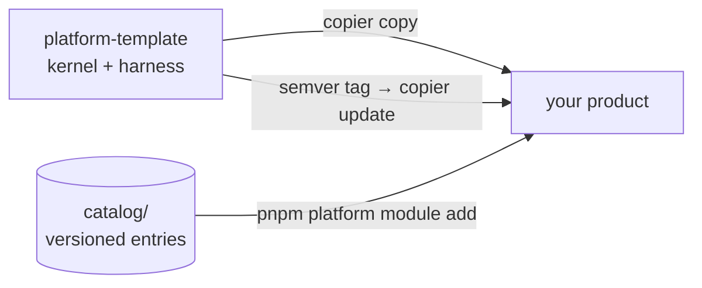

<p align="center">
  
</p>

<p align="center">
  <a href="https://github.com/EmanuelVogt/platform-template/actions/workflows/ci.yml"></a>
  <a href="https://github.com/EmanuelVogt/platform-template/tags"></a>
  <a href="/LICENSE"></a>
</p>

`platform-template` is a [Copier](https://copier.readthedocs.io) template that generates a TypeScript monorepo: a
NestJS modular monolith and a headless React front end (Vite or Next.js). Architectural rules — layer boundaries,
authorization, transaction participation, the HTTP contract, the migration journal — are enforced by specs, lint and
the type checker.

The template ships the kernel — transactions, transactional outbox, idempotency, request context, authorization,
observability — and no domain modules. Platform modules (identity, attachment, audit, notification, tag…) are
versioned entries in [`catalog/`](/catalog), installed with `pnpm platform module add`. Template updates are
published as semver tags and applied with `copier update`.

## Getting started

Requirements: Node 22 (`.nvmrc`), pnpm 10 via corepack, Docker, and Copier ≥ 9.4 (`uv tool install copier` or
`pipx install copier`). Supported dev platforms: macOS, Linux and WSL2 — native Windows is not supported. The
repository is public; `copier` and the catalog installer clone over HTTPS, no key or token to configure.

```bash
copier copy --trust gh:EmanuelVogt/platform-template ./my-product   # --trust authorizes git init, pnpm install, skills sync
cd my-product
cp apps/api/.env.example apps/api/.env        # fill in the secrets
docker compose up -d                          # Postgres 16 + Redis 7
pnpm --filter api db:migrate:run
pnpm dev
```

API at `http://localhost:3000`, Scalar reference at `/docs`; front end at `http://localhost:5173` (Vite, the default
`web_stack`) or `http://localhost:3001` (Next.js). Copier uses the latest published tag by default; `--vcs-ref HEAD`
takes `main`.

```
my-product/
├── apps/
│   ├── api/                 # NestJS — kernel in src/shared, modules in src/modules
│   └── web/                 # headless React (Vite or Next.js) — transport, access guard, unstyled layout
├── packages/
│   └── api-client/          # client generated from openapi.json
├── docs/                    # handbooks, ADRs, advisories
├── .claude/  .agents/       # agent harness (hooks, skills, agents)
├── AGENTS.md                # mandatory-reading rules (CLAUDE.md is a symlink)
└── .copier-answers.yml      # template version — never edit by hand
```

## Enforced rules

Each architectural rule has a spec next to the code it guards. The specs share one shape — filesystem sweep,
offenders `toEqual([])`, allowlist with a reason per entry — and a violation without an allowlist entry fails CI.
The rules are documented in [`backend-architecture`](/.agents/skills/backend-architecture/SKILL.md) and [`frontend-architecture`](/.agents/skills/frontend-architecture/SKILL.md).

| Concern          | Rule and enforcement                                                                                                                                    |
| ---------------- | -------------------------------------------------------------------------------------------------------------------------------------------------------- |
| Layer boundaries | `module-boundaries` resolves every production import; cross-module imports are limited to another module's `api/facades`, `api/events` and `*.module.ts` |
| Authorization    | every route declares exactly one access mode; no declaration defaults to authenticated, a missing policy provider returns 403 (`authz-coverage`)        |
| Transactions     | every use case carries `@Transactional`, `@ReadOnly` or `@NonTransactional("reason")` (`transactional-coverage`); Postgres is reached only through `TransactionManager` |
| Event delivery   | transactional outbox: publishing outside a transaction throws; at-least-once with backoff, dead-letter, per-aggregate FIFO, replay; direct `EventEmitter.emit` is forbidden |
| Idempotency      | `Idempotency-Key` store with request hash and response snapshot; a repeated payload replays the stored response, a different payload under the same key is rejected |
| Request context  | `RequestContext` over AsyncLocalStorage carries correlation/causation, actor and tenant; every dispatcher (HTTP, outbox, job) opens one                 |
| HTTP contract    | Zod schemas generate the DTOs, `openapi.json` and the typed client; CI fails on an uncommitted `openapi.json`, so an API change surfaces as a type error in the front end |
| Errors           | every error renders as RFC 7807 `application/problem+json` with `correlationId`; responses carry no stack, SQL or path (`error-namespace`)              |
| Maintenance jobs | `@MaintenanceJob` takes a Postgres advisory lock; a duplicate name or `lockId` fails at boot (`maintenance-registry`)                                   |
| Database schemas | one Postgres schema per module; a table missing from the aggregator fails `schema-completeness`, a migration dated before the journal head fails `db:check:journal` |
| Observability    | pino JSON logs with correlation, causation, tenant and actor ids; OpenTelemetry auto-instrumentation with `trace_id` in log lines; PII redacted at every depth |

Repository-wide gates:

- **TypeScript** `strict` plus `noUncheckedIndexedAccess`, `noImplicitOverride` and `exactOptionalPropertyTypes` on
  both apps; `any` and `eslint-disable` are lint errors.
- **Vitest 4** as the single runner over four projects — `api`, `api-int`, `api-e2e`, `web` — against real Postgres
  and Redis (testcontainers), one database clone per worker.
- **Coverage floor of 90 %** on statements, branches, functions and lines, global and per app.
- **Pre-push** runs `db:check:journal → typecheck → test:coverage`; CI additionally smoke-tests a kernel-only render
  and installs every catalog entry into a fresh render, running its tests.

## Kernel, catalog and updates



`copier update` applies the template diff with a three-way merge. Conflicts are avoided by ownership, not by merge
heuristics: the product only adds files, platform files are edited by the template alone, and extension happens
through catalog entries and kernel ports. The kernel never imports a catalog entry, and a spec checks that no entry
vocabulary appears in the kernel.

| Command                                        | What it does                                                                                                   |
| ---------------------------------------------- | --------------------------------------------------------------------------------------------------------------- |
| `pnpm platform module add <entry> [--variant]` | copies the entry into the product, resolves `dependsOn`, generates migrations, regenerates the contract, tests |
| `pnpm platform module list`                    | compares installed versions (`.platform-modules.lock`) with the catalog                                        |
| `pnpm platform module update <entry>`          | prints the porting guide — updating an installed entry is an agent task (`port-module-update` skill)           |
| `pnpm platform status`                         | installed template version vs latest tag, installed entries, pending advisories                                |
| `copier update [--vcs-ref vX.Y.Z]`             | brings the product to a tag with a three-way merge; `--pretend --diff` previews                                |

A fix to an already-published entry is recorded as an advisory (`docs/advisories/ADV-*.md`): the product receives
the file on `copier update`, and a session-start hook reports the ones not yet applied. Changes that require action
from the product are listed per version in [`docs/dev/template-changelog.md`](/docs/dev/template-changelog.md).

## Headless front end

`apps/web` ships transport, routing, environment and error helpers; session screens, UI kit and styling are the
product's.

- Feature-Sliced Design layers with the layer direction enforced by lint; no barrels, deep imports through `@/`.
- Every route declares an access level, consumed by a single guard in the shell; with TanStack Router the declaration
  is part of the route type and its absence is a compile error.
- One axios instance (`@platform/api-client`): credentials, CSRF double-submit header on mutations, correlation id
  read from RFC 7807 bodies, `Idempotency-Key` reused on retries. Hooks, Zod schemas and models are generated from
  `openapi.json` by Kubb.
- Forms with react-hook-form + `zodResolver`, reusing the contract schema when the form is the request body.

## Operations

- Multi-stage Dockerfiles from `turbo prune --docker`, non-root (`tini` + `USER node`; `nginx-unprivileged` for the
  web), health checks, migrations applied by the entrypoint.
- Environment and module configs are Zod schemas validated at boot, before `NestFactory`; OpenTelemetry starts first.
- `docker compose up -d` raises the local stack; the deploy guide ([`docs/dev/deploy.md`](/docs/dev/deploy.md))
  targets Dokploy — no cloud provider is assumed.

## Agent harness

`AGENTS.md` (also `CLAUDE.md`) lists the mandatory rules and tripwires. Hooks enforce a context budget (navigation
delegated to a scout subagent, oversized reads blocked), report unapplied advisories at session start and list the
front-end consumers of an edited contract. Dedicated agents and skills implement a spec-driven workflow with
distinct author and verifier roles; the handbooks in `docs/` are inputs to that workflow.

## Stack

| Layer      | Technologies                                                                                                    |
| ---------- | ---------------------------------------------------------------------------------------------------------------- |
| API        | NestJS 11 · Express 5 · Drizzle ORM + PostgreSQL · Redis (ioredis) · Zod 4 / nestjs-zod · OpenTelemetry · pino  |
| Front end  | React 19 · Vite 8 + TanStack Router (default) or Next.js · TanStack Query · Zustand · react-hook-form + Zod     |
| Contract   | Zod → OpenAPI 3 → Kubb (`packages/api-client`) · Scalar at `/docs`                                              |
| Tests      | Vitest 4 (single runner, four projects) · testcontainers · supertest · Testing Library · MSW                    |
| Tooling    | pnpm 10 · Turbo 2 · TypeScript 6 · ESLint 10 · Prettier · lefthook                                              |
| Operations | Docker · GitHub Actions · Dokploy (guide in `docs/dev/deploy.md`)                                               |

## Documentation

| Topic                                        | Read                                                                |
| -------------------------------------------- | ------------------------------------------------------------------- |
| API architecture                             | [`backend-architecture`](/.agents/skills/backend-architecture/SKILL.md) |
| Front-end architecture                       | [`frontend-architecture`](/.agents/skills/frontend-architecture/SKILL.md) |
| Testing                                      | [`testing`](/.agents/skills/testing/SKILL.md)                       |
| Code quality                                 | [`code-quality`](/.agents/skills/code-quality/SKILL.md)             |
| Platform × product boundary, `copier update` | [`docs/dev/template.md`](/docs/dev/template.md)                     |
| Catalog, advisories, authoring an entry      | [`docs/catalog/catalog.md`](/docs/catalog/catalog.md)               |
| Agent workflow, harness, communication       | [`dev-workflow`](/.agents/skills/dev-workflow/SKILL.md), [`agent-harness`](/.agents/skills/agent-harness/SKILL.md), [`communication`](/.agents/skills/communication/SKILL.md) |
| Deploy                                       | [`docs/dev/deploy.md`](/docs/dev/deploy.md)                         |
| Template changelog                           | [`docs/dev/template-changelog.md`](/docs/dev/template-changelog.md) |

Handbooks and the changelog are written in English; generated code comments, test names and user-facing strings
follow the product's locale (`product_locale`, default `pt-BR`).

## Contributing

Changes to the template are validated by its own gates:

```bash
pnpm template:smoke                 # renders a kernel-only product and runs check + tests
pnpm catalog:check [entry…]         # installs each catalog entry into a fresh render and tests it
```

Constraints, detailed in [`TEMPLATE.md`](/TEMPLATE.md): nothing product-specific enters the template (no brand,
domain or business outside the Jinja placeholders); only docs and manifests carry `.jinja` — source code reads
config/env; the kernel never imports a catalog entry; a fix in `catalog/**` without an advisory is rejected by the
commit-msg hook. Every change products should receive becomes a semver tag, cut by CI after the full gate
(`pnpm platform release`).

## License

[MIT](/LICENSE). `.github/` is excluded from the template render, so the generated product does not receive this
file — the product chooses its own license.
