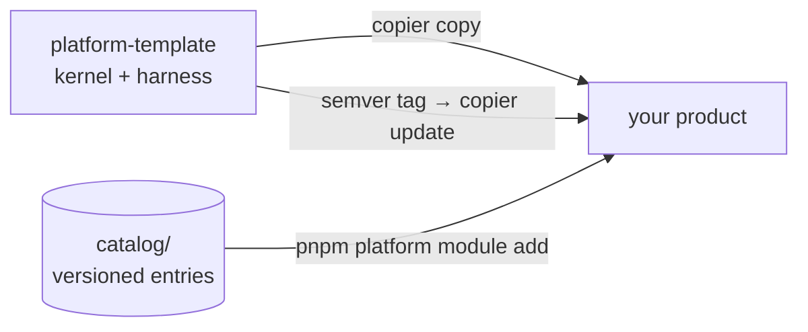

<p align="center">
  
</p>

<p align="center">
  <a href="https://github.com/EmanuelVogt/platform-template/actions/workflows/ci.yml"></a>
  <a href="https://github.com/EmanuelVogt/platform-template/tags"></a>
  <a href="/LICENSE"></a>
</p>

`platform-template` is a [Copier](https://copier.readthedocs.io) template that generates a TypeScript monorepo — a
NestJS modular monolith and a headless React front end — whose architectural rules are executable: layer boundaries,
authorization, transaction participation, the HTTP contract and the migration journal are enforced by specs, lint and
the type checker, not by convention or code review.

The template ships only the **kernel**: the infrastructure every product needs and none should rewrite — transactions,
transactional outbox, idempotency, request context, authorization, observability. Platform modules (identity,
attachment, audit, notification, tag…) are versioned entries in [`catalog/`](/catalog), installed on demand into the
generated repository, and template updates reach a product as semver tags applied with `copier update`. Everything
product-specific is born in the product and never collides with an update.

## Getting started

Requirements: Node 22 (`.nvmrc`), pnpm 10 via corepack, Docker, and Copier ≥ 9.4 (`uv tool install copier` or
`pipx install copier`). Supported dev platforms: macOS, Linux and WSL2 — native Windows is not supported. The
repository is public; `copier` and the catalog installer clone over HTTPS, no key or token to configure.

```bash
copier copy --trust gh:EmanuelVogt/platform-template ./my-product   # --trust authorizes git init, pnpm install, skills sync
cd my-product
cp apps/api/.env.example apps/api/.env        # fill in the secrets
docker compose up -d                          # Postgres 16 + Redis 7
pnpm --filter api db:migrate:run
pnpm dev
```

API at `http://localhost:3000`, with the Scalar reference at `/docs`; front end at `http://localhost:5173` (Vite, the
default `web_stack`) or `http://localhost:3001` (Next.js). Copier uses the latest published tag by default;
`--vcs-ref HEAD` takes `main`.

```
my-product/
├── apps/
│   ├── api/                 # NestJS — kernel in src/shared, modules in src/modules
│   └── web/                 # headless React (Vite or Next.js) — transport, access guard, unstyled layout
├── packages/
│   └── api-client/          # client generated from openapi.json
├── docs/                    # handbooks, ADRs, advisories
├── .claude/  .agents/       # agent harness (hooks, skills, agents)
├── AGENTS.md                # mandatory-reading rules (CLAUDE.md is a symlink)
└── .copier-answers.yml      # template version — never edit by hand
```

## What is enforced

Every architectural rule ships as a spec next to the code it guards. The specs share one shape — filesystem sweep,
offenders `toEqual([])`, allowlist with a reason per entry — so bypassing a rule without a justified allowlist entry
fails CI. The rules themselves are documented in [`docs/arch/back.md`](/docs/arch/back.md) and
[`docs/arch/front.md`](/docs/arch/front.md); the table names each guarantee and what enforces it.

| Guarantee                       | Enforcement                                                                                                                                                            |
| ------------------------------- | ---------------------------------------------------------------------------------------------------------------------------------------------------------------------- |
| Layer boundaries are real       | `module-boundaries` resolves every production import; across modules only another module's `api/facades`, `api/events` and `*.module.ts` are legal targets             |
| Authorization is fail-closed    | every route declares exactly one access mode; no declaration → authenticated, no policy provider → 403 (`authz-coverage`)                                              |
| Transactions are declared       | every use case is `@Transactional`, `@ReadOnly` or `@NonTransactional("reason")` (`transactional-coverage`); Postgres is reached only through `TransactionManager`     |
| Events cannot be lost           | transactional outbox: publishing outside a transaction throws; at-least-once with backoff, dead-letter, per-aggregate FIFO, replay; direct `EventEmitter.emit` is banned |
| Mutations are idempotent        | `Idempotency-Key` store with request hash and response snapshot — same payload replays, different payload is rejected                                                  |
| Context is never a parameter    | `RequestContext` over AsyncLocalStorage carries correlation/causation, actor and tenant; every dispatcher (HTTP, outbox, job) opens one                                |
| The HTTP contract has one truth | Zod → DTOs → `openapi.json` → generated client; CI fails on an uncommitted contract, so a change breaks on the front end, never silently in the API                    |
| Errors are a contract           | every error renders as RFC 7807 `application/problem+json` with `correlationId` — never a stack, SQL or path (`error-namespace`)                                       |
| Jobs cannot collide             | `@MaintenanceJob` takes a Postgres advisory lock; a duplicate name or `lockId` fails at boot (`maintenance-registry`)                                                  |
| Schemas stay complete           | one Postgres schema per module; an unreachable table fails `schema-completeness`, a migration born in the past fails `db:check:journal`                                |
| Observability is on by default  | pino JSON with correlation, causation, tenant and actor ids on every line; OpenTelemetry with `trace_id` in the logs; PII redacted at every depth                      |

The gates around the specs:

- **TypeScript** `strict` plus `noUncheckedIndexedAccess`, `noImplicitOverride` and `exactOptionalPropertyTypes` on
  both apps; `any` and `eslint-disable` are lint errors.
- **Vitest 4** as the single runner over four projects — `api`, `api-int`, `api-e2e`, `web` — against real Postgres
  and Redis (testcontainers), one database clone per worker.
- **Coverage floor of 90 %** on statements, branches, functions and lines, global and per app.
- **Pre-push** runs `db:check:journal → typecheck → test:coverage`; CI additionally smoke-tests a kernel-only render
  and installs every catalog entry into a fresh render, running its tests.

## Kernel, catalog and updates



The rule that keeps `copier update` conflict-free: **the product adds files; it never edits platform files**. Where
the platform needs extending it exposes a catalog entry or a kernel port — never an edit point. The kernel never
imports an entry, and a spec keeps entry vocabulary out of the kernel.

| Command                                        | What it does                                                                                                   |
| ---------------------------------------------- | --------------------------------------------------------------------------------------------------------------- |
| `pnpm platform module add <entry> [--variant]` | copies the entry into the product, resolves `dependsOn`, generates migrations, regenerates the contract, tests |
| `pnpm platform module list`                    | compares installed versions (`.platform-modules.lock`) with the catalog                                        |
| `pnpm platform module update <entry>`          | prints the porting guide — updating an installed entry is an agent task (`port-module-update` skill)           |
| `pnpm platform status`                         | installed template version vs latest tag, installed entries, pending advisories                                |
| `copier update [--vcs-ref vX.Y.Z]`             | brings the product to a tag with a three-way merge; `--pretend --diff` previews                                |

Fixes to already-published entries are **advisories** (`docs/advisories/ADV-*.md`): the product receives the file on
`copier update`, and a session-start hook reports which ones have not been applied yet. Changes that need action from
the product are listed per version in [`docs/dev/template-changelog.md`](/docs/dev/template-changelog.md).

## Headless front end

`apps/web` ships transport, routing, environment and error helpers — no session screens, no UI kit, no styling
decisions; the product picks those.

- Feature-Sliced Design layers with the layer direction enforced by lint; no barrels, deep imports through `@/`.
- Every route declares an access level consumed by a single guard in the shell; with TanStack Router the declaration
  is type-mandatory, so an unguarded screen does not compile.
- One axios instance (`@platform/api-client`): credentials, CSRF double-submit header on mutations, correlation id
  captured from RFC 7807 bodies, `Idempotency-Key` reused on retries. Hooks, Zod schemas and models are generated
  from `openapi.json` by Kubb — the front end never writes an HTTP client.
- Forms with react-hook-form + `zodResolver`, reusing the contract schema when the form is the request body.

## Operations

- Multi-stage Dockerfiles from `turbo prune --docker`, non-root (`tini` + `USER node`; `nginx-unprivileged` for the
  web), health checks, migrations applied by the entrypoint.
- Environment and module configs are Zod schemas validated at boot, before `NestFactory`; OpenTelemetry starts first.
- Local stack with one `docker compose up -d`; a deploy guide for Dokploy in [`docs/dev/deploy.md`](/docs/dev/deploy.md)
  — nothing assumes a specific cloud.

## Agent harness

The repository is meant to be worked on by coding agents without degrading. `AGENTS.md` (also `CLAUDE.md`) carries
the mandatory rules and tripwires; hooks enforce a context budget (navigation is delegated to a scout subagent,
oversized reads are blocked), surface unapplied advisories at session start and list the front-end consumers of an
edited contract; dedicated agents and skills implement a spec-driven workflow in which the author of a change is
never its verifier. The handbooks in `docs/` are first-class inputs to that workflow.

## Stack

| Layer      | Technologies                                                                                                    |
| ---------- | ---------------------------------------------------------------------------------------------------------------- |
| API        | NestJS 11 · Express 5 · Drizzle ORM + PostgreSQL · Redis (ioredis) · Zod 4 / nestjs-zod · OpenTelemetry · pino  |
| Front end  | React 19 · Vite 8 + TanStack Router (default) or Next.js · TanStack Query · Zustand · react-hook-form + Zod     |
| Contract   | Zod → OpenAPI 3 → Kubb (`packages/api-client`) · Scalar at `/docs`                                              |
| Tests      | Vitest 4 (single runner, four projects) · testcontainers · supertest · Testing Library · MSW                    |
| Tooling    | pnpm 10 · Turbo 2 · TypeScript 6 · ESLint 10 · Prettier · lefthook                                              |
| Operations | Docker · GitHub Actions · Dokploy (guide in `docs/dev/deploy.md`)                                               |

## Documentation

| For…                                            | Read                                                                |
| ----------------------------------------------- | ------------------------------------------------------------------- |
| API architecture (the rules behind every spec)  | [`docs/arch/back.md`](/docs/arch/back.md)                           |
| Front-end architecture                          | [`docs/arch/front.md`](/docs/arch/front.md)                         |
| Testing                                         | [`docs/test/testing.md`](/docs/test/testing.md)                     |
| Code quality                                    | [`docs/code-quality.md`](/docs/code-quality.md)                     |
| Platform × product boundary, `copier update`    | [`docs/dev/template.md`](/docs/dev/template.md)                     |
| Catalog, advisories, authoring an entry         | [`docs/catalog/catalog.md`](/docs/catalog/catalog.md)               |
| Agents: workflow, harness, communication, infra | [`docs/agents/`](/docs/agents)                                      |
| Deploy                                          | [`docs/dev/deploy.md`](/docs/dev/deploy.md)                         |
| Template changelog                              | [`docs/dev/template-changelog.md`](/docs/dev/template-changelog.md) |

Handbooks and the changelog are written in English; generated code comments, test names and user-facing strings
follow the product's locale (`product_locale`, default `pt-BR`).

## Contributing

Contributions run through the template's own gates:

```bash
pnpm template:smoke                 # renders a kernel-only product and runs check + tests
pnpm catalog:check [entry…]         # installs each catalog entry into a fresh render and tests it
```

House rules, detailed in [`TEMPLATE.md`](/TEMPLATE.md): nothing product-specific enters the template (no brand,
domain or business outside the Jinja placeholders); only docs and manifests carry `.jinja` — source code reads
config/env; the kernel never imports a catalog entry; a fix in `catalog/**` without an advisory is not accepted.
Every change products should receive becomes a semver tag, cut by CI after the full gate (`pnpm platform release`).

## License

[MIT](/LICENSE). `.github/` is excluded from the template render, so the generated product does not receive this
file — your product's license is your decision.
