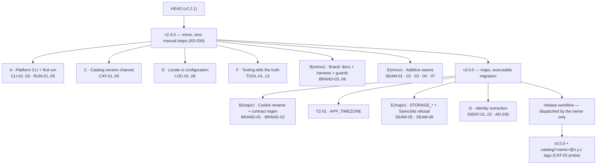
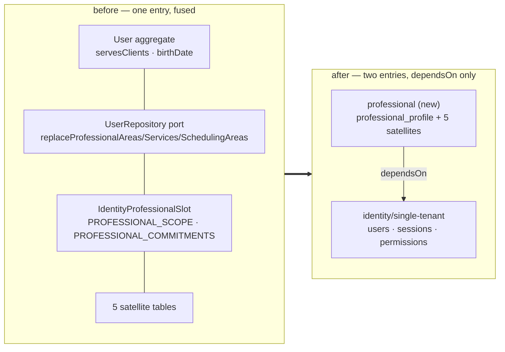

# Audit 2026-08-23 Remediation Design

**Spec**: `.specs/features/audit-2026-08-23-remediation/spec.md`
**Context**: `.specs/features/audit-2026-08-23-remediation/context.md`
**Evidence ledger**: `.specs/features/audit-2026-08-23-remediation/research.md` — every `file:line` in
this document is cited from there and is not re-derived. Do not re-run the sweep.
**Status**: Approved (three architecture forks confirmed by the owner, 2026-08-23)

---

## Architecture Overview

This feature has no single architecture: it is 51 requirements over eight surfaces. What makes it a
design rather than a checklist is that the fixes are held together by **three new invariants, each
expressed as a gate rather than as code**, and by **one structural extraction** that changes the
catalog graph.

The three gates are the load-bearing part. Every requirement in this feature closes a defect that
already shipped once; without a gate, the same class returns on the next release.

| Invariant | Gate | Closes |
| --- | --- | --- |
| No child receives the owner's brand, pilot domain or infrastructure | `brand-hygiene.spec.ts` (new, CI) | BRAND-01…08, TZ-01 |
| No two published tags ship different content under one entry version | `lintEntryBump` in `runLint` + CI (Fork C = **C2**) | CAT-01, CAT-02 |
| The committed contract never drifts, and the check survives the first `module add` | `contract:check` CI step (**not** a template-only snapshot) | TOOL-11 |

### Two releases (Fork A = **R2**)

Base is **`v2.2.1`**, re-derived from the real tag list (`v0.1.0 … v2.2.0 v2.2.1`; `v2.2.1` is absent
from `STATE.md`). `git tag -l 'catalog/*'` is empty, confirming CAT-05 still live.

**The minor is `v2.4.0`, not `v2.3.0` — and this is a hard ordering constraint, not a naming
preference.** `docs/dev/template-changelog.md:7` already holds a `## v2.3.0` section, authored by the
closed `template-update-contract` feature (plus two unrelated commits and a parallel session's
dev-server hooks) and **still untagged**, waiting on the owner's release dispatch. Its
`### Child migration steps` must stay the literal `None — copier update is enough.`
(`template-changelog.md:27-29`), which `lintChildMigrationSteps` enforces at preflight.

Because `release-preflight.mjs` refuses any release whose `version` differs from the **latest**
`## vX.Y.Z` section (AD-034), appending `## v2.4.0` above it would make `v2.3.0` permanently
untaggable. Therefore:

> **`v2.3.0` must be tagged by the owner before this feature writes its own changelog section.**
> Writing the `v2.4.0` section is the gate on that dispatch, not the other way round. The agent does
> not tag (AD-006/AD-034), so this is a hand-off point, and the `v2.4.0` section is authored only
> after `git tag -l v2.3.0` is non-empty.



**Why the split is architectural and not cosmetic.** AD-034 fixes that a non-major ships **zero**
manual child-migration steps. Everything in `v2.4.0` is therefore reachable by a client with a plain
`copier update` — which is the whole point, because that release is what un-breaks the products that
are dead on arrival today (`pnpm platform *` fails at import, `format:check` crashes, the documented
port is wrong). The major then carries a small, coherent payload where every item genuinely forces a
child decision, and ships one idempotent `scripts/platform/migrations/v3.0.0.mjs` (AD-034).

The split also resolves two collisions the research flagged for free, without any sequencing rule:

- **BRAND-03 ↔ IDENT-01** both touch identity's "Agendamentos" vocabulary. They now sit in different
  releases, so they cannot run in parallel by construction.
- **BRAND-07 ↔ IDENT-01** collide on `apps/api/test/setup/test-db.ts:105`
  (`identity.professional_default_hours` in the truncation list). BRAND-07 lands in `v2.4.0` and
  merely widens the guard's scan; IDENT-01 deletes the line in `v3.0.0`.

### The extraction (Fork B = **I-A**, recorded as AD-035)

The professional/scheduling slice leaves `identity/single-tenant` for a new entry
`catalog/professional/` with `dependsOn: ["identity"]`. The decisive property is that **the cut is
made at the aggregate, not at the table**: because `servesClients` and `birthDate` leave the `User`
entity, identity stops calling into the slice altogether, the `identity ↔ professional` cycle never
forms, and AD-025's "invert only edges that close a cycle" means `dependsOn` carries the single
remaining edge. No token is promoted to `shared/kernel/**`, so AD-021, AD-024 and RULE C are
untouched, and the existing entry-local slot is deleted rather than lifted.



---

## Code Reuse Analysis

### Existing Components to Leverage

| Component | Location | How to Use |
| --- | --- | --- |
| `entryChangedWithoutBump` | `scripts/platform/release-preflight.mjs:43-52` | **Move**, not rewrite. The tree-vs-tag algorithm is correct; Fork C relocates it into `lint.mjs` as `lintEntryBump` and preflight imports it back. |
| `previousStableTag` / `stableTagsFromLsRemote` | `release-preflight.mjs:26-30`, `lib/template-version.mjs` | Baseline resolution for `lintEntryBump`. `git ls-remote <repoRoot>` is a **local** path — no network — which is what makes running it inside `runLint` affordable. |
| `lintKernelRange`, `lintAdvisoryFrontmatter`, `lintAdvisoryModule`, `discoverEntries` | `scripts/platform/lib/lint.mjs` | Shape precedent for `lintEntryBump` and `lintAdvisoryPathScope` (CAT-04): same signature, same aggregation into `runLint`. |
| `computePending` | `scripts/platform/lib/advisories.mjs:48-86` | CAT-03 is plumbing, not a new algorithm: `catalogRef` is already written per module (`lib/commands/add.mjs:156-162`) and read nowhere outside tests. Add the branch beside the existing `templateVersion` branch (`:58-66`). |
| `parseInstalledVersion` | `lib/template-version.mjs:32-37` | TOOL-03 is one line — `readTemplateVersion` (`add.mjs:36-41`) must call it. Already correct; only the caller is wrong. |
| `COOKIE_NAME` / `DEVICE_COOKIE_NAME` env seam | `catalog/identity/single-tenant/.../identity.config.ts:20,23` | The precedent BRAND-02 copies for `CSRF_COOKIE_NAME`, which today is a bare module constant (`api/guards/cookie.ts:78`). Two of three cookies already have the seam. |
| Per-job `timeZone` field | `maintenance-job.decorator.ts:19`, `maintenance-registry.ts:10` | Config-driven timezone precedent already in the kernel — TZ-01 is not a new pattern, it generalises this one. |
| `sql.raw` + closed-map design | `bucket-sql.ts:8-10` (26 lines total) | The comment documents the injection-safety property (`no text from outside becomes SQL`). `APP_TIMEZONE` must be validated against an IANA set at boot so `sql.raw` stays safe. |
| `TEMPLATE_ONLY_FILES` | `scripts/platform/lib/apply.mjs:17-21` | TOOL-11's real subject. Entries `:19-20` are the contract **e2e spec and its snapshot** — deleted on first `module add`. The list stays as-is; the drift check moves out of it. |
| `KERNEL_SURFACE` | `module-boundaries.spec.ts:539-545` | Five roots today. BRAND-07 widens it to cover `apps/api/test`, `apps/api/src/openapi`, `apps/api/src/docs`, `apps/web/src/pages`. |
| `catalog/tag/` skeleton (43 files) | `catalog/tag/` | The canonical minimal entry the new `professional` entry is built from: no `web/`, no `api/testing/`, no `api/seeds/`. |
| Null-object adapter shape | `infrastructure/professional/null-professional-adapters.ts` | Deleted by IDENT-01, but its shape is exactly what SEAM-05's `NullStorageAdapter` needs. Read it before writing that one. |
| `ADV-20260823-01` kernel-advisory branch | `docs/advisories/ADV-20260823-01.md`, `advisories.mjs:58-66` | Working precedent for reaching children through the template version when the module lock cannot identify them. |
| Lettered work areas + `## Execute notes` | `.specs/features/done/security-audit-remediation/design.md` (40.7 kB) | Structural precedent for a feature of this size. |

### Integration Points

| System | Integration Method |
| --- | --- |
| `copier.yml` | New question `product_locale` (default `pt-BR`); `_exclude` already names `catalog.yml` (`:35`) and `release.yml` (`:39`) — BRAND-08 adds `feedback-triage.yml` or deletes it. |
| `.github/workflows/catalog.yml` | Job `gates` gains `fetch-depth: 0` so `lintEntryBump` has a baseline; `catalog:lint` invocation is unchanged. |
| `.github/workflows/ci.yml` | Gains `contract:check` (TOOL-11) and `format:check` (RUN-04). |
| `lefthook-local.yml` `pre-commit.catalog-lint` | Already scoped to `{catalog/**,docs/advisories/**,docs/dev/template-changelog.md}` and is template-only; `lintEntryBump` rides it with no wiring change. |
| `scripts/platform/migrations/v3.0.0.mjs` | New, executable, idempotent (AD-034): `R2_*` → `STORAGE_*`, `APP_TIMEZONE` preservation, cookie-name escape hatches. |
| `docs/advisories/` | Five corrected `affects` (CAT-01) + `breaking` advisories for `identity` **and** `audit` (IDENT-03). |
| Drizzle journal | New entry's migrations are generated **in the child** by `module add` (AD-015); the template ships TS tables + `migrations/custom/*.sql`. |

---

## Components

Work areas A–H. Each is a candidate cluster boundary for Tasks; the release column is binding.

### A · Platform CLI and first run — `v2.4.0`

- **Purpose**: make a rendered child execute its own advertised tooling and its documented first run.
- **Location**: `scripts/platform/**`, `copier.yml`, `apps/api/.env.example`, `apps/web/.env.example`, `apps/api/Dockerfile`, `docker-compose.yml`, `README.md.jinja`, `.github/README.md`, `docs/dev/local-environment.md`, `.prettierrc`.
- **Interfaces**:
  - `guardExcludedImports(): void` — a spec that fails when any `scripts/**` file imports a path listed in `copier.yml` `_exclude` (CLI-02). This is the gate that stops CLI-01 recurring.
  - `pnpm template:smoke` — extended to execute the platform CLI **inside** the rendered child (CLI-03).
- **Dependencies**: `copier.yml` `_exclude` list; `template-update-contract` (closed) owns that list.
- **Reuses**: existing `template:smoke` harness; `discoverEntries` for the import scan.
- **RUN-04 is NOT built here — it is delegated.** `.specs/features/prettier-format-gate/` is an
  already Specified + Tasked feature owning exactly this finding (`F-web-kernel-1`, the same
  `docs/platform_template/audit-2026-08-23.json:309`): it removes `prettier-plugin-tailwindcss`,
  `tailwindStylesheet`, `tailwindFunctions`, the root devDependency and `.vscode/settings.json:48`,
  and picks the enforcement seam so a child is not turned red on day one. Its own § Assumptions
  already carries the constraints this design would have had to re-derive (`.md` stays out of the
  enforced set; the `catalog/**` reformat commit needs the `Advisory: none — mechanical formatting,
  no behaviour change` trailer for AD-019's `commit-msg` hook; execution starts only after `v2.3.0`
  is tagged, because a repo-wide mechanical diff inside the `template-update-contract` Verifier's
  range would drown its audit). Re-implementing it here would produce two features racing on
  `.prettierrc` and `package.json:11,40`. **RUN-04 is closed by that feature**; this feature's
  Verifier records it as satisfied-by-sibling with the sibling's commit as evidence, and asserts only
  that `pnpm format:check` is green at this feature's HEAD.
- **Notes**: RUN-01 is a single canonical port `3000` across nine files. RUN-02 is Redis auth — the research records it as fixed **in compose only**, so the `REDIS_URL` side is the live half. **RUN-05 has no fix left** (`F-runtime-probe-4` closed by `74022fe`); it degrades to a regression assertion that the changelog and the template-update skill keep stating the fixture repair.

### B · Brand and domain hygiene — split across both releases

- **Purpose**: remove the owner's identity from everything a child receives, and make reintroduction fail CI.
- **Location (minor)**: `.claude/hooks/subagent-model-required.mjs:42`, `.claude/agents/spec-verifier.md:3`, `.agents/skills/tlc-spec-driven/{SKILL.md:80,115, references/validate.md:114, references/sub-agents.md:59,73, references/cards/orchestrator.md:90}`, `docs/agents/harness.md:129`, `.agents/skills/repo-discovery/SKILL.md:37`, `docs/agents/infra.md.jinja` (221 lines), `docs/dev/deploy.md.jinja` (168 lines), `AGENTS.md.jinja:23,28`, `docs/agents/README.md:17`, `docs/agents/workflow.md:129`, `module-boundaries.spec.ts:539-545`, `.github/workflows/feedback-triage.yml`.
- **Location (major)**: `openapi-config.ts:26,29,48,51,53,101`; `packages/api-client/src/client.ts:61,65,69,109-114`; `apps/web/src/app/config/api-client.ts:11`; `apps/web/src/shared/lib/last-location.ts:5`; `apps/web/src/shared/store/auth.store.ts:5`; `identity.config.ts:20,23`; `api/guards/cookie.ts:78`; root `openapi.json:37,48,49`.
- **Interfaces**:
  - `ConfigureClientOptions` gains `csrfCookieName?: string` (BRAND-02) — today it exposes only `baseURL` and `onUnauthorized` (`client.ts:109-114`). **This is the only new mechanism in the whole cluster**; everything else is a default change.
  - `brand-hygiene.spec.ts` — greps the rendered child. Keys on `rit_` / `rit-` / `__Host-rit`, **never** on the company name, which appears nowhere outside `.specs/` and `docs/platform_template/`.
- **Dependencies**: BRAND-01 forces a contract regeneration (see § *Error Handling* and the exclusive-wave note in § *Execute notes*).
- **Reuses**: `COOKIE_NAME`/`DEVICE_COOKIE_NAME` seam; `KERNEL_SURFACE`.
- **Notes**: `docs/agents/infra.md.jinja` and `docs/dev/deploy.md.jinja` are **rewrites, not edits** — the concrete-infra assertions span most of both files. The hygiene gate needs a built-in exclusion list: `preservar`/`preservad-`, `reservado` and `state-preservation` account for ~110 of 241 raw `reserva` hits, and a gate that cries wolf on its first run gets disabled.

### C · Catalog version channel — `v2.4.0`

- **Purpose**: make `module.json.version` + advisory `affects` address exactly one immutable codebase.
- **Location**: `scripts/platform/lib/lint.mjs`, `scripts/platform/release-preflight.mjs`, `scripts/platform/lib/advisories.mjs`, `docs/advisories/ADV-20260822-0{1..5}.md`, all five `catalog/*/module.json`, `.github/workflows/catalog.yml`.
- **Interfaces**:
  - `lintEntryBump({ repoRoot, exec, entries }): LintFinding[]` — **moved** from `release-preflight.mjs:43-52`, now exported from `lint.mjs` and aggregated by `runLint`. `release-preflight` imports it back so there is one implementation.
  - `resolveBaseline({ repoRoot, exec }): { tag } | { unavailable: reason }` — explicit. **A missing baseline is a distinct loud outcome, never a pass** (Fork C = C2). This is the same rule TOOL-05/TOOL-06 impose on `advisory detect`, applied to this gate.
  - `lintAdvisoryPathScope(advisory): LintFinding[]` — rejects a `detect`/`parity` path starting with `catalog/` (CAT-04), because `copier.yml:30` excludes that tree from every child.
  - `computePending(lock, advisories, ledger, { templateVersion })` — unchanged signature; the entry branch additionally consults `installedModules[name].catalogRef` (CAT-03).
- **Dependencies**: CI `fetch-depth: 0`.
- **Reuses**: `previousStableTag`, `stableTagsFromLsRemote`, `discoverEntries`, the `module: kernel` advisory branch.
- **Notes**: all five entries sit at `2.0.0` with `kernelRange >=2.0.0 <3.0.0`. `git diff --name-only v2.0.0 v2.1.0 -- catalog/` = **183 files** — that is the collision, measured. CAT-05 is the feature's **single probe** (`git tag -l 'catalog/*'`), spent because cutting a tag is the owner's act (AD-006/AD-034).

### D · Locale is configuration — `v2.4.0`

- **Purpose**: one swap point per layer, defaulting to today's behaviour.
- **Location**: `copier.yml`, `AGENTS.md.jinja`, `docs/code-quality.md`, `docs/agents/communication.md`, `docs/agents/issue-tracker.md.jinja`, kernel `env.ts`, `apps/web/src/**` (title, `<html lang>`, `pageTitle()`), `apps/web/public/`, each `catalog/*/` message table.
- **Interfaces**:
  - copier question `product_locale`, default `pt-BR`.
  - `VITE_APP_NAME`, `VITE_LOCALE` (web); `DEFAULT_LOCALE` (API); one message table per entry.
- **Dependencies**: none blocking; threads through files area A and area B also rewrite, which is why it shares their release.
- **Notes**: **the default is load-bearing.** `product_locale=pt-BR` means a child taking `v2.4.0` sees **no string change**. A child whose `.copier-answers.yml` lacks the key gets the default on `copier update`. Verification must assert *absence of change* at the default, not only presence of English at `en`.

### E · Product extension seams — split across both releases

- **Purpose**: every extension point is a product-owned file, so `copier update` never 3-way-merges a platform file.
- **Location (minor)**: `bootstrap.product.ts` (new, `_skip_if_exists`), ALS tenant writer, `shell.tsx` / `main.tsx` / `app-providers.tsx` seams, `shared/config/routes.ts`, the ownership table in the docs.
- **Location (major)**: storage module (`R2_*` → `STORAGE_*`, `NullStorageAdapter`), cookie `SameSite` validation.
- **Interfaces**:
  - `setTenant(tenantId: string): void` — one-shot, symmetric to `setActor`; **throws when called twice** (SEAM-02).
  - `StorageAdapter` + `NullStorageAdapter` — boot succeeds unconfigured; the **first call** throws `StorageUnavailable` (SEAM-05).
- **Reuses**: `setActor` ALS precedent; `null-professional-adapters.ts` as the null-object shape (read it before it is deleted in `v3.0.0`).
- **Notes**: SEAM-02 is additive → minor. SEAM-05 renames env keys and SEAM-06 turns a working configuration into a refusal — both are `breaking` per AD-031 → major.

### F · Tooling tells the truth — `v2.4.0`

- **Purpose**: close the silent-wrong-answer class — commands that exit 0 having done nothing.
- **Location**: `scripts/platform/**` (9 sites of the broken path guard, not 7 — `template-update-contract` added two copies), `lib/commands/advisory.mjs:22`, `lib/commands/add.mjs:36-41,156-162`, `lib/apply.mjs`, `.claude/hooks/**`, `docs/agents/workflow.md`, `docs/dev/deploy.md.jinja`, `.github/workflows/ci.yml`, `application-pool.ts`.
- **Interfaces**:
  - `contract:check` — `pnpm contract:generate && git diff --exit-code openapi.json packages/api-client/src` as a **CI step** (TOOL-11).
  - Exit-code convention for `advisory detect`, defined in **one place**: detect-failed is distinct from not-affected (TOOL-06). Today `advisory.mjs:22` coalesces every non-1 exit — including `rg`'s exit 2 on a missing path — to "não afetado".
- **Reuses**: `parseInstalledVersion` (TOOL-03), `EXIT_CODES` (`lib/exit-codes.mjs`), `TEMPLATE_ONLY_FILES`.
- **Notes on TOOL-11 — the premise the research flagged is now settled.** `git ls-files '*openapi.json'` → one hit at the repo root; `git check-ignore -v openapi.json` → no output, exit 1; `.gitignore` has no `openapi` line; tree clean; history shows deliberate `chore(contract): regenerate…` commits (`65af323`, `9b308cd`, `2c3ec74`). **The contract is a committed artefact and ships to the child.** The TOOL scout's "git-ignored, not tracked" reading came from `apply.mjs:19-20`, which lists the contract **e2e spec and its snapshot** — not the contract. That is the actual defect: the only drift detector today is a template-only spec that `module add` **deletes**, so a child loses drift detection at the exact moment it acquires a non-trivial contract. The snapshot spec stays template-only (it asserts a template fact — "born kernel-only"); the regenerate-and-diff step ships to the child and survives.
- **Note on TOOL-12**: `F-tests-quality-gates-3` is half-refuted. `application-pool.ts:15-19` documents the 500-not-503 exclusion as deliberate; only the spec's **timing margin** is a defect. Do not "fix" the documented behaviour.

### G · Identity extraction — `v3.0.0` (AD-035)

- **Purpose**: `identity/single-tenant` gives users, sessions and permissions only.
- **Location**: new `catalog/professional/`; `catalog/identity/single-tenant/**`; `catalog/audit/**`; `apps/api/test/setup/test-db.ts:105`.
- **Interfaces**: the new entry owns its own write path (`professional_profile` + the five satellites) and its own `<schema>.attach_audit()`.
- **Dependencies**: `dependsOn: ["identity"]`. **No kernel port** — see § *Tech Decisions*.
- **Reuses**: `catalog/tag/` skeleton; `module.json` minimal shape (`name`, `version`, `description`, `kernelRange`, `dependsOn`, `apiModule`, `schemaExports`, `customMigrations`, `env: []`, `absorbs: []`).
- **What is deleted, not moved**: `IdentityProfessionalSlot`, `forRoot({ professional })`, `PROFESSIONAL_SCOPE`, `PROFESSIONAL_COMMITMENTS` (`identity.module.ts:62-63,78-79,89-90,209-236`) and `infrastructure/professional/null-professional-adapters.ts`. The slot exists to let identity call into the slice; after the aggregate cut, identity never calls it.
- **Blast radius, as measured**: 35 spec files under the entry; `parity/profiles.parity.spec.ts` + `parity/contract.snapshot.json` **fail by design** and must be re-snapshotted as part of the change; `api/testing/seed-user.ts:14-16,46` derives `servesClients` from `accessProfile === "professional"` and its comment cites "migration 0131", a product-specific number that should not be in the template at all.
- **Two dangling references inherited, not created**: `api/professional-assignment.module.ts` documents itself against a `ServiceModule`/`service` entry that ships nowhere, and the satellites' `areaId`/`serviceId` are `text` with **no FK**, pointing at `service.areas`/`service.services`. These move to the new entry's README as declared debt — they are not invented by this change and must not be silently dropped.

### H · Release machinery — both releases

- **Purpose**: publish both tags correctly and tell every affected child what to do.
- **Location**: `docs/dev/template-changelog.md`, `scripts/platform/migrations/v3.0.0.mjs`, `docs/advisories/`, `.specs/STATE.md`.
- **Interfaces**: `pnpm platform template migrate` runs `v<X.Y.Z>.mjs` ascending, each idempotent (AD-034).
- **`v3.0.0.mjs` must do**, idempotently: rename `R2_*` → `STORAGE_*` in the child's env files; write `APP_TIMEZONE` preserving the child's **current** semantics rather than the new `UTC` default; and offer the cookie-name escape hatch so sessions are not silently invalidated.
- **Hard constraint**: the agent **never tags and never pushes**. Cutting `v2.4.0`, `v3.0.0` and the `catalog/<name>@x.y.z` tags is the owner's act through the `release` workflow (AD-006/AD-034). CAT-05's probe observes the result; it does not produce it.

---

## Data Models

### `professional_profile` (new entry, replaces two `users` columns)

```typescript
// catalog/professional/api/infrastructure/tables/professional-profile.table.ts
interface ProfessionalProfile {
  userId: string      // PK + FK → identity.users.id, ON DELETE CASCADE
  servesClients: boolean
  birthDate: Date | null
  createdAt: Date
  updatedAt: Date
}
```

**Relationships**: 1:1 with `identity.users`. This table is why the cycle disappears: the fields move
*out* of the `User` aggregate rather than being read back into it. `user.entity.ts` loses them at
`:13,29,40,77,86,99,110,119,137,145,150,213,220,229-236,325-329`, including `activate()`,
`updateOwnProfile()` and `assertValidBirthDate()`.

### The five satellite tables — moved verbatim

`professional_areas`, `professional_services`, `professional_scheduling_areas`,
`professional_schedule_config`, `professional_default_hours`. Currently declared in
`identity/single-tenant/module.json:13` `schemaExports`; they move to the new entry's `schemaExports`
with their columns unchanged. `areaId`/`serviceId` stay `text` with no FK (inherited debt, declared).

### Contract delta (the breaking part)

`identity.contract.ts` loses `areaIds`/`serviceIds`/`schedulingAreaIds` (`:140-143`) from
`createUserSchema:169-181`, `updateUserSchema:187-198`, `userListItemSchema:131-150`,
`setPasswordSchema:204-211` and `updateMyProfileSchema:216-221`. Because **no professional-named
`operationId` exists**, this is a break on `createUser` / `updateUser` / `listUsers` themselves — not
the removal of a route group.

### Access-profile enum

`user.table.ts:18` derives the PG enum from code: `ACCESS_PROFILES` ←
`permission.types.ts:7-19 defineAccessProfiles([...BASE_ACCESS_PROFILES, ...PRODUCT_ACCESS_PROFILES])`,
with `professional` at `access-profile.types.ts:16-21`. No migration in this repo writes the enum — a
child generates it with drizzle-kit. Dropping the literal is a code edit **plus** an `ALTER TYPE`
story for existing children.

### `04_audit_attach_hook.sql` — split

Identity's `attach_audit()` registers 14 tables: 7 core (redacting `users.password_hash`,
`sessions.token_hash`, `devices.cookie_token_hash`, `verification_tokens.token_hash`) and the 7
professional ones. Under AD-032 the new entry ships its own `<schema>.attach_audit()` and `PERFORM`s
it under the same `pg_proc` guard.

### `.platform-modules.lock`

No shape change. `catalogRef` is already written (`add.mjs:156-162`: `{version, variant, installedAt,
catalogRef, files}`, plus per-file `sha256` from `lib/apply.mjs:143-151`) and is simply read for the
first time by CAT-03.

---

## Error Handling Strategy

| Error Scenario | Handling | User Impact |
| --- | --- | --- |
| `lintEntryBump` cannot resolve a baseline (shallow clone, no tags, not a repo) | Distinct **loud** outcome — never a pass, never a silent skip (Fork C = C2) | Gate reports "baseline unavailable" and fails; CI carries `fetch-depth: 0` so it does not occur there |
| `rg` absent or exits ≥ 2 during `advisory detect` | Distinct detect-failed exit code, defined in one place | "I could not check" instead of today's "não afetado" (`advisory.mjs:22`) |
| `APP_TIMEZONE` unknown or non-IANA | Boot fails with a validation error; validated against a closed set before reaching `sql.raw` | Product does not start with a silently wrong day boundary; the `bucket-sql.ts:8-10` injection-safety property is preserved |
| `APP_TIMEZONE` absent | Falls back to `UTC` and logs the fallback **once** at boot | Documented default; `v3.0.0.mjs` writes the child's previous value so behaviour is preserved on update |
| Storage unconfigured | Boot succeeds; `NullStorageAdapter` throws `StorageUnavailable` on **first use** | A kernel-only product boots without inventing credentials |
| `setTenant` called twice in one request | Throws | Tenancy cannot be silently reassigned mid-request |
| `COOKIE_SAMESITE=none` with API host ≠ `WEB_ORIGIN` host | Configuration refused at boot unless the token travels a channel the SPA can read | Fails closed instead of shipping a double-submit that cannot work |
| Contract drift (`openapi.json` or generated client stale) | `contract:check` CI step fails on a non-empty `git diff --exit-code` | Cannot merge a contract change without its regenerated artefacts — and unlike today, the check survives the first `module add` |
| Pool cannot acquire a connection | 503 + `Retry-After` for **both** pg timeout messages | Client backs off instead of seeing a 500; note `application-pool.ts:15-19` documents one exclusion as deliberate |
| Cookie rename invalidates live sessions | Changelog child-migration step + `COOKIE_NAME` / new `CSRF_COOKIE_NAME` escape hatch | An updating child chooses between re-login and pinning its current names |
| Child's `.copier-answers.yml` lacks `product_locale` | `copier update` applies the `pt-BR` default | **No shipped string changes** — the invariant the whole locale cluster rests on |

---

## Risks & Concerns

| Concern | Location (`file:line`) | Impact | Mitigation |
| --- | --- | --- | --- |
| **The feature edits the harness it runs under** — BRAND-05's P0 taxonomy lives in skill and agent files this very workflow reads | `.agents/skills/tlc-spec-driven/SKILL.md:80,115`, `references/validate.md:114`, `references/sub-agents.md:59,73`, `references/cards/orchestrator.md:90`, `.claude/agents/spec-verifier.md:3`, `.claude/hooks/subagent-model-required.mjs:42` | A worker can change the rules mid-flight; the Verifier may read a different contract than the orchestrator dispatched under | Give BRAND-05 its **own exclusive task at the end of its wave**, never parallel with another cluster. Record the pre-edit taxonomy in the task so the Verifier is judged against the contract in force at dispatch. |
| **A naive domain grep is ~46% false positives** | ~110 of 241 raw `reserva` hits: `preservar`/`preservad-`, `reservado` (idempotency keys, kernel-reserved ids), `state-preservation` in a vendored skill | The hygiene gate gets disabled on its first red run — losing the invariant that protects the whole BRAND cluster | Ship the exclusion list **with** the gate, and add a self-test asserting the excluded terms do not trip it. Key brand detection on `rit_`/`rit-`/`__Host-rit`, never the company name. |
| **Parity guard fails by design** | `parity/profiles.parity.spec.ts`, `parity/contract.snapshot.json` | A red parity spec is indistinguishable from a real regression during G | Re-snapshot as an explicit, separately-committed task **after** the contract change, so the diff is reviewable rather than incidental. |
| **The `professional` enum value needs an `ALTER TYPE` story** | `user.table.ts:18`, `permission.types.ts:7-19`, `access-profile.types.ts:16-21` | Existing children cannot drop the literal by code edit alone; AD-004 already half-documents the reverse hazard (a value added in a migration transaction is unusable by DML in the same batch) | `v3.0.0.mjs` handles it explicitly and idempotently; the changelog states it as a child migration step. |
| **Requirement↔AC mapping is ambiguous for BRAND-04 / BRAND-07** | `spec.md:363,366` map BRAND-04→`F-agents-skills-4` and BRAND-07→`F-tests-quality-gates-4`, but `research.md` labels the legacy-MySQL cluster "(BRAND-07)" | Two ACs (legacy MySQL; guard scan coverage) could be attributed to the wrong requirement, and the Verifier would mark a real fix as an unmet AC | **Resolve in Tasks, not here** — pin each AC to a requirement ID against the audit annex before clustering. Flagged rather than guessed. |
| **`audit` must bump with `identity`** | `base-audit-registrations.ts:24,30,36,42,48,54,60`; `audit-coverage.ts:23-29`; `api/testing/reattach-identity-tables.ts:28-34`; `api/__e2e__/audit.e2e-spec.ts:178-184` | Shipping the split with only an identity advisory leaves audit children silently broken | IDENT-03's "advisory per affected entry" is **identity and audit**, minimum. Both bump in the same commit as the split. |
| **`feedback-triage.yml` ships to every child and is dangling** | `.github/workflows/feedback-triage.yml:37,64,161` curls `$API_BASE_URL/v1/internal/feedback-triage/…`; no `feedback` entry exists in `catalog/`; `docs/agents/issue-tracker.md.jinja:52` points at a nonexistent `../dev/triagem-de-feedback.md`; `docs/dev/template-changelog.md:339` already admits it | Every child gets a workflow wired to a module that does not exist | BRAND-08: `_exclude` it (it names only `catalog.yml:35` and `release.yml:39` today) or delete it. Fix the doc router either way. |
| **Broken follow-up chain is confirmed dead, and docs still cite it** | `catalog/identity/single-tenant/README.md:409-412`; `.specs/features/done/v0-2-product-slots/coverage-sweep.md:9-10,60-69`; issues #2–#8 return **410 deleted** (`gh issue list --state all` → only #1, #9, #10, #11, #12); all five `module.json` carry `"absorbs": []` | Readers are sent to deleted issues for work that has no other record | Part of BRAND-03 (`F-known-debt-1`): state the debt inline where it is owned, or close it. Do not re-link the dead issues. |
| **RUN-04 overlaps a sibling feature that is already Tasked** | `.specs/features/prettier-format-gate/spec.md:5-14,37-41` vs `spec.md:358` (RUN-04) — both cite `F-web-kernel-1` / `audit-2026-08-23.json:309` | Two features editing `.prettierrc`, `package.json:11,40` and `.vscode/settings.json:48` in the same window; whichever lands second gets a spurious conflict, and the audit finding could be double-counted as closed | RUN-04 is **delegated**, not built (see area A and § *Tech Decisions*). The Verifier records it satisfied-by-sibling with that feature's commit as evidence. Both features are queued behind the same `v2.3.0` tag, so the ordering is already shared. |
| **`v2.3.0` is authored but untagged, and a parallel session is still appending to it** | `docs/dev/template-changelog.md:7,27-29`; `STATE.md` § Handoff (`template-update-contract`) | Appending `## v2.4.0` above it makes `v2.3.0` permanently untaggable, because `release-preflight` keys on the **latest** section (AD-034). A concurrent edit could also break the literal `None — copier update is enough.` that `lintChildMigrationSteps` requires | Area H's changelog task is gated on `git tag -l v2.3.0` being non-empty. Code tasks proceed meanwhile. Do not touch the `v2.3.0` section — a second session owns it. |
| **`v2.2.1` is untracked in project memory** | `.specs/STATE.md` (Decisions record up to `v2.2.0`) | Release shape was being derived from a stale snapshot — the original spec assumption said "kernel major" off `v2.2.0` | Re-derived from `git tag -l` before Fork A was posed; recorded in § *Architecture Overview*. `STATE.md` gains the `v2.2.1` fact with AD-035. |
| **`seed-user.ts` carries a product-specific migration number** | `api/testing/seed-user.ts:14-16,46` (comment cites "migration 0131") | A product artefact in the template — the class this whole feature exists to remove | Fold into G; the comment goes when the derivation goes. |
| **9 copies of the broken path guard, not 7** | `scripts/platform/**` — `template-update-contract` added two more | A partial sweep leaves the bug alive and looking fixed | TOOL-01 must enumerate from a fresh scan at Tasks time, not from the audit's count of 7. |

---

## Tech Decisions

| Decision | Choice | Rationale |
| --- | --- | --- |
| Release slicing (Fork A) | **R2** — `v2.4.0` minor, then `v3.0.0` major | AD-034 guarantees a non-major ships zero manual steps, so the day-one breakage reaches clients through a plain `copier update`. Splitting also resolves the BRAND-03↔IDENT-01 and BRAND-07↔IDENT-01 collisions by construction. R1 holds the DOA fixes hostage to the largest work; R3 triples the owner's dispatch ceremony. |
| Identity extraction shape (Fork B) | **I-A** — cut the aggregate | The only option that closes IDENT-01 as written (AC 1 demands the users **schema** and contract carry neither field nor the `professional` literal), and the only one needing no kernel port. |
| Professional port token | **None — the slot is deleted** | I-B would keep identity calling the slice, and with `professional → identity` (`user_id` FK) that closes a cycle. AD-025 then *forces* inversion, and AD-024 forces the token into `shared/kernel/**` — where "professional scope"/"professional commitments" is exactly the module vocabulary RULE C exists to bar. Cutting the aggregate removes the cycle, so `dependsOn` alone carries the edge (AD-025) and no token is promoted. |
| New entry address | `catalog/professional/`, a **new entry**, not a variant | AD-013: one entry per module, variant = sub-entry. A variant is an alternative implementation of the same module; this is an add-on that `dependsOn` identity. |
| CAT-02 placement (Fork C) | **C2** — `lintEntryBump` in `runLint`, missing baseline is a loud distinct state | Closes the AC literally ("`catalog:lint` **and** CI SHALL fail"). A silently-skipping gate is the exact silent-wrong-answer class TOOL-05/TOOL-06 fix in this same feature, so C3 was rejected on this feature's own principle. C1 preserves AD-034's preflight-only pattern but leaves the AC unmet without an amendment. |
| One implementation of the bump rule | `lint.mjs` exports it; `release-preflight.mjs` imports it | The algorithm at `release-preflight.mjs:43-52` is already correct. Duplicating it would recreate the drift class this feature is closing. |
| TOOL-11 gate shape | CI step `contract:generate && git diff --exit-code`, **not** a snapshot spec | The contract is a tracked, committed artefact that ships to the child. The current detector is `apps/api/test/openapi-contract.e2e-spec.ts` + its snapshot, both in `TEMPLATE_ONLY_FILES` (`apply.mjs:19-20`) and therefore **deleted on the first `module add`**. The snapshot spec stays template-only because it asserts a template fact; the diff step ships. |
| `product_locale` default | `pt-BR` | Any other default silently re-languages every existing child at its next `copier update`. Verification asserts *no string change* at the default, not only English at `en`. |
| RUN-04 | **Delegated to `prettier-format-gate`, not built here** | That feature is already Specified + Tasked against the same finding (`F-web-kernel-1`), owns `.prettierrc` / `package.json:11,40` / `.vscode/settings.json:48`, and has already resolved the seam question AD-034 forces (a shipped full-tree check would demand a manual step on a non-major). Two features editing the same three files is the collision class this design exists to prevent. |
| RUN-05 | Regression assertion only | `F-runtime-probe-4` is genuinely closed (fixture removed in `74022fe`). There is no fix left to write; the requirement degrades honestly rather than being marked done without work. |
| TOOL-12 scope | Timing margin only | `application-pool.ts:15-19` documents the 500-not-503 exclusion as deliberate; the audit's other half is refuted by the code's own comment. |
| Tagging | Owner's act, always | AD-006/AD-034. The agent never tags and never pushes; CAT-05's probe observes tags, it does not create them. |

> **Project-level decision:** the extraction is recorded as **AD-035** in `.specs/STATE.md`
> § Decisions. It conforms to AD-013 (entry, not variant), AD-014 (entry internals are entry-local),
> AD-015 (migrations generated in the child), AD-016 (entry tag per version), AD-021/AD-024/AD-025
> (no port needed because no cycle survives the aggregate cut) and AD-032 (per-schema `attach_audit`).
> It supersedes nothing: AD-002, whose recorded rationale kept `professional` in the base set, was
> already retired by AD-014.

---

## Execute notes (input to Tasks)

**Blocked on the owner before any changelog work.** `v2.3.0` is authored and untagged
(`template-changelog.md:7`). Until `git tag -l v2.3.0` is non-empty, this feature must not append its
own `## v2.4.0` section — doing so would make `v2.3.0` untaggable under `release-preflight`'s
latest-section rule. Code tasks are **not** blocked by this; only area H's changelog task is.

**Release boundary is binding.** `v2.4.0` work and `v3.0.0` work never share a wave; the major's
waves start after the minor's Verifier passes.

**Exclusive tasks** — each takes a wave of its own (no parallel cluster, per the skill's wave rules):

1. Contract regeneration for BRAND-01 (`openapi.json` + `packages/api-client`) — `v3.0.0`.
2. Contract regeneration + parity re-snapshot for G — `v3.0.0`.
3. The five `module.json` bumps + advisory `affects` corrections (C) — `v2.4.0`.
4. BRAND-05's harness-taxonomy edit — last in its wave, alone (it changes the rules mid-flight).
5. `.prettierrc` + root `devDependency` removal (RUN-04) — root config.

**Sequencing that is no longer a rule.** BRAND-03/IDENT-01 and BRAND-07/IDENT-01 are separated by the
release boundary, so no cross-cluster ordering constraint is needed for them.

**Unresolved before clustering:** pin each of the nine ACs of the "nothing names the owner" story to
its requirement ID against the audit annex — `spec.md` and `research.md` disagree on BRAND-04/BRAND-07
(see § *Risks & Concerns*). Do not cluster area B until this is settled.

**Probe budget: 1 of 3, already spent** by CAT-05. No further probes; every other AC proves by `test`
or `gate`.
