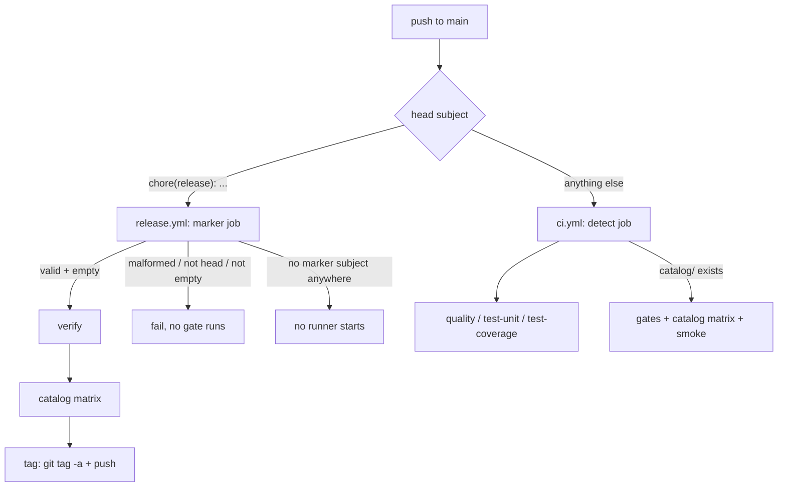

# Release Marker Commit + CI Consolidation — Design

**Spec**: `.specs/features/release-marker-commit/spec.md`
**Status**: Approved (owner, 2026-08-23)

---

## Architecture Overview

Two halves, no shared code. **(A)** `catalog.yml` is deleted and its jobs move into `ci.yml`,
behind a `detect` job that makes them inert in a generated product. **(B)** `release.yml` drops
`workflow_dispatch` and triggers on a push to `main` whose head commit is an empty
`chore(release): vX.Y.Z`; a tested module, not a YAML regex, decides.



---

## Decisions locked at Design

The five spec rows left `n — flagged` are now closed. Owner, 2026-08-23.

| Row | Resolution |
| --- | --- |
| How the catalog jobs self-disable in a child | A `detect` job probes `test -d catalog` and emits `template: true\|false`. It governs **six** things, not four — see the CI-03 correction below. `hashFiles()` in a job-level `if` stays forbidden: it evaluates before checkout. |
| Scope of "one CI" | `ci.yml` is the single workflow that runs **code gates** on push and PR. `release.yml` (different trigger, different permissions) and the template-only `format.yml` that `prettier-format-gate` T10 adds stay separate by construction. Nothing about formatting enters `ci.yml`. |
| The release's own duplicate of the catalog matrix | **Superseded.** The duplication is removed from the *other* side: `ci.yml` does not run on a marker push. `release.yml` keeps its full gate set, so AD-034's self-sufficiency is untouched. Rationale: a marker commit is empty, so the tree is byte-identical to the commit CI already gated. |
| The marker must be empty | Enforced, loud. A `chore(release):` head that changes at least one file fails before any gate, naming the file count. Consequence: an ordinary work commit can never become a release by accident. |
| Marker logic seam | `scripts/platform/lib/release-marker.mjs`, pure functions, covered by `pnpm test:scripts`. The workflow calls `node` and reads `$GITHUB_OUTPUT`. A regex inside YAML is only provable by pushing to GitHub. |

---

## Components

### 1. `.github/workflows/ci.yml` — merged, ships to the child

**Triggers**: `push: branches: [main]`, `push: tags: ["v*"]` (inherited from `catalog.yml`;
AD-033 requires `lintKernelRange` on every tag), `pull_request`.

**`detect`** — the single choke point, carrying both gate conditions:

- Job-level `if` skips the whole workflow on a marker push. It must be scoped to a **branch**
  push, or the `v*` tag pushed by `release.yml` — whose head commit *is* the marker — would
  skip too and silently retire AD-033:
  ```
  if: >-
    !(github.event_name == 'push'
      && github.ref == 'refs/heads/main'
      && startsWith(github.event.head_commit.message, 'chore(release): '))
  ```
- Steps: `actions/checkout`, then `[ -d catalog ] && echo template=true >> "$GITHUB_OUTPUT"`.
- Every other job carries `needs: detect`, so a skipped `detect` skips the workflow. One
  condition, one place.

**Jobs that always run** (`needs: detect`): `quality` (`turbo lint typecheck`,
`api build:emit`, `web build`), `test-unit` (`needs: [detect, quality]`, `pnpm test`),
`test-coverage` (`needs: [detect, quality]`, `pnpm test:coverage`). Unchanged from today.

**Jobs gated on `needs.detect.outputs.template == 'true'`** — the six the child cannot run:

| Job | Runs | Why it cannot run in a child |
| --- | --- | --- |
| `gates` | `test:scripts`, `catalog:lint`, `catalog:typecheck`, ADV-04 step | all three scripts are pruned from the child's `package.json` (`copier.yml:74`); `advisory-required.mjs` and `__tests__/` are `_exclude`d |
| `catalog` | 5-entry `catalog:check` matrix | `catalog:check` pruned; `catalog/` absent |
| `smoke` | `template:smoke` | `template:smoke` pruned; `scripts/template-smoke.mjs` `_exclude`d |

`gates` keeps `fetch-depth: 0` (already at `catalog.yml:19-20`) — `lintEntryBump` resolves the
previous stable tag from it. The ADV-04 step keeps its own `if: github.event_name ==
'pull_request'` **nested inside** the template gate; it compares a PR commit range and has no
meaning on a push.

`gates` **drops** `pnpm check` and `pnpm test` (`catalog.yml:27-28`) — `quality` and
`test-unit` already run them. That is the whole of CI-02.

### 2. `.github/workflows/catalog.yml` — deleted

With it, `copier.yml:35`'s `_exclude` entry. **Single-editor collision: `copier.yml` is
`audit-2026-08-23-remediation` T41.** See § Cross-feature collisions.

### 3. `.github/workflows/release.yml` — marker-driven

`workflow_dispatch`, its `version` input and the non-main ref guard step (`:21-26`) are all
deleted. `on: push: branches: [main]`; `concurrency: release` stays.

**`marker`** (new first job) — the only job with a trigger-level filter:

```
if: >-
  startsWith(github.event.head_commit.message, 'chore(release):')
  || contains(join(github.event.commits.*.message, '|'), 'chore(release):')
```

The condition is deliberately **loose**, and the second clause exists for MARK-07: a strict
grammar in the `if` would make a malformed marker skip silently instead of failing. Steps:
`checkout` with `fetch-depth: 0`, then `node scripts/platform/lib/release-marker.mjs --decide`.
Outputs `release` (`true|false`) and `version`.

**`verify`** — `needs: marker`, `if: needs.marker.outputs.release == 'true'`. Same six steps as
today, with `inputs.version` replaced by `needs.marker.outputs.version`.
**`catalog`** — `needs: [marker, verify]`, same `if`, matrix unchanged.
**`tag`** — `needs: [marker, verify, catalog]`; the only job with `permissions: contents: write`.

> **MARK-03 reading.** The AC says `tag` keeps `needs: [verify, catalog]`. `marker` is added
> because a job can only read outputs from a *direct* need. The set is a strict superset, so the
> AC's intent — no tag without green gates — is preserved, and `release-workflow.test.mjs` must
> be updated to assert the superset rather than equality.

### 4. `scripts/platform/lib/release-marker.mjs` — new, tested

Pure, no I/O. The CLI half of the workflow does the `git` calls and hands it data.

- `parseMarkerSubject(subject)` → `{ ok: true, version } | { ok: false, reason }`.
  Grammar: `^chore\(release\): v(\d+)\.(\d+)\.(\d+)$` — stable semver, no prerelease, exactly
  one space. Matches `stableTagsFromLsRemote`.
- `isMarkerSubject(subject)` → boolean, the loose `chore(release):` prefix.
- `decideRelease({ headSubject, subjects, changedFiles })` → one of:
  `{ action: "release", version }` · `{ action: "skip" }` (loose match came from a body line —
  no subject is a marker; exits 0, no gate runs) · `{ action: "fail", reason }`.
  Failure order: malformed head (MARK-06) → marker present but not head (MARK-07) → head marker
  changes files (MARK-08).
- CLI entry `--decide` (behind `isMain`, the repo idiom): collects `git log -1 --format=%s`,
  `git log --format=%s <before>..<sha>` and `git diff-tree --no-commit-id --name-only -r HEAD`,
  calls `decideRelease`, writes `$GITHUB_OUTPUT`, exits `EXIT_CODES.USAGE_ERROR` on `fail`.

**Ships to the child** (no `_exclude` entry), following the `release-preflight.mjs` precedent —
that file ships today and is equally inert there.

### 5. `pnpm platform release [version]` — new CLI subcommand

`scripts/platform/lib/commands/release.mjs`, registered in `cli.mjs` next to `status`. Follows
the `status.mjs` idiom: a pure `planRelease({ ... })` with injected deps, and a
`releaseCommand({ positionals, options, cwd, exec, log })` returning an `EXIT_CODES` value.

Order of operations — every refusal happens **before** any commit exists:

1. `git rev-parse --abbrev-ref HEAD` must be `main`; `git status --porcelain` must be empty
   (MARK-13).
2. Version = the argument, else `readLatestChangelogVersion` (`lib/kernel-version.mjs:24`).
3. `runPreflight({ version })` from `release-preflight.mjs` — on non-zero, return that exact
   exit code and let its message stand (MARK-11).
4. `git commit --allow-empty -m "chore(release): v<version>"` — exactly one commit, no tag,
   no push (MARK-12, AD-006/AD-034).
5. Print `git push origin main` as the operator's next act.

The `commit-msg` hook (`lefthook-local.yml:20-23` → `advisory-required.mjs`) passes without an
`Advisory:` trailer: `checkAdvisoryRequired` derives `touchedEntries` from
`git diff --cached --name-only`, which is empty for an empty commit, so it returns `{ok: true}`
(MARK-14). The only `pre-commit` hook (`lefthook-local.yml:12-18`, `catalog-lint`) is
glob-gated and does not fire either.

### 6. Record and docs

- **AD-034 amended**: "a tag is cut only by the `release` workflow the user dispatches" becomes
  the pushed marker; the deleted `workflow_dispatch` and ref guard are named as superseding that
  clause of REL-01 (`template-update-contract`). "Agents never tag and never push" is unchanged
  and now also covers `pnpm platform release`, which commits locally and stops.
- **AD-036 (new)**: `ci.yml` is the single gate workflow, it ships, and its template-only jobs
  are inert in a product behind `detect`.
- Docs: `docs/agents/workflow.md:134-135`, `TEMPLATE.md:24` and `:29`.

---

## Spec corrections this Design makes

| Spec text | Correction |
| --- | --- |
| CI-03's command list | **Omits `template:smoke`.** `catalog.yml:82-94` has a `smoke` job. Without it the merge silently drops a gate. The AC must name nine commands, not eight. |
| DOC-03's anchors | `docs/dev/template.md:58` carries no dispatch or tag instruction — the citation is stale. In `TEMPLATE.md` the `git tag v1.2.0` line is at `:24`/`:29`, not `:26`. Re-anchor at Tasks. |
| MARK-03 | `tag` needs a superset — see above. |
| Edge case "the 5-entry matrix runs twice — accepted" | No longer true: `ci.yml` skips the marker push. Delete the row. |
| Assumption "The release's own duplication survives … Worth revisiting at Design" | Revisited; resolved the other way round. |

---

## Risks & Concerns

| Concern | Location | Impact | Mitigation |
| --- | --- | --- | --- |
| `ci.yml` ships, and its marker skip goes with it. A product that pushes a commit subject `chore(release): ` gets **no CI at all**, silently. | `.github/workflows/ci.yml` (`detect.if`) | A child's convention collides with a template convention it never opted into | Owner-accepted, knowingly. Mitigate with a `# ` comment block on the `if` naming the behaviour, and a line in the changelog's `### Child migration steps` context. Escalate to a real fix (a template-only marker file) only if a product reports it. |
| `github.event.commits` is truncated at 20 entries by GitHub | `release.yml` `marker.if` | A >20-commit push carrying a *deep* marker whose head is not a marker may not trigger the loud MARK-07 failure | Accepted. `github.event.head_commit` is never truncated, so the release path itself is unaffected; only the diagnostic for an already-malformed push degrades. `decideRelease` still uses the authoritative `git log` range inside the job. |
| `github.event.before` is all-zeros on a branch's first push and lies after a force-push | `release-marker.mjs --decide` | The `subjects` range for MARK-07 cannot be computed | Fall back to `HEAD~1..HEAD` when `before` is all-zeros or `git log` exits non-zero; never fail the release for a range that cannot be resolved. |
| `release-preflight.mjs` messages are pt-BR while the docs refactor moves to English | `release-preflight.mjs:70-107` | The new CLI surfaces them verbatim, mixing languages | Out of scope. Do not rewrite them here — the CLI passes them through unchanged so the exit code and message stay identical between local and CI. |
| `gates.test.mjs` reads `catalog.yml` (`:84-90`) and `release-workflow.test.mjs` asserts the dispatch shape (`:18-63`) | `scripts/platform/__tests__/` | Both fail the moment the workflows change | They are in scope (DOC-04). Rewrite in the same task as the workflow they cover, never in a follow-up. |

---

## Cross-feature collisions, live 2026-08-23

Relayed by the `audit-2026-08-23-remediation` session; verified against disk.

| File | Other owner | Resolution |
| --- | --- | --- |
| `.github/workflows/ci.yml` | that feature's **T36** adds a `contract:check` step and asserts `format:check` is **absent** | Both hold here: nothing about formatting enters `ci.yml`, and `contract:check` belongs in a job that always runs (`quality`). Whoever lands second rebases onto the merged file. |
| `.github/workflows/catalog.yml` | its **T35** adds `fetch-depth: 0` to the `gates` job | **Already satisfied**: `catalog.yml:18-20` has it today. The obligation here is to *preserve* it on the merged `gates` job, not to add it. T35 becomes a no-op after this feature lands. |
| `copier.yml` | its **T41** is a single-editor task on the same `_exclude` list | Unresolved ordering. Deleting line 35 is a one-line edit; hand it to T41 if that feature lands first, otherwise T41 rebases. Must be settled before either feature's wave touches the file. |
| `catalog.yml` formatting | `prettier-format-gate` T7 reformats every `.yml` | Deletion wins; whoever goes second re-runs the formatter over the merged `ci.yml`. |

---

## Tech Decisions

| Decision | Choice | Rationale |
| --- | --- | --- |
| Where the marker skip lives in `ci.yml` | One `if` on `detect`; every other job `needs: detect` | One condition in one place. A per-job `if` would be six copies of the drift this feature exists to remove. |
| Marker skip scoped to a branch push | `github.ref == 'refs/heads/main'` in the condition | Without it the `v*` tag push — whose head commit *is* the marker — skips `ci.yml` and silently retires AD-033. |
| `detect` probes `catalog/`, not `copier.yml` | `[ -d catalog ]` | `catalog/` is the concrete dependency of all six gated commands; `copier.yml` only correlates. Confirmed inert in a child: `plan.mjs:84-105` writes vendored modules to `apps/api/**` and the web root, never to a `catalog/` mirror. |
| `marker` job's `if` is loose, the module is strict | prefix match in YAML, grammar in `.mjs` | A strict `if` turns a typo into a silent skip — the exact failure MARK-06 exists to prevent. |
| `release-marker.mjs` ships to the child | no `_exclude` entry | Matches `release-preflight.mjs`, which ships today. Adding an exclusion would also need a `copier.yml` edit, and that file is contended. |

> **Project-level:** AD-036 is appended to `.specs/STATE.md § Decisions` at Tasks; AD-034 is
> amended in the same commit.
