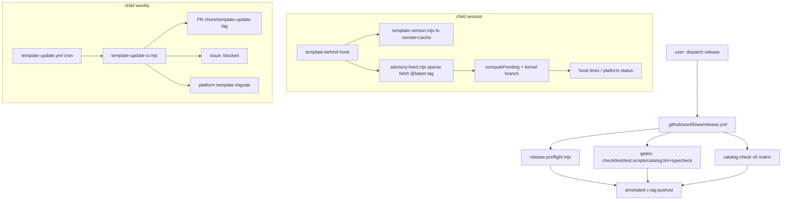

# template-update-contract Design

**Spec**: `.specs/features/template-update-contract/spec.md`
**Status**: Approved (approach locked by `context.md` decisions 1–4, user-confirmed 2026-08-23)
**Baseline**: `main` @ `9d6e071`

## Architecture Overview

Seven blocks, all reusing the existing `scripts/platform` patterns (thin CLI/workflow over
exported, injectable-runner functions; node:test in `scripts/platform/__tests__`).

Conforms to: AD-006 (version truth = tag + changelog), AD-033 (kernelRange vs changelog),
`docs/agents/workflow.md` tag rule (the workflow is dispatched by the user; agents still
never tag/push). No active AD is superseded.

## Code Reuse Analysis

| Component | Location | How to use |
| --- | --- | --- |
| Changelog version parsing | `scripts/platform/lib/kernel-version.mjs` (`CHANGELOG_HEADING`, `readLatestChangelogVersion`) | Preflight reuses; add `readChangelogSection(version)` helper here (heading → next heading slice) |
| Installed/remote tag logic | `scripts/platform/lib/template-version.mjs` (`parseInstalledVersion`, `stableTagsFromLsRemote`, `cachedRemoteStableTags`, `computeTemplateStatus`) | Feed + bot + cadence consume as-is; injectable `exec`/`now` pattern copied |
| Sparse git fetch + cache-by-hash | `scripts/platform/lib/catalog-source.mjs` (`resolveCatalog`, `hashRef`, `expandGitShorthand`) | `advisory-feed.mjs` clones the same way (`--depth 1 --filter=blob:none --sparse --branch <tag>`, `sparse-checkout set docs/advisories`) |
| Advisory parse/pending | `scripts/platform/lib/advisories.mjs` (`loadAdvisories`, `readLedger`, `computePending`) | Extend `computePending` with the kernel branch; feed merges into its `advisories` input |
| Hook skeleton (events, first-prompt dedup, silent-fail, exit 0) | `.claude/hooks/template-behind.mjs`, `.claude/hooks/pending-advisories.mjs` | Extend `template-behind`; keep `pending-advisories` for local-only advisories |
| Injectable step runner for CI-ish scripts | `scripts/platform/catalog-check.mjs` (`defaultRun`, timeout tracker) | `template-update-ci.mjs` copies the shape (plan pure, run injectable) |
| Exit codes | `scripts/platform/lib/exit-codes.mjs` | Preflight and bot reuse; add codes only if none fits |
| Lint plumbing | `scripts/platform/catalog-lint.mjs` + `lib/lint.mjs` | New `lintAdvisoryModule` + non-major-steps rule follow `lintKernelRange`'s shape |
| CI job steps | `.github/workflows/catalog.yml` (pnpm/node setup block, entry matrix) | `release.yml` copies the setup block and the 5-entry matrix |

Integration points: `scripts/platform/cli.mjs` gains the `template migrate` route (same
dispatch table as `status`); `copier.yml` must NOT exclude `template-update.yml`,
`docs/dev/template-update.md`, `scripts/platform/migrations/**` (they ship to the child)
while `release.yml` IS excluded (template-only, like `catalog.yml` at `copier.yml:31`).

## Components

### release-preflight.mjs (new, `scripts/platform/`)

- **Purpose**: Everything checkable about "may version X be tagged now", as one testable script.
- **Interfaces**: `runPreflight({ version, repoRoot, exec, log })` → exit code; `--message <version>` mode prints the changelog section's first paragraph (used by the workflow for `git tag -a -m`). Checks, in order: version === `readLatestChangelogVersion` (REL-01); `git tag -l v<version>` empty (REL-01, covers the double-dispatch edge); previous stable tag exists → entry-change guard: for each `discoverEntries` dir, `git diff --quiet <prev> HEAD -- <dir>` vs `git show <prev>:<dir>/module.json` version equality (REL-04); non-major → migration-steps rule on the section (REL-05, shared rule function with the lint).
- **Reuses**: kernel-version.mjs, lint.mjs `discoverEntries`, exit-codes.
- **Note**: HEAD==main is asserted by the workflow (`github.ref == 'refs/heads/main'`), not by the script.

### release.yml (new, `.github/workflows/`)

- **Shape**: `workflow_dispatch` with input `version`; `concurrency: release` (no parallel dispatches); job `verify` = setup block + `node scripts/platform/release-preflight.mjs <version>` + the five gate commands; job `catalog` = 5-entry matrix `pnpm catalog:check <entry>` (needs: verify); job `tag` (needs: verify+catalog, `permissions: contents: write`) = `git tag -a v<version> -m "$(node …release-preflight.mjs --message <version>)"` + `git push origin v<version>`. REL-02 holds structurally: `tag` needs green upstream jobs. Excluded from copier.
- **Proof**: REL-03 probe = `actionlint` + review; the script pieces are unit-tested.

### computePending kernel branch (edit, `lib/advisories.mjs`)

- **Interface**: `computePending(lock, advisories, ledger, { templateVersion } = {})`. `advisory.module === "kernel"` → skip lock lookup entirely; pending iff `templateVersion` truthy ∧ `semver.satisfies(templateVersion, affects)` ∧ not in ledger (KADV-01/02/04). Entry advisories unchanged. All three callers (`commands/status.mjs`, `commands/advisory.mjs`, `.claude/hooks/pending-advisories.mjs`) pass `templateVersion: parseInstalledVersion(answers._commit)`; `pending-advisories.mjs` reorders so `noLock` no longer short-circuits kernel advisories (KADV-02) — it prints kernel lines first, then the noLock notice or entry lines.

### lintAdvisoryModule + migration-steps rule (edit, `lib/lint.mjs` + `catalog-lint.mjs`)

- `lintAdvisoryModule(advisory, entryNames)` → error unless `module` is `kernel` or in `discoverEntries`-derived names (`name` / `name/variant`) (KADV-05). `lintChildMigrationSteps(sectionText, version)` → for non-major versions, every numbered step must start with a backticked command, or the section is exactly `None — copier update is enough.` (REL-05; shared by preflight). Both wired in `runLint` next to `lintKernelRange`.

### advisory-feed.mjs (new, `scripts/platform/lib/`)

- **Interface**: `fetchRemoteAdvisories(source, tag, { cacheRoot = tmpdir, ttlMs = 24h, timeoutMs = 8000, exec, now })` → `{ tag, tagDate, advisories, fromCache }`; throws `FeedUnreachableError`. Sparse-clones `docs/advisories` at `tag` into a temp dir, parses via `loadAdvisories` (unparseable file → skipped, collected in `skipped[]` — FEED edge), reads `tagDate` = `git log -1 --format=%cI`, caches JSON at `platform-template-feed-<hashRef(source)>.json` keyed `{source, tag}`. `mergeAdvisories(local, remote)` → by id, remote wins (FEED-01).
- **Consumers**: `template-behind.mjs` (silent on throw — FEED-03/04), `commands/status.mjs` (surfaces `error`/`skipped`).

### template-behind.mjs extension (edit, `.claude/hooks/`)

- After the existing behind computation (which already resolved `source` and latest tag): feed fetch → merge with local `loadAdvisories` → `computePending` with `templateVersion` → print each pending kernel advisory as `<id> <kind> <severity> kernel — fix: <first line of fix>` (FEED-02). Every failure path stays `exit 0` silent.

### cadence.mjs (new, `scripts/platform/lib/`)

- **Interface**: `advisoryIdDate(id)` (from `ADV-YYYYMMDD-NN`), `ageDays(dateIso, now)`, `isOverdue(kind, days)` with `{security: 7, breaking: 30, bug: 30}` (CAD-01). `status` prints `(<n>d, overdue)` per pending kernel advisory and `latest <tag> published <n> days ago` from the feed's `tagDate` (CAD-02); OK output unchanged (CAD-03).

### template-update-ci.mjs (new, `scripts/platform/`) + template-update.yml (new)

- **Split**: `planUpdate({ status, openPrs, closedPrs, openIssues })` is pure → `{ action: "none" | "update", tag }` honoring idempotency (open PR for tag → none; closed-unmerged PR for tag → none — BOT-03 + closed-PR edge). `runUpdate({ tag, run, log })` executes: branch, `copier update --trust --vcs-ref <tag>`, conflict scan, `pnpm platform template migrate`, `pnpm install`, `pnpm check && pnpm test`, then `gh pr create` (BOT-02/03) or `gh issue` create-or-comment `template update to <tag> blocked` with conflicting files / failing step tail (BOT-04). Exit non-zero with the `TEMPLATE_READ_TOKEN` hint when the origin clone fails auth/unreachable (BOT-06).
- **Conflict detection**: copier `--conflict rej` (its default) → scan for `**/*.rej`. ⚠ Verify against the installed copier's docs in the implementing task before relying on it (chain step 3/4 deferred; the `template-update` skill's Conflict rules section is the local reference).
- **Workflow**: weekly cron + `workflow_dispatch`; `if: hashFiles('.copier-answers.yml') != ''` makes it inert in the template repo (BOT-05 — the template root has no answers file since `74022fe`); permissions `contents: write, pull-requests: write, issues: write`; ships to the child (not in `_exclude`).

### template-migrate.mjs (new, `scripts/platform/lib/commands/`)

- **Interface**: `platform template migrate [--target vX.Y.Z]` → runs every `scripts/platform/migrations/v*.mjs` with version ≤ target (default: installed `_commit`), ascending; each script exports `run({ cwd, log })` and owns its idempotency check (MIG-01) — no state file. Stops at first failure naming the script (MIG-02). No scripts dir → no-op success. `cli.mjs` route + removal NOT added to copier's script-prune task (the child keeps it).

### Docs + retro advisories

- `docs/dev/template-update.md` (new, ≤80 lines, ships to child): the two-sided contract + cadence table (CAD-04).
- `docs/agents/workflow.md`: tag rule edited — user dispatches `release`; agent still never tags (DOC-02). `docs/advisories/README.md`: `module: kernel` + feed (DOC-03). `docs/dev/template-changelog.md`: `## v2.3.0` section satisfying REL-05 (MIG-03).
- `ADV-20260823-01` (kernel, bug, `>=2.0.0 <2.1.0`, issue #9) and `-02` (kernel, bug, `>=1.0.0 <2.2.0`, fixture leak), `parity` → the template tests proving each fix (KADV-06).
- AD-034 appended to `.specs/STATE.md` at the DOC task (DOC-01).

## Error Handling Strategy

| Scenario | Handling | User impact |
| --- | --- | --- |
| Preflight mismatch / existing tag / unbumped entry / manual step in minor | Named message, non-zero exit, workflow stops before gates | Release refused with the exact reason |
| Any gate red in release.yml | `tag` job never runs (needs) | No tag exists; run page shows the red step |
| Feed unreachable/timeout/corrupt cache | Hook: silent, exit 0, cache if present; status: `error` field | Session never blocked; status names the failure |
| Remote advisory unparseable | Skipped in hook; listed by status | One bad file cannot hide the others |
| Bot: copier conflict or red gate | Issue created/updated, no branch push | One issue per tag, refreshed not duplicated |
| Bot: origin unreachable | Run fails naming `TEMPLATE_READ_TOKEN` | Actionable failure on private origins |
| Migration script fails | Runner stops, names script, later scripts unrun | Child tree left at the failing step, reported |

## Risks & Concerns

| Concern | Location | Impact | Mitigation |
| --- | --- | --- | --- |
| Hook latency: first sparse clone per 24 h adds up to ~8 s to session start | `template-behind.mjs` | Slow first prompt | 8 s timeout, 24 h cache, fetch only when already behind (ls-remote result already in hand) |
| `GITHUB_TOKEN` tag push does not re-trigger `Catalog` on the tag event | `release.yml` | No separate on-tag run recorded | Accepted in spec assumptions; the release run is the evidence |
| Copier conflict artifact (`*.rej`) not verified against installed version | `template-update-ci.mjs` | Bot could miss conflicts | Explicit verify step inside the implementing task (BOT-04) before the scan is trusted |
| `computePending` signature change ripples to 3 callers + tests | `lib/advisories.mjs:48` | Silent miss if a caller is skipped | Options-object (backward-compatible); test asserts kernel advisory ignored when `templateVersion` absent |
| `copier.yml` `_exclude` drift: new files must land on the right side | `copier.yml:31` | Child missing the bot, or template workflows leaking | `copier-answers-leak.test.mjs` pattern: a scripts test asserts the exclude list covers `release.yml` and not `template-update.yml` |
| Repo-wide `prettier --check` crash (known Handoff follow-up) | `.prettierrc` | None for gates | Untouched here |

## Tech Decisions (feature-local)

| Decision | Choice | Rationale |
| --- | --- | --- |
| Preflight in node, workflow thin | All decidable checks in `release-preflight.mjs` | Testable without Actions; the workflow only sequences |
| Kernel branch inside `computePending`, not a second function | Options-object 4th parameter | One pending model; callers stay one-call |
| No state file for migrations | Each script idempotent, run all ≤ target | Removes a sync problem; re-runs are free |
| Feed cache separate from tags cache | Own JSON keyed by source+tag | Different TTL semantics and payload; no coupled invalidation |
| Bot plan/run split | Pure `planUpdate` + effectful `runUpdate` | The decision matrix is the risky part — unit-tested without git/gh |

## Spike results

Seam survey at `d52b86f` recorded in `.specs/STATE.md` § Handoff entry (template-version
exports, hook behaviors, `computePending` shape, `advisory-required` regexes, catalog.yml
matrix, copier `_tasks`/`_skip_if_exists`/excludes). No further measurements taken.
