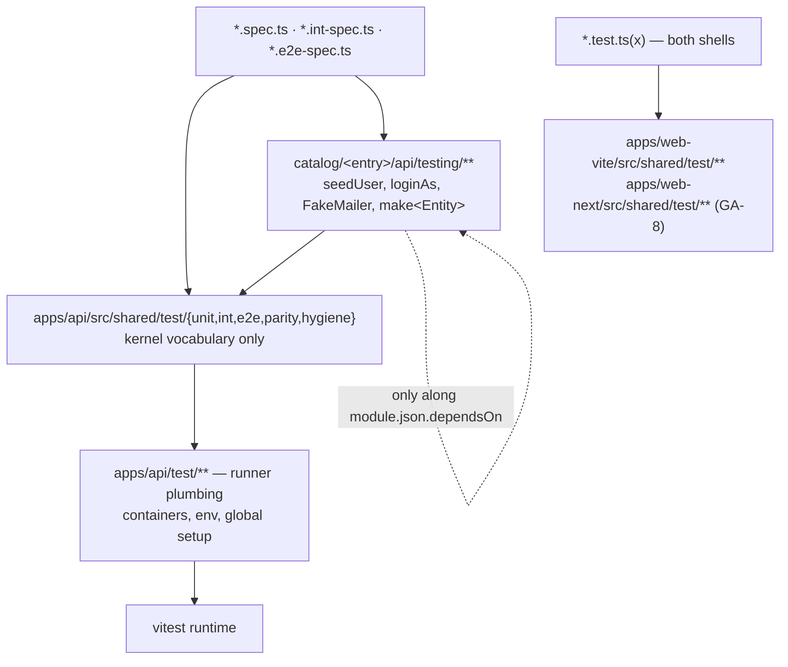

# Test Suite Refactor Design

**Spec**: `.specs/features/test-suite-refactor/spec.md`
**Context**: `.specs/features/test-suite-refactor/context.md`
**Tasks**: `.specs/features/test-suite-refactor/tasks.md` (18 tasks / 7 clusters / 4 waves)
**Status**: **Approved 2026-08-24**
**Decisions loaded**: AD-013 (catalog model, RULE C), AD-016 (entry versions), AD-019 (advisories), AD-021/AD-024/AD-025 (entry-to-entry coupling), AD-026 (a cross-entry e2e lives in the dependent), **AD-027** (flat 90 coverage floors, `pnpm test:coverage` is the pre-push gate), AD-028 (no `test*` task in Turbo) — this design **conforms** to all of them and adds AD-023 (§ *Tech Decisions*). **AD-012 is superseded by AD-027** and is loaded only as history: the 95 % bar it carried is not a target of this feature.

> **Reconciled to the scope cut, 2026-08-24.** This file was authored 2026-08-19 against a plan of
> 40 tasks / 10 clusters / 5 waves. `tasks.md` § *Scope cut* reduced it to **18 / 7 / 4** and
> `spec.md`'s re-baseline note recorded what the world had moved under it. Every component below now
> has a live owner in `tasks.md`; components that lost their owner were deleted, not left as
> orphaned prose. The three structural changes are: **GA-8** (the web harness lands in *both* shells),
> **GA-9** (enforcement ships at full strength against a generated baseline that can only shrink,
> which is what makes the 250-file sweep unnecessary instead of postponed), and the removal of the
> coverage ratchet (a new owner decision on AD-027, not this feature's work). § *Spike results* is
> preserved as the dated 2026-08-19 audit and is explicitly **historical** — the tree has moved and
> the section says where.

## Architecture Overview

Three layers, one direction of import. Nothing below imports from anything above it.



Two import rules, both enforced by a spec rather than by review:

- **RULE C (existing)** — `apps/api/src/shared/**` carries no module vocabulary. The kernel harness therefore knows schemas as strings, dispatchers as a `Pollable[]` option and users not at all. Implemented today in `apps/api/src/modules/module-boundaries.spec.ts` alongside RULE A.
- **RULE D (new, this feature)** — a test file may import another entry's `testing/` barrel only when that entry is in its `module.json.dependsOn`, and only when the edge keeps the `dependsOn` graph acyclic (AD-025). `module-boundaries.spec.ts` gains the rule (T34); `catalog-lint` reports it for an uninstalled entry. The file carries RULE A and RULE C only today — RULE D is unimplemented and T34 is its sole owner.

**What enforcement measures itself against (GA-9).** Every rule this feature ships is switched on at
full strength immediately, against a *generated* record of the violations that already exist:
`eslint.suppressions.json` (native to ESLint 10 — this repo is on `eslint@10.4.0`) for the lint
rules, `harness-hygiene-baseline.json` for the guard spec. A violation absent from the baseline
fails; a baseline entry that no longer matches **also** fails. The file can only shrink, so
migration becomes opportunistic — whoever next touches a file pays for that file — instead of a
250-file sweep this feature would have to fund up front.

## Code Reuse Analysis

### Existing components to leverage

| Component | Location (today) | How to use |
| --- | --- | --- |
| App bootstrap | `apps/api/test/setup/app-factory.ts` | becomes the body of `createE2eApp`, moved into the kernel harness; the module-aware bits become the `overrides`/`extraModules` options |
| Pool + truncate | `apps/api/test/setup/test-db.ts` (+ its `test-db.int-spec.ts`) | split: generic pool/reset into `shared/test/int/db.ts`, the module-named truncations deleted in favour of `resetDb(pool, schemas)`; **the spec moves with the code** — a spec may not stay under `test/setup/` (component 8) |
| Cookie readers | `apps/api/test/setup/cookies.ts` | becomes `cookieValue`/`cookieHeader` in `shared/test/e2e/http.ts`; the ad-hoc styles in specs collapse onto it |
| Silent logger | `apps/api/test/setup/test-logger.ts` | `makeTestLogger()` in `shared/test/int/logger.ts`, reused by `fakeLogger()` |
| Seeds and mailer already in an entry | `catalog/identity/single-tenant/api/testing/{seed-user.ts,fake-mailer.ts,allow-all-rate-limiter.ts,seeds/**}` · `catalog/notification/api/testing/{fake-mailer.ts,sample-templates/}` · `catalog/audit/api/testing/{reattach-identity-tables.ts,reattach-tag-tables.ts}` | already in the right place, wrong shape — **no `index.ts` in any of the three**, and `FakeMailer` is duplicated across identity and notification. The barrel tasks add the index, keep every existing file (audit's two `reattach-*` helpers are live consumers' code, not dead weight) and leave one owner (notification) for `FakeMailer`, with identity importing it along its existing `dependsOn` edge |
| Contract snapshot + source survey | `apps/api/src/shared/test/parity/contract-snapshot.ts`, `apps/api/src/shared/test/unit/source-survey.ts` | precedent that `shared/test/**` is an allow-listed home, and `unit/` already exists — T2 adds files beside `source-survey.ts`, it does not create the folder |
| Local ESLint rule precedent | `packages/eslint-config/rules/` + the registration shape already used by the package's flat configs | copy the registration shape for `no-existence-only-assert` |
| Web harness | `apps/web-vite/src/shared/test/` and `apps/web-next/src/shared/test/` — each `{fixed-clock.ts, msw-server.ts, render-with-providers.tsx}`, **verified byte-identical across the two shells today** | kept and extended in both shells (GA-8); `fixed-clock.ts` has no consumer and is deleted from both |
| Boundaries spec | `apps/api/src/modules/module-boundaries.spec.ts` | host for RULE D |
| Entry install gate | `scripts/platform/catalog-check.mjs` (`pnpm catalog:check`) | proves `module.json.files` really ships `testing/**` — the entry is installed into a scratch child and its tests run there |
| Coverage merge | `vitest.coverage.mts` — one run over the four projects, v8, `WEB_DIR` resolver at `:7-10`, flat 90 floors global + per glob at `:57-77` | **floors untouched** (the ratchet is cut). T5 owns one change: the entry-barrel exclude. `**/shared/test/**` is already excluded at `:51`; `apps/api/src/modules/*/testing/**` is **not**, and that is a live defect **in the child**, where the barrels land inside the `apps/api/src/**` include glob |

### Integration points

| System | Integration |
| --- | --- |
| vitest (api) | `apps/api/vitest.{config,int.config,e2e.config,catalog.config}.mts` + `vitest.shared.mts`; T5 adds the entry-barrel `exclude` to `vitest.coverage.mts`; `sequence.shuffle` becomes the default for the `api-e2e` project in CI (T37) |
| vitest (web) | `apps/web-vite/vitest.config.ts` and `apps/web-next/vitest.config.ts` — **two live projects**, 24 and 19 test files. Harness exports only; **no threshold change** (the ratchet left scope; the floors stay at a flat 90) |
| lefthook | pre-push is `migrations → typecheck → catalog-typecheck → test-coverage` (AD-027, needs Docker); this feature changes the gate's *denominator*, never its floors |
| turbo | untouched — `turbo.json` carries no `test*` task, tests run outside Turbo (AD-028); T38 pins that shape |
| GitHub Actions | **`catalog.yml` no longer exists** — the workflows are `ci.yml`, `release.yml` and `format.yml`. `ci.yml` already carries the `web_stack: [vite, next]` matrix on `catalog:check` (`:151`) and `template:smoke` (`:199`); T37 extends it in place. **Any job T37 adds must also satisfy `release-gate-parity.test.mjs`**, which derives what `release.yml` must run from the `ci.yml` jobs carrying a `web_stack` leg — a check added to CI alone is exactly the asymmetry that let `v2.4.0` ship broken |
| copier | `apps/api/src/shared/test/**` ships with the template; entry `testing/**` ships through `module.json.files`; the web harness ships from whichever shell the child renders (GA-8) |

## Components

### 1. Unit harness — `apps/api/src/shared/test/unit/`

**Purpose**: typed doubles with no module vocabulary. The folder already exists (`source-survey.ts`); this adds to it.
**Files**: `mock-of.ts`, `clock.ts`, `request-context.ts`, `logger.ts`, `constants.ts`, `index.ts`.
**Interfaces**:

- `mockOf<T>(partial?: Partial<Mocked<T>>): Mocked<T>` (`Mocked` from `"vitest"`) — every method not supplied is a `vi.fn()` that **rejects** with `Error("<method> not stubbed")`.
- `fixedClock(iso = FIXED_NOW): Clock`
- `fakeRequestContext(partial?: Partial<RequestContextStore>): RequestContext` — kernel defaults `correlationId: "c1"`, `userAgent: "test"`, `actor: null`.
- `fakeLogger(): { logger, loggerFactory, lines }`
- `FIXED_NOW`, `TEST_PASSWORD`.

**Dependencies**: kernel types only (`Clock`, `RequestContextStore`, logger port).
**Reuses**: `test/setup/test-logger.ts`.

### 2. Int harness — `apps/api/src/shared/test/int/`

**Purpose**: one database and one Redis per suite, owned by the harness.
**Files**: `db.ts`, `with-test-db.ts`, `redis.ts`, `logger.ts`, `index.ts`, and the migrated `db.int-spec.ts` (from `test/setup/test-db.int-spec.ts`).
**Interfaces**:

- `createTestPool(): Pool` · `createTestDb(pool): TestDb`
- `resetDb(pool, schemas: readonly string[]): Promise<void>` — one `TRUNCATE`, schema names validated against `information_schema` first.
- `truncateKernel(pool)` = `resetDb(pool, ["_kernel"])`
- `withTestDb(opts: { schemas: readonly string[] }): { pool, db, txm, logger }` — registers its own `beforeAll` / `beforeEach(resetDb)` / `afterAll(pool.end)`.
- `testRedisUrl(): string` · `flushRedis(): Promise<void>` · `makeTestLogger()`

**Dependencies**: `pg`, drizzle, the global container URIs from the runner plumbing.
**Reuses**: `test/setup/test-db.ts`, `test/setup/container-uris.ts`.
**Scope note (UNT-02)**: the kernel int-specs move onto `withTestDb` here. The two *entry* int-specs that boot their own `GenericContainer` — `catalog/notification/api/infrastructure/realtime/realtime.int-spec.ts` and `catalog/identity/single-tenant/api/infrastructure/rate-limit/redis-rate-limiter.int-spec.ts` — are **outside the cut scope** (entry unit and int specs are not migrated) and enter the GA-9 hygiene baseline, where the guard spec's `GenericContainer` ban records them and can only see them removed.

### 3. E2E harness — `apps/api/src/shared/test/e2e/`

**Purpose**: the only app bootstrap and the only assertion vocabulary for HTTP.
**Files**: `app.ts`, `http.ts`, `outbox.ts`, `wait-for.ts`, `problem.ts`, `constants.ts`, `index.ts`.
**Interfaces**:

- `createE2eApp(opts?: { rateLimiter?: "allow-all" | "real"; overrides?: Array<[token, value]>; extraModules?: Type[]; middleware?: "full" | "none" }): Promise<{ app, http, close }>`
- `withE2ePool(): { pool }` — suite-scoped, closed in `afterAll`.
- `drainOutbox(app, opts?: { dispatchers?: Pollable[]; until?: () => Promise<T | undefined>; timeoutMs?: number; intervalMs?: number }): Promise<T | void>` — default dispatcher is the kernel `OutboxDispatcher`; an entry passes its own (`DELIVERY_DISPATCHERS(app)`) so the kernel never names a module's dispatcher.
- `waitFor<T>(fn, opts?): Promise<T>` · `expectProblem(res, expected: { status; type?; title?; detail? }): void`
- `cookieValue(res, name): string | undefined` · `cookieHeader(res): string[]`
- `E2E_ORIGIN` (reads `process.env.WEB_ORIGIN`), re-export of `TEST_PASSWORD`.

**Kernel e2e migrated onto it (T4)**: `apps/api/test/` holds **five** e2e specs today — `bootstrap-product`, `health`, `openapi-contract`, `runner-env`, `security-bootstrap` — not the two the 2026-08-19 audit recorded. All five are in T4's `Touches` (`apps/api/test/*.e2e-spec.ts`); `runner-env` and `health` may legitimately need `middleware: "none"` rather than the full app.
**Dependencies**: Nest testing module, supertest, kernel middleware from `main.ts`.
**Reuses**: `test/setup/app-factory.ts`, `test/setup/cookies.ts`.

### 4. Guard spec — `apps/api/src/shared/test/hygiene/`

**Purpose**: make the duplication bans executable and permanent instead of grep-in-a-review. This is what keeps the refactor from decaying, and — with its baseline — what makes the scope cut sound.
**Files**: `scan.ts`, `scan.spec.ts`, `harness-hygiene.spec.ts`, **`harness-hygiene-baseline.json`**.
**Interfaces**: one spec file with one `it` per ban, each reporting `file:line` for every hit:

- exactly one file matching `Test.createTestingModule`;
- no local definition of the banned helper names (`allowAll`, `login`, `loginAndGetCookie`, `extractCookieValue`, `parseSetCookie`, `linkFromHtml`, `waitFor`, `pollUntil`, `findSent`, `makeInMemoryStorage`, `seedUser`) outside the harness and the entry barrels;
- no `PNG_1PX` byte literal, no literal web origin, no password literal outside those homes;
- no `createTestPool(` inside an `it`/`test` body;
- no `Record<string, any>` in a spec; `as never` / `as unknown as` only under `shared/test/**`;
- no `<Aggregate>.fromProps({` in a spec outside a `testing/` barrel;
- no `GenericContainer` in an `*.int-spec.ts`;
- `apps/api/test/setup/` contains only the runner-plumbing allow-list, and holds **no spec file**;
- **GA-8 parity** — the shell-agnostic half of `src/shared/test/` is byte-identical between `apps/web-vite` and `apps/web-next`; only the router helper may differ.

**Baseline contract (GA-9)**: every hit that exists on the tree the day the spec lands is written to
`harness-hygiene-baseline.json`. A hit absent from the baseline fails the spec. A baseline entry that
no longer matches **also** fails, so a fixed violation must be deleted from the file in the same
commit and the baseline can only shrink. It is a record of debt, never an allow-list.
**Scan scope**: `apps/api/**`, `catalog/**` and **both web shells** when they exist, `apps/api/**` + `apps/web/**` alone in a child; `node_modules`, `dist`, `coverage` and **`apps/api/.catalog-stage/**`** (the staging mirror of the entries, generated by `catalog:check`) are excluded — scanning the mirror would double every hit.
**Dependencies**: `fast-glob` (already a dev dependency of the scripts) and `node:fs`; no runtime code.
**Reuses**: the file-walk shape of `module-boundaries.spec.ts`.

### 5. Entry testing barrels — `catalog/<entry>/api/testing/index.ts`

**Purpose**: module vocabulary lives with the module and travels with it into the child.
**Interfaces**:

| Entry | `testing/` today | Exports after the barrel task |
| --- | --- | --- |
| `identity/single-tenant` (T6) | `seed-user.ts`, `fake-mailer.ts`, `allow-all-rate-limiter.ts`, `seeds/**` — no index | `seedUser(pool, opts)`, `loginAs(http, email, password?)`, `tokenFromMail(mailer, to, opts?)`, `makeUser(overrides?)`, `makeIdentityConfig`, `emails`, `seedEmail(suite, local)`, `allowAllRateLimiter`, re-export of notification's `FakeMailer` |
| `notification` (T17) | `fake-mailer.ts`, `sample-templates/` — no index | `FakeMailer` (single owner), `findSent(mailer, { to, subject? })`, `makeNotification(overrides?)`, `DELIVERY_DISPATCHERS(app): Pollable[]` |
| `attachment` (T18) | **none** | `inMemoryStorage(): ObjectStoragePort & { objects }`, `PNG_1PX`, `seedAttachment(pool, storage, opts)`, `makeAttachment(overrides?)` |
| `tag` (T23) | **none** | `makeTag(overrides?)`, `seedTag(pool, opts)` |
| `audit` (T23) | `reattach-identity-tables.ts`, `reattach-tag-tables.ts` — no index | `makeAuditEntry(overrides?)`, `seedAuditEntry(pool, opts)`, **plus the two existing `reattach-*` helpers, kept and re-exported** — they have live consumers and are not superseded by the barrel |

Each barrel task also moves **that entry's e2e files** onto the harness — the barrel proves itself on a real consumer, not on speculation. The entry's unit and int specs are **not** migrated; they enter the GA-9 baseline.
**Dependencies**: the entry's own domain plus, along `dependsOn` only, another entry's barrel (identity → notification for `FakeMailer`; attachment/tag/audit → identity for `loginAs`).
**Reuses**: the files already sitting in the three `testing/` folders; `identity.config.fixture.ts` moves into the identity barrel.

### 6. Web harness — both shells (GA-8)

**Purpose**: the same idea, one layer thinner (the template web is a shell) — and in **both** live shells, because a rendered child has exactly one web app and a seam built in one shell only is a seam a `web_stack=next` child silently loses.
**Where**: `apps/web-vite/src/shared/test/` and `apps/web-next/src/shared/test/`, at the **identical relative path**; `apps/web/src/shared/test/` in the rendered child. Every `apps/web/**` path in `spec.md` reads as both shells here.
**Interfaces**: `renderWithProviders` (existing), `makeTestQueryClient`, `createQueryWrapper(qc?)`, `resetAuthState()`, `useMswServer(...handlers)` — **byte-identical between the shells**, which the three existing files already are today. `mockRouter(opts?: { navigate?; pathname?; outlet? })` as one `vi.hoisted` shape is **the only permitted divergence**: `@tanstack/react-router` in `web-vite`, the Next router in `web-next`. `fixed-clock.ts` is deleted from both (no consumers).
**Why not a shared package**: it would be copied into the child carrying the other shell's dead code.
**Enforcement**: the parity is asserted by the guard spec (component 4), not by convention.
**Dependencies**: vitest, testing-library, msw.

### 7. Test lint — `packages/eslint-config/`

**Purpose**: the mechanical half of "every test proves a value".
**Interfaces**: `@vitest/eslint-plugin` (`^1.6`) and `eslint-plugin-testing-library` (`^7.16`) are already dependencies and already wired in `vitest.js`; this feature adds **`eslint-plugin-jest-dom`** on the web test globs, pins the versions, and extends the globs to cover **both shells**. The local rule `rules/no-existence-only-assert.js` is registered the way the package already registers its local rules, with a `RuleTester` suite beside it (`rules/no-existence-only-assert.test.js`).
**Rule semantics**: report when **every** `expect` chain in the test body ends in an existence-only matcher (`toBeDefined`, `toBeUndefined`, `toBeTruthy`, `toBeFalsy`, `resolves/rejects.toBeDefined`, argument-less `not.toThrow`); exempt a body that also asserts a concrete value, that declares `expect.assertions(n)`, or that passes a matcher to `not.toThrow(...)`.
**Baseline (GA-9)**: the rules ship as `error` with `eslint.suppressions.json` generated in the same commit — ESLint 10's native bulk-suppressions file, so no `eslint-disable` comment and no glob allow-list enters the tree. CI fails on a **new** violation *and* on a **stale** suppression, so the file can only shrink.
**Proof that the plugin set is active**: a config test resolving `calculateConfigForFile` for one api test file and one test file **per web shell**, asserting the rule severities — a rule that is configured but not reachable would otherwise pass unnoticed.

### 8. Runner plumbing — `apps/api/test/`

**Purpose**: what the runner needs and no spec imports.
**Allow-list after the refactor**, checked against the tree as it is today: `global-setup.ts`, `e2e-env.ts`, `int-env.ts`, `unit-env.ts` (importing the shared env block instead of duplicating it), `e2e-after-env.ts`, `container-uris.ts`, `docker-runtime.ts`, plus the kernel e2e specs at `apps/api/test/*.e2e-spec.ts` and their `__snapshots__/`. The `vitest.*.mts` configs live one level up, in `apps/api/`, not in `test/`.
**Removed from `test/setup/`**: `app-factory.ts`, `cookies.ts`, `test-db.ts`, `test-logger.ts` (moved into the harness) and **`test-db.int-spec.ts`** (moves with its subject — a spec under `test/setup/` is itself a violation the guard spec bans).
**Not present, and not to be invented**: `global-teardown.ts` and `global.d.ts` were named by the 2026-08-19 audit and do not exist; teardown is handled inside `global-setup.ts`.

### 9. Gates — `.github/workflows/`, `lefthook.yml`

**Purpose**: run what the handbook claims is run, in **both** gates over the tree.
**Interfaces**: `ci.yml` exists and already carries `quality`, `test-unit`, `test-coverage` plus the `web_stack: [vite, next]` matrix on `catalog:check` and `template:smoke`; T37 extends it in place with a `contract` job and `sequence.shuffle` for `api-e2e`. `release.yml` is the second gate over the same tree and `release-gate-parity.test.mjs` derives its required jobs from the `ci.yml` jobs carrying a `web_stack` leg — **a job added to `ci.yml` alone will fail that parity test, by design**: two gates over one tree with the weaker one holding the tag is precisely how `v2.4.0` shipped broken. Pre-push is the AD-027 gate (`pnpm test:coverage`, Docker). Turbo declares no test task (AD-028), pinned by T38.

### 10. Count baseline — `scripts/platform/it-count.mjs`

**Purpose**: STR-04's proof — the non-weakening probe (GA-7), and the only probe in the api half of the feature.
**Interfaces**: `--write <file>` records `{ file, titles[], count }` per test file; `--check <file>` compares the current tree against it and exits non-zero on any file (or split group, matched by preserved `it` title) whose total dropped. Baseline lives at `.specs/features/test-suite-refactor/baseline.json`.
**The baseline is measured at wave 1, never read from the archive.** Neither the script nor the baseline file exists yet, and the counts recorded in § *Spike results* predate `v2.4.0`. The tree measures **317 test files** and **2074 `it(`/`test(` call sites** today (`apps/api` 82/654, `catalog` 192/1292, `apps/web-vite` 24/76, `apps/web-next` 19/52) — T1 re-measures and commits the real numbers.
**Pre-flight (T1, binding)**: abort unless `catalog/` holds the five entries — `attachment`, `audit`, `identity/single-tenant`, `notification`, `tag` (`catalog/schema` is the JSON schema, not an entry) — and `apps/api/src/modules/` holds only `module-boundaries.spec.ts`.

## Data Models

```ts
type Pollable = { poll(): Promise<unknown> };

type SeededUser = { id: string; email: string; password: string; accessProfile: string };

type E2eApp = { app: INestApplication; http: Server; close: () => Promise<void> };

type HygieneViolation = { rule: string; file: string; line: number; snippet: string };

/** GA-9: a record of debt. An entry that no longer matches fails, so it can only shrink. */
type HygieneBaseline = Record<string, { rule: string; count: number }[]>;

type ItBaseline = Record<string, { titles: string[]; count: number }>;
```

No persistence, no migration: every model above lives for the duration of a test run.

## Error Handling Strategy

| Scenario | Handling | Author sees |
| --- | --- | --- |
| `resetDb` gets an unknown schema | throws before executing, listing the schemas found in `information_schema` | a typo fails the suite immediately instead of silently truncating nothing |
| `drainOutbox` never satisfies `until` | rejects after `timeoutMs` with the timeout in the message and the dispatchers it polled | a flaky sleep becomes a named failure |
| A `mockOf` method is called but was not stubbed | the mock rejects with `"<method> not stubbed"` | the spec cannot pass on an accidental `undefined` |
| `createE2eApp` fails to boot | the error propagates; `close()` is safe to call on a partially built app | no orphan container or pool between files |
| The guard spec finds a violation absent from the baseline | fails with one line per hit (`rule · file:line · snippet`), never a bare count | the author fixes the exact site |
| A baseline entry no longer matches (GA-9) | fails naming the stale entry and the file it pointed at | the fix and the baseline shrink in the same commit; the file cannot rot into an allow-list |
| The `it`-count probe finds a drop | exits non-zero naming file, expected and actual counts | a silently deleted test cannot pass as a "simplification" |
| The web shells' shared halves diverge (GA-8) | the guard spec fails naming the file and the differing side | the seam cannot exist in one shell only |

## Risks & Concerns

| Concern | Location | Impact | Mitigation |
| --- | --- | --- | --- |
| The guard spec scans the staging mirror | `apps/api/.catalog-stage/src/modules/**` | every violation counted twice, and fixes in `catalog/` never clear the mirror hits | the scan excludes `.catalog-stage`, `dist`, `coverage`, `node_modules` — asserted by `scan.spec.ts` |
| `drainOutbox` must not name a module dispatcher | `shared/test/e2e/outbox.ts` | a `DeliveryDispatcher` import in the kernel harness breaks RULE C | dispatchers are a `Pollable[]` option; the entry passes `DELIVERY_DISPATCHERS(app)` |
| `FakeMailer` exists twice today | `catalog/identity/.../testing/fake-mailer.ts` and `catalog/notification/api/testing/fake-mailer.ts` | two behaviours drift; identity's tests assert on a mailer notification never sends | notification is the single owner; identity imports it along the `dependsOn` edge it already declares (AD-025) |
| RULE D could invert an existing edge | attachment/tag/audit e2e need identity's `loginAs` | a `testing/` import that closes a cycle would violate AD-021/AD-025 | the DAG is `notification → identity → {audit, attachment}`, `tag` isolated; the four `notifications-*` e2e already live in identity (AD-026), so no new edge is needed |
| **Enabling the lint rules turns existing files red** | `packages/eslint-config`, ~317 test files | the old plan deferred the lint wave behind a 250-file migration that no longer exists — without a baseline the rules could not ship at all | **GA-9**: the rules ship at full strength with `eslint.suppressions.json` generated in the same commit. No `eslint-disable`, no glob allow-list; CI fails on a new violation *and* on a stale suppression |
| Shrinking the coverage denominator raises the effective bar | `vitest.coverage.mts` | excluding the entry barrels removes covered lines from the numerator too | the floors are **not** raised (the ratchet is cut) and the tree measures 96.5 / 94.4 / 94.9 / 96.8 against a flat 90 — the headroom absorbs the exclude. T5 re-runs `pnpm test:coverage` and reports the post-exclude numbers |
| The exclude is a no-op here and load-bearing in the child | `apps/api/src/modules/*/testing/**` | in the template `catalog/` is outside `include`, so a broken exclude passes green here and fails in the child | T5 proves it through `pnpm catalog:check`, which installs the entry into a scratch child, not through the template's own coverage run |
| Child repositories run the guard spec too | installed entries at `apps/api/src/modules/<entry>/testing/**`, web at `apps/web/**` | the template's own paths do not exist in a child | the scan globs both layouts and asserts on whichever is present |
| **A job added to `ci.yml` alone silently skips the release gate** | `.github/workflows/{ci,release}.yml` | the `v2.4.0` failure mode: two gates over one tree, the weaker one holds the tag | `release-gate-parity.test.mjs` derives the release's required jobs from `ci.yml`; T37 must land the job in both files and `pnpm test:scripts` proves it |
| **GA-8 parity decays on the next edit** | the two shells' `src/shared/test/` | a helper fixed in one shell only re-creates the seam the child loses | the shell-agnostic half is byte-identical (true of all three files today) and the guard spec asserts it; only the router helper may diverge |
| ESLint flat-config compatibility of `eslint-plugin-jest-dom` | `packages/eslint-config/vitest.js` | a plugin without flat-config support blocks T31 | T31 pins the version and proves resolution with the config test before any rule is switched on |
| `.only` could reach `main` before wave 3 | any test file | the lint ban is not active until T31/T32 land | the window is inside the feature branch only; `--sequence.shuffle` and the existing `@vitest/eslint-plugin` wiring already cover part of it |

## Tech Decisions

| Decision | Choice | Rationale |
| --- | --- | --- |
| Harness home | Kernel `src/shared/test/**` + entry `api/testing/**` (approach A) | B (everything under `apps/api/test/`) breaks the moment module vocabulary is needed — RULE C; C (a full in-memory fake layer per entry) is the right long-term shape but a parallel implementation to maintain per entry, deferred |
| Doubles | `mockOf<T>()` typed mocks, stateful fakes only where state is asserted | avoids a second repository implementation per entry (GA-3) |
| Fixtures | one `make<Entity>` per aggregate plus named constants in the entry barrel | replaces the local `makeUser` definitions and the literal e-mail/date sprawl (GA-4) |
| Enforcement | a committed guard spec, not greps in acceptance criteria | greps in a spec die with the feature; a spec is a gate that runs in every child |
| **Enforcement timing (GA-9)** | full strength immediately, against a generated baseline that can only shrink | the alternative — scoping the rules to changed files in the pre-commit hook — is invisible to CI, silently skipped by `--no-verify`, and depends on git context a fresh clone lacks. Baselining is what makes the 250-file sweep unnecessary instead of merely postponed |
| **Web shell coverage (GA-8)** | both shells, identical relative path, router helper the only divergence | a rendered child has exactly one web app; a seam built in one shell only is lost by every `web_stack=next` child. A shared package was rejected: it reaches the child carrying the other shell's dead code. **Precedent only** — this does not decide `v2.4.0`'s Fix 5, which stays the owner's call on that feature |
| Bans on the mirror | exclude `.catalog-stage` | it is generated by `catalog:check`, not source |
| `FakeMailer` owner | notification | identity already depends on notification in production code (AD-025); the reverse edge would close a cycle |
| Lint plugin proof | a config test asserting resolved severities, not a fixture file that fails lint | a fixture that must fail lint cannot live inside the linted tree |
| Coverage floors | **untouched at a flat 90** | AD-012 is superseded by AD-027; raising the bar is a new owner decision on AD-027, cheap and still available, but not charged here. This feature owns only the denominator (T5) |
| CI file layout | extend `ci.yml` in place, and mirror into `release.yml` | `catalog.yml` no longer exists; the real risk is now gate asymmetry, not duplication |

> **AD-023 (planned, to append to `.specs/STATE.md` § Decisions as `active` at T40)** — **Test harness layering.** Runner plumbing lives in `apps/api/test/`; everything a spec imports lives in `apps/api/src/shared/test/{unit,int,e2e,parity,hygiene}` with kernel vocabulary only; each catalog entry ships `api/testing/` (seed, login, fakes, fixtures) listed in `module.json.files`, importable by another entry only along `dependsOn` and only where the graph stays acyclic (RULE D). Web mirrors it in `src/shared/test/` **in both shells**, shell-agnostic half byte-identical, router helper the only divergence (GA-8). Test files may not define local copies of harness helpers — enforced by `harness-hygiene.spec.ts`, not by review. Lint forbids `.only`/`.skip`, assertion-less and existence-only tests. Both enforcement surfaces ship at full strength against a generated baseline that can only shrink (GA-9). Constrains the entry anatomy (README § Tests) and `docs/test/testing.md`.

## Spike results

> **Historical — audit of 2026-08-19, re-measured 2026-08-19 against `main` after the v1 merge (`8bb606d`).** The tree has moved twice since (`vitest-migration`, then `v2.4.0` / `audit-2026-08-23-remediation`). The section is kept because it is the evidence the design was reasoned from and the map of what the GA-9 baselines will record — **not** as a current measurement. Where a number is known to be stale it is marked. Live counts: **317 test files, 2074 `it(`/`test(` sites** (2026-08-24); T1 re-measures per file.

Scope of the audit: `apps/api/**` + `catalog/**` + `apps/web/**`, excluding `node_modules`, `.catalog-stage`, `dist`, `coverage` — **268 test files then, 317 now**.

### Duplication and typing (2026-08-19 counts — the input to the GA-9 baselines)

| Measure | Count | Where it lands |
| --- | --- | --- |
| Files containing `Test.createTestingModule` | 25 | HRN-01 → 1 in the harness; the rest baselined |
| `createTestPool(` call sites | 89 | HRN-05 ban, baselined |
| mock-factory sites (`jest.fn(` at audit time, `vi.fn(` after vitest-migration) | 736 | UNT-01 (`mockOf` covers the port mocks, not all of them) |
| `Record<string, any>` in `*.spec.ts` | 24 | UNT-01 ban, baselined |
| `as unknown as` + `as never` in test files | 166 | UNT-01 → allowed only under `shared/test/**`; the rest baselined |
| `User.fromProps({` in specs | 45 | UNT-03 ban, baselined |
| Local `makeUser` definitions (all in identity) | 21 | UNT-03 → 1 in the identity barrel |
| `http://localhost:5173` literal in test files | 48 | HRN-06 ban, baselined |
| `@example.com` literals | 288 | GA-4 named constants |
| `toBeDefined()` in api test files | 41 | LNT-02 → suppressed in `eslint.suppressions.json` |
| Bare `not.toThrow()` | 27 | LNT-02 → suppressed in `eslint.suppressions.json` |

Each row above is a ban this feature ships **at full strength**; the existing hits become baseline
entries, and the baseline can only shrink. That redistribution is the whole content of the scope cut.

### Current homes (corrected 2026-08-24)

- `apps/api/test/setup/` — 12 files; `app-factory.ts`, `cookies.ts`, `test-db.ts`, `test-logger.ts` and `test-db.int-spec.ts` move to the harness, the rest stay. `global-teardown.ts` and `global.d.ts` **do not exist** (the audit listed them in error).
- `apps/api/test/` — **five** kernel e2e specs (`bootstrap-product`, `health`, `openapi-contract`, `runner-env`, `security-bootstrap`) plus `__snapshots__/`, not the two the audit recorded.
- `apps/api/src/shared/test/` — `parity/contract-snapshot.{ts,spec.ts}` and `unit/source-survey.ts`. `int/`, `e2e/` and `hygiene/` are absent.
- `catalog/identity/single-tenant/api/testing/` — `fake-mailer.ts`, `allow-all-rate-limiter.ts`, `seed-user.ts`, `seeds/{types,run,master-user.seed,master-user.seed.spec}.ts`; **no `index.ts`**.
- `catalog/notification/api/testing/` — `fake-mailer.ts`, `sample-templates/`; **no `index.ts`**.
- `catalog/audit/api/testing/` — `reattach-identity-tables.ts`, `reattach-tag-tables.ts`; **no `index.ts`**. (The audit recorded this folder as absent; it exists.)
- `catalog/{attachment,tag}/api/testing/` — do not exist.
- `apps/web-vite/src/shared/test/` and `apps/web-next/src/shared/test/` — `render-with-providers.tsx`, `fixed-clock.ts` (no consumers), `msw-server.ts`, **byte-identical across the two shells**. `apps/web/` does not exist in this repository.
- e2e distribution — five kernel files in `apps/api/test/`, the rest in `catalog/<entry>/api/__e2e__/`; the four `notifications-*` files live in **identity** (AD-026).

### Weak spots the audit named (STR-01 — cut; recorded here as baseline input)

The strengthening sweep left scope. These files keep their weak assertions until someone next touches
them; T32's rule blocks a **new** existence-only assert and the suppressions file records the existing
ones, so the count can only fall. The list is kept as the map of where that debt sits:

`apps/api/src/shared/kernel/clock/bucket-sql.spec.ts` (assert the generated SQL) · `apps/api/src/shared/infra/database/pool-metrics.spec.ts` (metric values, not existence) · `apps/api/src/shared/infra/database/application-pool.int-spec.ts` (pool state per transition) · `apps/api/src/shared/config/load-dotenv.spec.ts` (the loaded value, not "did not throw") · `catalog/audit/api/infrastructure/trail/audit-trigger.int-spec.ts` (the written trail row) · `catalog/notification/api/application/templates/notification-template-registry.spec.ts` (resolved template + subject) · the identity e2e `create-user-flow`, `auth-rate-limit`, `authz`, `access-catalog`, `user-trash` · `catalog/tag/api/__e2e__/tags.e2e-spec.ts` · `catalog/audit/api/__e2e__/audit.e2e-spec.ts` · and, on the web side, `router.test.tsx`, `shell.integration.test.tsx`, `transport.test.ts` in **both shells**.

Note: the entry e2e in that list **are** touched — each barrel task moves its entry's e2e onto the harness — so their assertions are strengthened opportunistically as part of the move, which is the only strengthening this feature funds. Two files named by the original audit no longer exist and are dropped: a `docs-login` e2e and `maintenance-schedule.spec.ts`.

### Ordered chains and container boots

- Order-dependent e2e: `create-user-flow`, `authz`, `access-link-activation` (identity). The "seed master" pseudo-test in `create-user-flow` asserts `toBeTruthy` only and is the single removal the spec allows. **STR-02's repo-wide shuffle proof is cut**; `--sequence.shuffle` still lands on `api-e2e` in CI via T37.
- Int-specs booting their own `GenericContainer`: `catalog/notification/api/infrastructure/realtime/realtime.int-spec.ts` and `catalog/identity/single-tenant/api/infrastructure/rate-limit/redis-rate-limiter.int-spec.ts`. Both are **entry int-specs, outside the cut scope** — they enter the GA-9 hygiene baseline under the `GenericContainer` ban (component 2).

### Gaps (GAP-01, GAP-02) — cut, own follow-up

Recorded so the follow-up does not have to re-audit: `catalog/tag/api/application/use-cases/{create-tag,get-tag,restore-tags,stash-tag,update-tag}` have no spec; `catalog/notification/api/infrastructure/repositories/drizzle-delivery.repository.ts` has no int-spec; the facades `user-directory`, `permission-catalog` (identity), `tag-directory` (tag) and `audit-registry` (audit) have no shape spec (`attachment.facade.spec.ts` exists). Unrelated to duplication — not charged here.

### Sensor candidates (input to the Verifier)

Behaviour-level mutants in production code, scratch only — the Verifier picks and sizes its own set; these are the eight the audit says the refactored suite must be able to kill: (1) `applySecurity` CSRF check inverted; (2) `AccessGuard` fails open when no policy is bound; (3) the outbox dispatcher skips delivery on the second poll; (4) login returns the session cookie without `HttpOnly`; (5) the problem-details filter drops `correlationId`; (6) trash purge ignores the cutoff; (7) web `requireAccess` returns `"allow"` for a null user; (8) the transport 401 interceptor does not clear the session.
