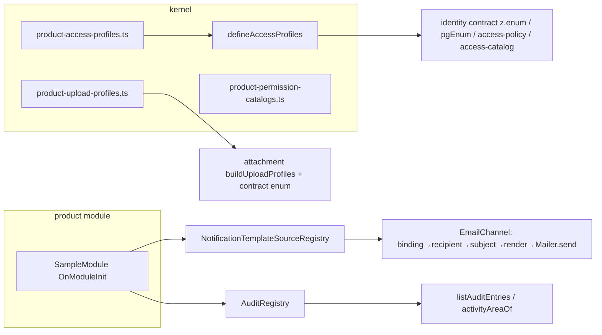

# v0.2 — Product slots — Design

**Spec**: `.specs/features/v0-2-product-slots/spec.md` · **Status**: Draft · Decisions: `.specs/STATE.md` AD-001..011.

## Architecture Overview

Two extension mechanisms, chosen by whether the set reaches the HTTP contract:

| Kind | When | Mechanism | Points |
| --- | --- | --- | --- |
| Static slot file (kernel) | the set is a `z.enum` in a contract → must be literal at import time | `PRODUCT_*` `as const` array the product appends to (AD-001) | access profiles, upload profiles (permission catalogs already) |
| Runtime registry | boot-time behaviour only | `@Injectable` registry exported by the owning module; product registers in `OnModuleInit` | notification template sources (exists), audit registrations |

## Code Reuse

| Component | Location | Use |
| --- | --- | --- |
| `definePermissionCatalog` | `shared/kernel/access/define-permission-catalog.ts` | pattern for `defineAccessProfiles` (generic literal preservation, `[K, ...K[]]` tuples) |
| `PRODUCT_PERMISSION_CATALOGS` | `shared/kernel/access/product-permission-catalogs.ts` | slot file precedent (doc comment style, `satisfies`) |
| `NotificationTemplateSourceRegistry` | `notification/application/templates/notification-template-registry.ts` | becomes the single lookup for base + product types |
| `HandlebarsTemplateRenderer` | `notification/infrastructure/mailer/handlebars-template-renderer.ts` | keep layout/partials; resolve every body via registry |
| `createE2eApp(configure)` | `apps/api/test/setup/app-factory.ts` | extend with `extraModules` for `FakeProductModule` e2e |
| `IdentityModule.forRoot` slot | `identity/identity.module.ts:193-230` | unchanged; documented in slots table |
| `db:check:journal` | `apps/api/src/db/check-journal.ts` | referenced by the migration note (`when` re-stamp) |

## Components

### 1. Access profiles (PROF-01..04)

- `shared/kernel/access/access-profile.types.ts` — `AccessProfileDef = { readonly key: string; readonly label: string; readonly assignable: boolean; readonly permissionFloor: boolean }`; `BASE_ACCESS_PROFILES = [{master, "Master", false, false}, {admin, "Administrador", true, true}, {professional, "Profissional", true, false}] as const`.
- `shared/kernel/access/define-access-profiles.ts` — `defineAccessProfiles<D extends readonly AccessProfileDef[]>(defs)` → `{ ACCESS_PROFILES: [K,...K[]]; ASSIGNABLE_ACCESS_PROFILES: [A,...A[]]; profileOf(key): AccessProfileDef; requiresPermissionFloor(key): boolean; isAccessProfile(v): v is K; PROFILE_DEFS: readonly AccessProfileDef[] }` with `A = Extract<D[number], { assignable: true }>["key"]`; throws on duplicate key.
- `shared/kernel/access/product-access-profiles.ts` — `export const PRODUCT_ACCESS_PROFILES = [] as const satisfies readonly AccessProfileDef[]` (slot).
- `shared/kernel/access/permission.types.ts` — `ACCESS_PROFILES`, `AccessProfile`, `ASSIGNABLE_ACCESS_PROFILES`, `AssignableAccessProfile` now derived from `defineAccessProfiles([...BASE_ACCESS_PROFILES, ...PRODUCT_ACCESS_PROFILES] as const)`; export names kept → `identity.contract.ts` (`z.enum(ACCESS_PROFILES)`), seeds, views untouched.
- `identity/infrastructure/tables/user.table.ts` — `identitySchema.enum("access_profile", ACCESS_PROFILES)`.
- `identity/application/access-policy.ts` — `assertProfileFloor`: `if (!requiresPermissionFloor(profile)) return` (replaces literal `master`/`professional` check).
- `identity/api/contracts/access-catalog.contract.ts` + `get-access-catalog.controller.ts` — response gains `profiles: [{ key, label, assignable }]` (additive contract change).
- Web: nothing (`permissions.ts` checks `"master"`, a base key).

**DB representation trade-off (AD-004):**

| Option | Product extension | Platform cost now | Risks |
| --- | --- | --- | --- |
| **DB enum (chosen)** | own migration `ALTER TYPE identity.access_profile ADD VALUE IF NOT EXISTS 'x'` | none (no data migration) | value unusable by DML in the same migration batch (PG ≥ 12); values cannot be dropped; drizzle-kit diff noise (irrelevant: hand migrations) |
| text + CHECK | product must drop/recreate the platform's CHECK with the full list | migration converting column | constraint has one owner → every base-set change to the list conflicts with the product's copy |
| lookup table `identity.access_profiles` | `INSERT` row | migration: enum→text, table, seed rows, FK | most moving parts; forces the Rituaali retrofit to convert too |

Extension proof: unit (`defineAccessProfiles` with a fake def; contract `accessProfileSchema.options` equals `ACCESS_PROFILES`), int-spec (`ADD VALUE 'sample'` on the test DB, `DrizzleUserRepository` round-trip with `accessProfile: "sample"`), e2e (`GET /v1/access-catalog` lists 3 base profiles with labels), smoke (SMK-01).

### 2. E-mail generic dispatch (MAIL-01..05)

- `notification/domain/ports/mailer.ts` — `EmailMessage = { to: string; subject: string; html: string; idempotencyKey?: string }`; `Mailer { send(message: EmailMessage): Promise<void> }` (AD-008).
- `notification/domain/ports/notification-template-source.port.ts` — `EmailTemplateBinding = { template: string; templateDir?: string; subject(data): string; recipient?(data): string; view?(data): Record<string, unknown> }`; `NotificationTemplateSources { require(type): { email?: EmailTemplateBinding }; findByTemplate(template): EmailTemplateBinding | undefined }`.
- `notification/application/templates/notification-template-registry.ts` — `NotificationTemplateSource = { type: NotificationType; catalog: CatalogEntry; email?: EmailTemplateBinding }` (AD-007); constructor seeds base entries from `application/templates/base-template-sources.ts` (8 e-mail types with `template`/`subject`/`view` (formatAt for `at`), 2 system-only types with `catalog` only); `templateDir` absent for base.
- `notification/application/templates/base-template-sources.ts` — one array; subjects/template names copied verbatim from today's `ResendMailer` (`"Configure seu acesso à plataforma"`/`access-link`, …).
- `notification/application/catalog/notification-catalog.ts` — keeps data schemas + `notificationCatalog` (used by base sources); handler resolves `entry = registry.find(type)?.catalog` only (one path).
- `notification/infrastructure/channels/email.channel.ts` — `send(input)`: `source = registry.require(type)`; `!source.email` → `EmailBindingMissingError(type)`; `to = email.recipient?.(payload) ?? payload.email` (non-string → `EmailRecipientMissingError(type)`); `subject`, `html = renderer.render(email.template, email.view?.(payload) ?? payload)`; `mailer.send({ to, subject, html, idempotencyKey: input.id })`. Injects `NotificationTemplateSourceRegistry`, `TEMPLATE_RENDERER`, `MAILER`.
- `notification/infrastructure/mailer/handlebars-template-renderer.ts` — drop `BODIES`; `resolve(template)` = `sources.findByTemplate` → `templateDir ?? join(__dirname, "templates")`; lazy compile + cache.
- `notification/infrastructure/mailer/resend-mailer.ts` — `send` only; no renderer; `notification.module.ts` MAILER factory drops the renderer inject.
- `notification/infrastructure/mailer/log-mailer.ts` — `send` logs `to`, `subject`, `idempotencyKey`, `links` (regex `href="([^"]+)"`).
- Delete `notification/domain/notification-payloads.ts`.
- Tests: `email.channel.spec.ts` rewritten (binding resolution, defaults, both errors, base type subject parity); `resend-mailer.spec`/`log-mailer.spec` to `send`; `templates.guard.spec` unchanged; MAILER fakes in 10 e2e files → `{ send: jest.fn() }`; `test/notifications-email.e2e-spec.ts` asserts `send` args; new `test/notifications-product-extension.e2e-spec.ts` (FakeProductModule: `declare module` adds `"sample_welcome"`, registers source with fixture `templateDir` `test/fixtures/sample-templates/sample-welcome.hbs`, publishes `NotificationRequested`, asserts fake mailer received `{ to, subject: "Bem-vindo, <name>", html ⊃ name }`).

### 3. Audit registry (AUD-01..03)

- `audit/application/services/audit-registry.ts` — `@Injectable() AuditRegistry`: `registerTables(entries: AuditedTableRegistration[])`, `registerRefTargets(entries: RefTargetRegistration[])`; `AuditedTableRegistration = { schema; table; owner: PermissionKey; aggregateRoot?: string; technical?: boolean }`, `RefTargetRegistration = { column; schema; table; labelColumn }`; queries `ownerOf(table)`, `allowedTables(owned: ReadonlySet<string>)`, `tablesForAggregate(root)`, `technicalTables()`, `refTargetFor(column)`; duplicates throw `DuplicateAuditRegistrationError`; constructor seeds base entries from `audit/domain/base-audit-registrations.ts` (content of today's `AUDIT_TABLE_OWNERS`, `AGGREGATE_SATELLITES`, `TECHNICAL_TABLES`, `BY_COLUMN`).
- Consumers: `list-audit-entries.use-case.ts` (inject registry; drop `refTargetFor`/`table-owners`/`aggregate-registry` imports), `activity-area.ts` → `ActivityAreaResolver` service (`activityAreaOf(table)`) used by `usage-activity.facade` and `drizzle-activity-stats.reader`; delete `ref-columns.ts`, `table-owners.ts`, `aggregate-registry.ts` (their specs move to `audit-registry.spec.ts`; the AUDITED-consistency check reads `registry.auditedTables()`).
- `audit.module.ts` — provides + exports `AuditRegistry`.
- Tests: `audit-registry.spec.ts` (base parity, duplicates, product entries); e2e `test/audit-product-extension.e2e-spec.ts` (FakeProductModule registers `sample.things` owned by `admin.users.audit.read` + ref `thing_id → sample.things.name`; creates schema/table + inserts an `audit.audit_entries` row via raw SQL; master lists it with resolved label; user with owner key lists it; without → 403).

### 4. Rename `attendsGuests` → `servesClients` (REN-01..02)

- Migration `apps/api/drizzle/migrations/0004_identity_serves_clients.sql`: `ALTER TABLE "identity"."users" RENAME COLUMN "attends_guests" TO "serves_clients";` + journal entry idx 4, `when` = last + 10_000_000.
- Rename in `user.table.ts` (comment reworded, no "hóspede"), entity/props, repository + mapper, contract (`servesClients`), use cases/types, access-policy input, views, facades, seeds, 26 spec files. Verification: `rg -c "attendsGuests|attends_guests|hóspede|hospede" apps/api/src openapi.json packages/api-client` = 0 after regen.

### 5. Upload profiles (UPL-01..04)

- `shared/kernel/upload/upload-profile.types.ts` — `UploadProfileDef = { readonly key: string; readonly accept: "image" | "any"; readonly maxBytes: number; readonly maxTotalBytes: number; readonly maxFiles: number; readonly visibility: "public" | "authenticated" | "restricted"; readonly uploadRoute: boolean }`.
- `shared/kernel/upload/product-upload-profiles.ts` — `PRODUCT_UPLOAD_PROFILES = [] as const satisfies readonly UploadProfileDef[]` (slot).
- `attachment/domain/upload-profiles.ts` — `BASE_UPLOAD_PROFILE_NAMES = ["avatar","access-link-avatar","document","image","multi"] as const`; `UploadProfileName = BaseName | (typeof PRODUCT_UPLOAD_PROFILES)[number]["key"]`; `UPLOAD_PROFILE_NAMES` and `ROUTE_UPLOAD_PROFILE_NAMES` tuples (base route names `document|image|multi` + product defs with `uploadRoute`); `buildUploadProfiles(config)` = base (avatar/access-link-avatar: image,1,authenticated; document: any,1,restricted; image: image,1,authenticated; multi: any, `ATTACHMENT_MULTI_MAX_FILE_BYTES`/`ATTACHMENT_MULTI_MAX_TOTAL_BYTES`, 100, restricted) + product defs; `isUploadProfileName` uses `UPLOAD_PROFILE_NAMES` (no probe config).
- `attachment/api/contracts/attachment.contract.ts` — `profile: z.enum(ROUTE_UPLOAD_PROFILE_NAMES)`.
- `attachment/attachment.config.ts` + `.env.example` + `docs/dev/*` — env renames (AD-010).
- Migration `0005_attachment_generic_upload_profiles.sql`: `UPDATE "attachment"."attachments" SET "profile" = 'multi' WHERE "profile" = 'feedback-attachment';` + journal idx 5.
- Tests: `upload-profiles.spec.ts` (catalog exact, derived enums with fake def via `buildUploadProfiles(config, [fakeDef])` overload for tests); int-spec `upload-attachment.use-case` with `UPLOAD_PROFILES` catalog containing `sample-doc` honoring limits/visibility.

### 6. Release, docs, sweep, smoke

- `docs/dev/template.md` — new "Slots e registries" table (profiles, permission catalogs, upload profiles, notification types/template sources, audit registry, product routes, `IdentityModule.forRoot({ professional })`, `db/schema.ts`, migrations numbering).
- `docs/dev/template-changelog.md` — `v0.2.0` entry: breaking list + child migration steps.
- `.specs/features/v0-2-product-slots/coverage-sweep.md` — sweep table; comment on issue #1 via `gh issue comment 1 -F`; follow-up issues via `gh issue create` (AD-011).
- `scripts/template-smoke.mjs` + `scripts/smoke/fake-product/` overlay (SMK-01): copier copy → overlay (module `apps/api/src/modules/sample/…`, appended slot entries, `1000_sample_init.sql` + journal entry, `app.module.ts` import) → `pnpm check && pnpm --filter api test`.
- Contract regen commit (`pnpm contract` + `pnpm --filter @platform/api-client build`) separate from code commits.

## Error Handling

| Scenario | Handling | Impact |
| --- | --- | --- |
| Duplicate profile/upload key | throw at import (`defineAccessProfiles`/`buildUploadProfiles`) | boot fails, message names the key |
| Type without e-mail binding but channel `email` | `EmailBindingMissingError` → delivery retry/dead-letter | visible in `notification_deliveries` |
| Recipient not a string | `EmailRecipientMissingError` | same |
| Duplicate audit registration | `DuplicateAuditRegistrationError` at boot | boot fails |
| Unknown profile in DB row | existing loud failure on download | prevented by 0005 |

## Risks & Concerns

| Concern | Location | Impact | Mitigation |
| --- | --- | --- | --- |
| Shared drizzle journal: platform `when` older than child's last applied → silently skipped | `apps/api/drizzle/migrations/meta/_journal.json`, `src/db/check-journal.ts:259` | child never gets 0004/0005 | AD-005 + changelog step; `db:check:journal` on pre-push catches it |
| `ADD VALUE` inside migrator tx unusable by same-batch DML | PG ≥ 12 semantics | product seed in the same batch fails | documented in slots table |
| Handler dual lookup (`notificationCatalog[type] ?? registry`) | `notification-requested.handler.ts:77-79` | two sources of truth | registry becomes the only path (base seeded) |
| Renderer's `BODIES` list + `templates.guard` | `handlebars-template-renderer.ts:14`, `templates.guard.spec.ts` | new base template needs 2 edits | registry-driven resolve; guard keeps only the .hbs allowlist |
| 10 e2e files hold 8-method mailer fakes | `apps/api/test/**` | churn | one shared `fakeMailer()` helper in `test/setup/` |
| Domain constants become injectable state (audit) | `audit/domain/*` | domain purity | base data stays a pure domain array; registry is an application service |
| `professional` semantics scattered (`access-policy`, directory facade) | identity | v0.3 extraction cost | AD-002 recorded; sweep marks `open slot (v0.3)` |

## Tech Decisions

| Decision | Choice | Rationale |
| --- | --- | --- |
| Slot file location | kernel (`shared/kernel/access`, `shared/kernel/upload`) | domain may import kernel; mirrors permission precedent |
| Base e-mail types through registry | yes | zero per-type code in channel/renderer |
| Rendering in channel, not mailer | yes | transport port has one method; fakes trivial |
| Audit registry scope | refs + owners + satellites + technical | one pattern for one module; professional tables live there |
| Contract enum for upload route | derived tuple from base + product `uploadRoute` | keeps openapi enum → Kubb typing |
| Version bump | tag + changelog only | AD-006 |
