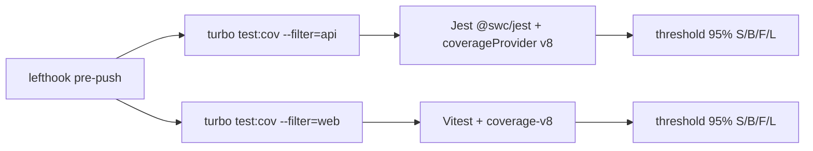

# Pre-push coverage 95% — Design

**Spec**: `.specs/features/pre-push-coverage-95/spec.md`
**Status**: Draft
**Spike**: `.specs/features/pre-push-coverage-95/spike.md`

---

## Architecture Overview

Keep the runners (`@swc/jest` for api unit, vitest+v8 for web). Change **how api unit coverage is measured**, then **fill behavioural unit tests by tree**, then **ratchet the pre-push gate to 95%**. Combined `test:cov:all` (nyc) is untouched.

Chosen approach: **Jest `coverageProvider: "v8"`** on api unit, still transforming with `@swc/jest` (handbook: SWC is orders of magnitude faster than ts-jest). V8 records execution on the emitted JS and maps back via source maps; it does not invent Istanbul counters on SWC’s downlevel of `?.` / `??` / default params / `design:paramtypes` ternaries ([swc#3854](https://github.com/swc-project/swc/issues/3854), [jest#11188](https://github.com/jestjs/jest/issues/11188)). Web already uses `@vitest/coverage-v8`.

Rejected:

| Approach | Why not |
| --- | --- |
| babel-plugin-istanbul / ts-jest | Instruments TS, but replaces or doubles the SWC transform; contradicts `docs/test/testing.md` speed contract |
| Keep default Jest Istanbul on SWC output + ignore comments | Spec COV-07 forbids pragmas; this is the current combined-script dead end |

Complement: keep `@swc/jest` on the existing `.swcrc` (`jsc.target: "es2023"`, `packages/typescript-config/nest.json` `ES2023`) so `?.`/`??` stay native. Jest today passes `@swc/jest` as a string-only transform (`apps/api/package.json:125`) — T1 must ensure V8 remap sees source maps (verify `.swcrc` `sourceMaps` or inline transform options). `legacyDecorator` + `decoratorMetadata` stay (handbook).

---

## Code Reuse Analysis

### Existing Components to Leverage

| Component | Location | How to Use |
| --- | --- | --- |
| Api unit coverage config | `apps/api/package.json` `jest` | Add `coverageProvider`, tighten `collectCoverageFrom`, keep `coverageDirectory` |
| Combined merge script | `apps/api/scripts/coverage-all.sh` | Do not change floors (spec out of scope) |
| Web coverage | `apps/web/vitest.config.ts` `test.coverage` | Already v8 + excludes; raise thresholds last |
| Pre-push | `lefthook.yml` `test-api` / `test-web` | Switch `test-api` from `turbo test` to `turbo test:cov` last |
| Colocated unit specs | `apps/api/src/**/*.spec.ts`, `apps/web/src/**/*.test.ts(x)` | Fill gaps here only — no new int/e2e for this feature |
| Product slots | `product-permission-catalogs.ts`, `product-access-profiles.ts`, `product-upload-profiles.ts` | Exclude from denominator (AD-001 empty) |

### Integration Points

| System | Integration Method |
| --- | --- |
| lefthook pre-push | `test-api` command string |
| turbo `test:cov` | already exists (`turbo.json`); api `test:cov` = `jest --coverage` |
| docs | `docs/test/testing.md` — document v8 + 95% gate after ratchet |

---

## Components

### Api unit coverage collector

- **Purpose**: Measure S/B/F/L on production TypeScript under api unit tests, without SWC-synthetic branches.
- **Location**: `apps/api/package.json` `jest`
- **Interfaces**:
  - `coverageProvider: "v8"`
  - `collectCoverageFrom`: `**/*.ts` minus specs, `*.d.ts`, `main.ts`, the three empty slot files
  - `coverageThreshold.global`: unchanged until the ratchet task (today 43/35/40/45)
  - `@swc/jest` reads `.swcrc` (`jsc.target: "es2023"`) or equivalent inline options; `sourceMaps: true` required for V8 remap
- **Dependencies**: Node ≥20, existing `@swc/jest`
- **Reuses**: current jest block

### Coverage-metric contract (COV-05 / COV-06)

- **Purpose**: Prove the collector’s branch semantics with fixtures, not with the whole suite.
- **Location**: `apps/api/src/shared/config/coverage-metric/`
- **Interfaces**:
  - `optional-chain.sample.ts` — only `x?.bar`; its spec exercises it; contract child-process expects **100% branch** on that file
  - `if-else.sample.ts` — explicit `if / else`; `if-else.sample.uncovered.spec.ts` takes only the true path and is **ignored** by the default `testPathIgnorePatterns`; contract child-process expects **branch < 100%** on that file
  - `coverage-metric.contract.spec.ts` — spawns `jest --coverage` on each fixture; asserts the printed/summary percents
- **Dependencies**: collector from the previous component
- **Reuses**: Jest CLI already used by `test:cov`

### Module coverage fills

- **Purpose**: Bring each owned tree to ≥95% S/B/F/L under unit tests so the global ratchet can pass.
- **Location**: trees listed in tasks (`shared/`, each `modules/<name>/`, remainder, `apps/web/src/`)
- **Interfaces**: colocated `*.spec.ts` / `*.test.ts(x)` asserting observable outcomes (COV-08/09); delete dead code (COV-10)
- **Dependencies**: collector (otherwise workers chase synthetic branches)
- **Reuses**: existing specs as the floor; `docs/test/testing.md` + L-002

### Pre-push ratchet

- **Purpose**: Fail `git push` below 95% on either suite.
- **Location**: `apps/api/package.json` `coverageThreshold`, `apps/web/vitest.config.ts` `thresholds`, `lefthook.yml` `test-api`
- **Interfaces**: all four metrics `95`; `test-api` runs `pnpm turbo test:cov --filter=api`
- **Dependencies**: every fill tree already ≥95% (global `test:cov` green at 95)
- **Reuses**: web already on `test:cov` in lefthook

---

## Error Handling Strategy

| Error Scenario | Handling | User impact |
| --- | --- | --- |
| Any metric < 95% (including 94.9%) | Jest/vitest `coverageThreshold` / `thresholds` exit non-zero | Push blocked; text summary in the hook log |
| Docker missing | Pre-push never calls int/e2e | Push can still pass |
| V8 remap miss (source maps off) | Contract tests fail in the collector wave | Do not ratchet; fix SWC `sourceMaps` |
| Combined `test:cov:all` fails | Out of scope — floors stay 85/51/90/90 | Manual combined run unchanged |

---

## Risks & Concerns

| Concern | Location | Impact | Mitigation |
| --- | --- | --- | --- |
| SWC decorator metadata ternaries inflate Istanbul branch % | `apps/api/scripts/coverage-all.sh:64-68` (comment) | 95% branch unreachable under default Jest coverage | Unit gate uses V8; combined script not raised |
| V8 is less precise than Istanbul (implicit else, statements after throw) | jest#11188 | COV-06 needs an **explicit** else in the fixture | Fixture uses `if / else`, not a one-sided `if` |
| Fill volume (~447 api files, web ~34) | spike.md | One worker cannot close the whole api | One cluster per disjoint tree; handoff if turn budget blows |
| Empty slots in the denominator | AD-001 slot files | 0% files drag the global % | `collectCoverageFrom` excludes them |
| Raising thresholds before fills | `coverageThreshold` / vitest `thresholds` | Every push red | Ratchet is the last exclusive wave |
| Ignore pragmas sneaking in | production src | Fake 95% (COV-07) | Final probe `rg` for `istanbul ignore` / `v8 ignore` / `c8 ignore`; Verifier rejects |

---

## Tech Decisions

| Decision | Choice | Rationale |
| --- | --- | --- |
| Api unit coverage provider | Jest `v8` | Drops SWC-synthetic branches; keeps `@swc/jest` |
| Web coverage provider | Keep vitest `v8` | Already in place |
| SWC target | Keep `es2023` (`.swcrc`) | Already set; native `?.`/`??` on Node ≥20 |
| When to raise 95% | After fills, one exclusive wave | Spec assumption “raise last” |
| Combined nyc gate | Unchanged | Spec out of scope |
| New tests layer | Unit only (`*.spec.ts` / `*.test.ts(x)`) | Pre-push suite is unit; int/e2e would need Docker |
| Project-level | **AD-012** | Future features must not drop the 95% pre-push bar |

---

## Spike results

See `spike.md` (current floors, excludes, file counts). Not copied here.

---

## Mapping to requirements

| ID | Design component |
| --- | --- |
| COV-01..03 | Pre-push ratchet |
| COV-04 | `collectCoverageFrom` / vitest `exclude` |
| COV-05..06 | Coverage-metric contract |
| COV-07 | Final probe + no-pragma rule |
| COV-08..10 | Module coverage fills |
