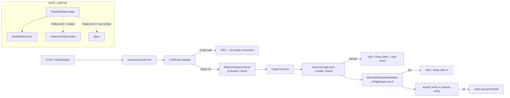

# Security Audit Remediation Design

**Spec**: `.specs/features/security-audit-remediation/spec.md`
**Evidence**: `spike.md` (file:line + repro per finding — the Verifier anchors every AC there)
**Status**: Draft — approach 1 below is the author's recommendation; kernel tag `v2.0.0` is the one call left to the user

---

## Architecture Overview

One principle: **the kernel owns every agnostic seam (rate-limit port, redaction list, in-flight gate, fail-closed config, production image contract); entries own policy and wiring** (which keys are critical, which routes carry `@RateLimit`, which auth events to record). No entry imports another outside `dependsOn` (AD-025), no module vocabulary enters `shared/**` (RULE C).

- **A. Rate-limit seam (kernel)** — port token + interface move from identity to `shared/kernel/rate-limit/`; Redis adapter to `shared/infra/rate-limit/`; new in-memory sliding window + `ResilientRateLimiter` composite honouring a per-call `critical` flag; `@RateLimit` + `RateLimitGuard` class move to the kernel, **registered by identity after `CsrfGuard`** (REM-04/06/14).
- **B. Login hardening (identity)** — per-account bucket keyed on the e-mail, cleared on success; `BoundedPasswordHasher` in front of argon2 via a kernel `InFlightGate`; HIBP always queried when enabled, mode applied only on lookup failure, 2 s abort (REM-01..03/05/07).
- **C. Secrets at rest (kernel)** — one `sensitive-keys` module feeding the log redactor (substring), outbox `markPublished`/dead-letter and notification's delivery redactor; `outbox-dead.purge` in `KERNEL_MAINTENANCE_JOBS` (REM-16/17/20).
- **D. Attachment** — lazy body (`openStream()` after the 304 check), `stream/promises.pipeline`, inline allowlist + `nosniff` always, S3 handler timeouts, stream sniff on the batch path, busboy `limits`, per-IP `@RateLimit`, owner pending-bytes quota, per-instance upload gate (REM-08..15/41/42).
- **E. Fail-closed config + production image (kernel)** — `env.ts` without insecure defaults, `/docs` gated, `DATABASE_SSL_CA`, `redis://` refused in production, `TRUST_PROXY_HOPS` 0; swc `ignore` for harness dirs; entrypoint glob `dist/modules/*/seeds/bootstrap.js`; catalog-lint rule against `testing/**` imports (REM-21..30).
- **F. Cheap hardening batch** (REM-31..47) and **G. release plumbing** (five entry bumps + advisories, kernel tag + changelog).



### Approaches (rate-limit seam placement)

| Approach | Verdict |
| --- | --- |
| **1. Kernel seam, identity registers the guard (recommended)** — port, adapters, composite, decorator, guard class in the kernel; `IdentityModule` `APP_GUARD` = `[CsrfGuard, RateLimitGuard]` | AD-024 satisfied, `attachment` decorates routes without importing identity, REM-06 ordering explicit in one file. Kernel-only child: decorator without an active guard — same as today. |
| 2. Kernel port only, guard stays in identity; attachment imports the decorator along `dependsOn` | Two homes for one concept; cross-entry import for a kernel-grade policy. |
| 3. Kernel registers the guard as `APP_GUARD` | `AccessGuard → RateLimitGuard → CsrfGuard` violates REM-06. Rejected. |

---

## Code Reuse Analysis

| Component | Location | Use |
| --- | --- | --- |
| Lua sliding window + Redis limiter | `catalog/identity/.../infrastructure/rate-limit/{redis-rate-limiter.ts,lua-scripts.ts}` | Move to the kernel; drop the fail-open branch (`:52-59`), add `reset` (DEL), let errors propagate. |
| `RateLimitGuard` + `@RateLimit` | `catalog/identity/.../api/guards/rate-limit.guard.ts:36-65` | Move; key stays `ip:${req.ip}:${routeKey}`; throw kernel `TooManyRequestsError`, not a bare `HttpException`. |
| `DomainError.retryAfterSeconds` + `problem-details.filter.ts:118-138` | `shared/kernel/errors/` | Every new 429/503 is a `DomainError` — the filter already emits `Retry-After`. `PoolSaturatedError:6-14` is the 503 shape. |
| `EventEmitter2` (`outbox.dispatcher.ts:241`) + `authEventOf` (`auth-event.factory.ts:19-35`) | kernel / identity | Composite emits `rate-limiter.degraded`/`recovered`; identity's `@OnEvent` listener records the auth event (`userId` nullable, `auth-event.table.ts:40`). |
| `MaintenanceRegistry` (AD-022) | `shared/kernel/scheduling/maintenance-registry.ts:85-92`, `maintenance-job.decorator.ts:16` | `outbox-dead.purge`, `lockId: 6` (was 3 at design time — 3 and 4 are taken by notification `delivery.purge` and identity `email-change.revert`; corrected at the wave-2 gate), body beside `purgePublished` (`outbox.dispatcher.ts:94-103`). |
| `redactValue`/`redactConfig` | `shared/kernel/logging/log.redact.ts:6-73` | Keep the API; swap the predicate for the shared substring matcher. |
| `sniffImageContentType(buf)` | `catalog/attachment/api/application/content-type-sniff.ts:7` | Wrap with a stream peeker for the batch path. |
| Batch discard + single `insertMany` | `upload-attachments-batch.use-case.ts:117-121,137` | Already atomic: a 415/413 in the loop deletes every stored object, persists nothing. |
| `audit.attach(schema, table, pk[], redacted[])` | `catalog/audit/migrations/custom/01_audit_trail_capture.sql:162-176` | Idempotent (`DROP TRIGGER IF EXISTS`) — re-attach with redact lists. `createZodDto` idiom (`list-users.controller.ts:39-41`) for params DTOs. |

**Integration points:** guard chain `AccessGuard` (kernel, `shared-kernel.module.ts:36`) → identity `[CsrfGuard, RateLimitGuard]`; outbox payloads rewritten in place, no schema change; identity enum `auth_event_type` + `rate_limiter_degraded` (drizzle-kit diff in the child, AD-015); identity `customMigrations` + `03_audit_redact_token_hashes.sql`; OpenAPI/Kubb regen for params DTOs and `.max()` (exclusive).

---

## Components

### A. Kernel rate-limit seam

- **Port** `shared/kernel/rate-limit/rate-limiter.port.ts` (replaces identity `domain/ports/rate-limiter.ts:1-11`): `consume(key, limit, windowSeconds, opts?: { critical?: boolean })`, `reset(key)`, `RATE_LIMITER` symbol. Keys are opaque strings.
- **`RedisRateLimiter`** `shared/infra/rate-limit/{redis-rate-limiter.ts,lua-scripts.ts}` (moved): same Lua; `reset` = `DEL ratelimit:<key>`; **throws** on Redis error.
- **`InMemoryRateLimiter`** `shared/kernel/rate-limit/in-memory-rate-limiter.ts`: `Map<key, number[]>` pruned per call; `clear()`; bounded at 50 000 keys (evict oldest-touched) so an outage is not a memory attack; injectable `Clock`.
- **`ResilientRateLimiter`** `shared/kernel/rate-limit/resilient-rate-limiter.ts`: try primary; on error → `critical` ? fallback : `{ allowed: true, retryAfterSeconds: 0 }`. One outage at a time: first error after healthy → `warn` + `emit("rate-limiter.degraded", { since, error })`; first success after degraded → `fallback.clear()` + `emit("rate-limiter.recovered")` (spec edge: Redis returns → fallback discarded). `reset` mirrors `consume`.
- **`@RateLimit` + `RateLimitGuard`** `shared/kernel/rate-limit/{rate-limit.decorator.ts,rate-limit.guard.ts}` (moved): metadata `{ limit, windowSeconds, critical? }` under `"kernel:rateLimit"`; denies with `TooManyRequestsError(retryAfterSeconds)` (`shared/kernel/errors/too-many-requests.error.ts`, 429). Not registered by the kernel.
- **`RateLimitModule`** `shared/kernel/rate-limit/rate-limit.module.ts`: imports `RedisModule`, provides and exports `RATE_LIMITER` = composite. Imported by `IdentityModule` and `AttachmentModule`.
- **`InFlightGate`** `shared/kernel/collections/in-flight-gate.ts`: `tryAcquire(): (() => void) | null`, `inFlight`. Shared by B and D.
- **Test double** `catalog/identity/.../testing/allow-all-rate-limiter.ts` stays; imports the kernel token; attachment e2e import it along `dependsOn`.

### B. Identity login hardening

- **`LoginUseCase`** (`login.use-case.ts:41-42,76-131`), new order: ① `consume("login:acct:<email>", LOGIN_ACCOUNT_MAX_FAILURES, LOGIN_ACCOUNT_WINDOW_SECONDS, { critical: true })` — denied → `rate_limited_burst` event (`metadata.scope = "account"`) + `RateLimitedError(retryAfter)` (429, `errors.ts:60-69`) **before the user lookup**, so unknown and existing e-mails share status, body and timing class (REM-02); ② existing per-IP burst `login:<ip>:<email>`, now `critical: true`, response unchanged; ③ lookup + verify (real or dummy) through the bounded hasher; ④ success → `reset(acctKey)`. The key uses the same normalised e-mail the repository queries with. Failure still throws the single `InvalidCredentialsError`.
- **`BoundedPasswordHasher`** `infrastructure/hashing/bounded-password-hasher.ts`: wraps `PasswordHasher` (`domain/ports/password-hasher.ts:1-7`) with `InFlightGate(PASSWORD_HASH_MAX_IN_FLIGHT)`; `hash`/`verify` throw `PasswordHashingSaturatedError` (503, `retryAfterSeconds: 2`) when full, **before** argon2; `needsRehash` passes through. Wired in the `PASSWORD_HASHER` factory (`identity.module.ts:117-128`). The dummy verify passes through the same gate.
- **`RateLimiterOutageListener`** `application/rate-limiter-outage.listener.ts`: `@OnEvent("rate-limiter.degraded")` → one `rate_limiter_degraded` auth event (`userId: null`, `metadata: { since }`). One event per outage by construction.
- **Breach check**: port `domain/ports/breach-check.ts` → `check(password): Promise<"clear" | "breached" | "skipped">`. `HibpBreachCheck` (`hibp-breach-check.ts:22-37`): `fetch(url, { signal: AbortSignal.timeout(2000) })`; on error/non-2xx `fail_open` → `"skipped"`, `fail_closed` → `BreachCheckUnavailableError` (503, `retryAfterSeconds: 5`). `NoopBreachCheck` → `"clear"`. `set-password:100-104`, `change-password:97-103`, `reset-password:82-88` drop the `if (MODE === "fail_closed")` wrapper and call `application/password/check-breach.ts` (throws the existing breached error, returns `"skipped"`) so each records `breach_check_skipped` (`metadata.mode = "fail_open"`) with its own `userId`.
- **Guard order** (REM-06): `identity.module.ts:261-262` → `CsrfGuard`, then the kernel `RateLimitGuard`. `critical: true` on login, `forgot-password`, `reset-password`, `resend-verification`, `verify-email`, `access-link/*`.
- **Config**: `identity.config.ts` + `module.json.env`: `LOGIN_ACCOUNT_MAX_FAILURES` (10), `LOGIN_ACCOUNT_WINDOW_SECONDS` (900), `PASSWORD_HASH_MAX_IN_FLIGHT` (8), `BREACH_CHECK_ENABLED` **required** (REM-21). Enum `auth-event.entity.ts:3-30` + `auth-event.table.ts:24`: `+ rate_limiter_degraded`.

### C. Secrets at rest and redaction (kernel)

- **`shared/kernel/redaction/sensitive-keys.ts`**: `SENSITIVE_KEY_FRAGMENTS = ["password", "token", "secret", "authorization", "cookie", "link"]` (case-insensitive substring of the key); `isSensitiveKey(key, fragments?)`; `redactSensitive<T>(value, fragments?): { value: T; changed: boolean }` — recursive over plain objects/arrays, leaves → `"[REDACTED]"`, same reference when nothing matched.
- **Outbox** (`outbox.dispatcher.ts`): `markPublished` (`:213-216`) → `set({ publishedAt, ...(changed && { payload }) })`; dead-letter insert (`:258-285`) → `payload: redactSensitive(row.payload).value`. The whole envelope is scanned (domain payload nests under `payload.payload`).
- **`outbox-dead.purge`**: `@MaintenanceJob("outbox-dead.purge") purgeDeadLetters()` on `OutboxDispatcher` — `DELETE FROM _kernel.outbox_dead WHERE dead_lettered_at < now() − OUTBOX_DEAD_RETENTION_DAYS`; `{ cron: "45 3 * * *", lockId: 6 }` in `KERNEL_MAINTENANCE_JOBS` (corrected from 3 at the wave-2 gate: 3 = notification `delivery.purge`, 4 = identity `email-change.revert`; kernel reserves 1, 2, 6); env `OUTBOX_DEAD_RETENTION_DAYS` (30).
- **Log redactor** (`log.redact.ts`): `redactValue` uses `isSensitiveKey(k, LOG_FRAGMENTS) || LOG_EXACT.has(k)` with `LOG_FRAGMENTS = [...SENSITIVE_KEY_FRAGMENTS, "email", "cpf", "phone", "creditcard", "useragent", "user_agent", "set-cookie"]` and `LOG_EXACT = {ip, ip_address, ipaddress}` (substring `ip` would hit `recipientId`). pino `redactConfig.paths` stays path-based and gains the literal variants the spec names (`newPassword`, `currentPassword`, `newEmail`, `pendingEmail`, `passwordHash`, `tokenHash`, `cookieTokenHash`).
- **Notification** `delivery.dispatcher.ts:47-51` `redactPayload` delegates to `redactSensitive`.

### D. Attachment: download, storage, upload

- **Use case** (`get-attachment-for-download.use-case.ts:21-28,48-79`): `DownloadResult` drops `stream`, gains `openStream(): Promise<NodeJS.ReadableStream>`; nothing opens inside `execute` (access-log write at `:69` unchanged).
- **Controller** (`download-attachment.controller.ts:46-76`): ① ETag + 304 branch returns before anything is opened (REM-11); ② `inline = INLINE_CONTENT_TYPES.has(contentType)` with `{"image/jpeg","image/png","image/webp"}` — profile no longer consulted, `legacy` included (REM-09); non-inline → `application/octet-stream` + `Content-Disposition: attachment`; `X-Content-Type-Options: nosniff` always; ③ `await pipeline(await result.openStream(), res)` (`node:stream/promises`) — client abort → `ERR_STREAM_PREMATURE_CLOSE`, source destroyed, socket freed (REM-10); source error after headers → `res` destroyed, `error` log, process up (REM-12); error before headers → problem filter.
- **`R2StorageAdapter`** (`r2-storage.adapter.ts:20-28`): `requestHandler: { requestTimeout: cfg.STORAGE_REQUEST_TIMEOUT_MS, connectionTimeout: 5000, httpsAgent: new https.Agent({ keepAlive: true, maxSockets: cfg.STORAGE_MAX_SOCKETS }) }` (plain `NodeHttpHandlerOptions`, no new dependency — verified below). `head`/`put`/`putStream`/`delete` pass `{ abortSignal: AbortSignal.timeout(…) }` to `send`; `getStream` does not (a long body must not be cut at 30 s; socket-level `requestTimeout` covers a stalled peer). SDK `TimeoutError`/`AbortError` → kernel `StorageUnavailableError` (503, `retryAfterSeconds: 5`). `storage.config.ts:4-10` + `STORAGE_REQUEST_TIMEOUT_MS` (30 000), `STORAGE_MAX_SOCKETS` (50).
- **`readMultipartFiles(req, res, fieldName, limits)`** (`multipart-files.ts:9-17,59-73`): busboy `limits = { fileSize: profile.maxBytes, files: profile.maxFiles, parts: profile.maxFiles, fields: 0 }`; `file.on("limit")`/`filesLimit`/`partsLimit` → `PayloadTooLargeError` (413); `fieldsLimit` → 400; part name ≠ `file` → `stream.destroy()` + 400 `UnexpectedMultipartFieldError`. The generator rejects on its next `yield` after a limit event; the use case's existing `catch` discards stored keys.
- **`sniffImageStream(stream)`** (`content-type-sniff.ts` +): peek 16 bytes with `readable` + `read(n)` (never `for await` — breaking out destroys the stream), `unshift` them back, return `SupportedImage | null`. Batch use case (`:52-109`): `profile.accept === "image"` → sniff each part; `null` or ≠ declared → the 415 error the single-file path already uses; persist the sniffed type (REM-08). Existing discard + single `insertMany` give the "nothing persisted" edge for free.
- **Quota and rate (REM-14)**: `UploadAttachmentsController` (`:32,57-61`) `@RateLimit({ limit: 20, windowSeconds: 60 })`; download controller `@RateLimit({ limit: 300, windowSeconds: 60 })`. Before the body: `UploadGate` provider (`InFlightGate(ATTACHMENT_MAX_CONCURRENT_UPLOADS)`, 16) → 503 `UploadsSaturatedError` (`retryAfterSeconds: 2`), released in `finally`; owner quota via new repo method `sumPendingBytesByOwner(ownerId)` (`attachment.repository.ts:3-15`, `SUM(size_bytes) … status = 'pending'`), rule `pending + (Content-Length ?? 0) > ATTACHMENT_PENDING_QUOTA_BYTES` → 413 `PendingQuotaExceededError`. Handler order: guard → gate → quota → busboy.
- **Purge / confirm (REM-41)**: `purge-pending-attachments.job.ts:63` → `repo.deletePendingByIds(ids)` (`AND status = 'pending'`); `confirm-uploads.use-case.ts:42-44` rejects when `ids.length > max(maxFiles over route profiles)` before `findByIds`.
- **`buildContentDisposition`** (`shared/kernel/http/content-disposition.ts:6-10`, REM-42): `attachment; filename="<ascii fallback>"; filename*=UTF-8''<rfc5987>` — rfc5987 = `encodeURIComponent` + `'()*` percent-encoded; fallback strips non-ASCII and `"`.
- **`attachment.config.ts`** + `module.json.env`: `ATTACHMENT_PENDING_QUOTA_BYTES` (2 GiB), `ATTACHMENT_MAX_CONCURRENT_UPLOADS` (16).

### E. Fail-closed configuration and production image

- **`env.ts`** (`:1-87`): `NODE_ENV`, `DATABASE_SSL` lose defaults; `TRUST_PROXY_HOPS` → `0`; new `DATABASE_SSL_CA` (optional PEM, `\n` unescaped), `REDIS_ALLOW_PLAINTEXT` (false), `DOCS_ENABLED` (false), `OUTBOX_DEAD_RETENTION_DAYS` (30); `superRefine`: production + `redis://` + `!REDIS_ALLOW_PLAINTEXT` → issue on `REDIS_URL`. `nodeEnvSchema` exported; `notification.config.ts:6` reuses it (REM-30).
- **`main.ts:54`**: `if (NODE_ENV !== "production" || DOCS_ENABLED) mountDocs(…)` — unmounted → Nest 404 (REM-25). **`connection-config.ts:14-15`**: `ssl: require ? { rejectUnauthorized: true, ...(ca && { ca }) } : false` (REM-23). **`redis.provider.ts:20-26`**: `+ commandTimeout: 2000`.
- **Build**: `nest-cli.json:14-19` `ignore` += `**/testing/**`, `**/__e2e__/**`, `**/parity/**`, `**/__parity__/**` (child layout name); `tsconfig.build.json` mirrors. Specs keep importing `testing/**` — only emit changes; the REM-26 probe is the proof.
- **Seeds**: `catalog/identity/.../api/seeds/bootstrap.ts` (production code; body of `testing/seeds/bootstrap-master.ts:1-97`, idempotent, `MASTER_EMAIL`/`MASTER_PASSWORD`); `testing/seeds/master-user.seed.ts:11-12` reads `SEED_MASTER_PASSWORD` or generates one (`crypto.randomBytes`) and prints it once (REM-28). Convention (AD-031): **an entry's boot-time seed is `api/seeds/bootstrap.ts`; `testing/**` is dev/test only.**
- **`docker-entrypoint.sh`** (`:15-18,24-27`): both `MASTER_*` set → `for f in "${DIST_DIR:-dist}"/modules/*/seeds/bootstrap.js; do [ -e "$f" ] && node "$f"; done`; `legacy-import` block deleted; boot proceeds without the variables. Test: script-suite spec (`pnpm test:scripts`) spawns the entrypoint with `DIST_DIR` at a stub tree and a stub `node` first on `PATH`, asserting invoked paths (REM-27). `package.json:15-16` and `deploy.md.jinja:50,158` follow.
- **Catalog lint**: `scripts/platform/lib/lint.mjs` `lintProductionTestingImports(entryDir)` — every `api/**/*.ts` that is not a test file (`.spec|.int-spec|.e2e-spec|.parity.spec|.fixture`) nor under `testing/`, `__e2e__/`, `parity/` must not import a specifier containing `/testing/`; wired into `catalog-lint.mjs` `lintEntry()`, exercised by `catalog:check` (REM-29). Slot for the planned RULE D (AD-023).
- **Docs**: `deploy.md.jinja` states `TRUST_PROXY_HOPS=2` for Cloudflare → Traefik, plus `DOCS_ENABLED`, `REDIS_ALLOW_PLAINTEXT`, `DATABASE_SSL_CA` (REM-24).

### F. Cheap hardening batch (REM-31..47)

| REM | Owner | Change (file:line from spike.md) |
| --- | --- | --- |
| 31 | identity, tag | `list-users` / `list-tags` use cases: `if (query.deleted) assertPermission(actor, "<res>.trash.read")` via identity's imperative check; stale `MasterGuard` comment removed (`list-users.use-case.ts:16`). |
| 32 | kernel | `idempotency.interceptor.ts:81,102`: key must match `^[A-Za-z0-9_-]{1,200}$` else 400; anonymous scope `ip:<req.ip>`. |
| 33 | kernel | `listing-query.schema.ts:13` `page.max(10_000)`. |
| 34 | identity | `identity.contract.ts:16` `email.max(254)`, `token.max(128)`, `name.max(200)`. |
| 35 | identity | `IdParamDto = createZodDto(z.object({ id: z.string().min(1).max(64) }))` in `identity.contract.ts`; `@Param() { id }: IdParamDto` in `delete-user`, `resend-access-link`, `revoke-device` controllers (`:18`). |
| 36 | identity | `identity.contract.ts:22-24,31-32` id arrays `.refine(noDuplicates)`. |
| 37 | audit | `audit.contract.ts:19-20` `from`/`to` → `z.iso.datetime()`; `txId.max(Number.MAX_SAFE_INTEGER)`. |
| 38 | notification | `notification-catalog.ts:51,56,61,77` `link: z.url({ protocol: /^https?$/ })`. |
| 39 | api root | `multer` ≥ 2.2.0; `limits.fields: 0` on both avatar interceptors (`upload-avatar.controller.ts:47`, `upload-access-link-avatar.controller.ts:55`); transitive advisories via root `pnpm.overrides`; gate `pnpm audit --prod --audit-level=high` (lockfile = exclusive). |
| 40 | identity | `migrations/custom/03_audit_redact_token_hashes.sql`: `audit.attach('identity','sessions','{id}','{token_hash}')`, `devices` → `{cookie_token_hash}`, `verification_tokens` → `{token_hash}` (guarded like `02_audit_attach.sql:14`); `module.json.customMigrations` += it. |
| 41, 42 | attachment, kernel | See D. |
| 43 | identity | `auth.middleware.ts:102-152`: load access **before** publishing the actor; deleted user publishes nothing → `requireAuth` (`require-auth.ts:20-31`) throws 403 on every authenticated route. |
| 44 | identity | `request-email-change.use-case.ts:99-107,144`: in-use / deleted-owner branches persist `lastEmailChangeRequestedAt` (entity `recordEmailChangeAttempt(now)`) then throw `EmailAlreadyInUseError` for both; `EmailBelongsToDeletedUserError` removed. |
| 45 | identity | `auth.middleware.ts:108`: touch only when `now − lastSeenAt ≥ SESSION_TOUCH_INTERVAL_SECONDS` (`identity.config.ts:34`). |
| 46 | notification | `sse.controller.ts:26-34`: `Origin` present and ≠ kernel `env().WEB_ORIGIN` → 403. |
| 47 | repo root | Pin `actions/checkout`, `pnpm/action-setup`, `actions/setup-node`, `anthropics/claude-code-action` to SHAs (`@<sha> # vX.Y.Z`); `permissions: { contents: read }` in `ci.yml`, `catalog.yml`; `openapi-config.ts:28-29` attributes CSRF to the identity entry. |

### G. Release plumbing

- **Entry versions (AD-016)**: `identity/single-tenant` → **2.0.0** (required `BREACH_CHECK_ENABLED`, `RATE_LIMITER` path, `BreachCheck` port, 409 type removed); `attachment` → 1.1.0; `notification` → 1.1.0; `audit` → 1.0.1; `tag` → 1.0.1; all five bump `kernelRange` to the new kernel major.
- **Advisories (AD-019)**: `ADV-<date>-01` identity `breaking`/high · `-02` attachment `security`/high · `-03` notification `security`/medium · `-04` audit `bug`/low · `-05` tag `security`/low; `detect` = `pnpm platform advisory detect <id>`, `fix` links the entry CHANGELOG, `parity` the entry parity spec; bodies pt-BR per `docs/advisories/README.md`.
- **Kernel (AD-006)**: tag **`v2.0.0`** (required env vars break every child's boot — semver major; user may choose `v1.3.0`) + `docs/dev/template-changelog.md` section: env now required, `TRUST_PROXY_HOPS` 0, `redis://` refusal, `/docs` gate, swc ignore, entrypoint glob, `@RateLimit` import path, redaction list, `outbox-dead.purge`.
- **Commit protocol**: the first commit of each entry cluster stages the advisory with the code; later commits in the same entry carry `Advisory: none — covered by ADV-<date>-NN (security-audit-remediation)` (`advisory-required.mjs:8`).
- **Version fold (pending user confirmation, spec § Open questions)**: `vitest-migration` already took every entry to `2.0.0` (`ADV-20260821-01..05`, unreleased) with `kernelRange` still `">=1.0.0 <2.0.0"` and no kernel tag. Default: entries **stay** `2.0.0` — T53–T56 extend the existing `## [2.0.0]` changelog section instead of adding one, add `ADV-20260822-NN` beside the Vitest advisory, and move `kernelRange` to `">=2.0.0 <3.0.0"`; the `v2.0.0` kernel tag then covers both features (T57 lists the Vitest items by pointer to the migration's own changelog entry).

### H. Jest → Vitest port (added 2026-08-22; REM-48..51)

**Why**: `main` merged `feat/vitest-migration` at `278dde0` (349 files: `apps/api` jest configs deleted, `vitest.{config,int.config,e2e.config,shared}.mts` + root `vitest.config.mts` / `vitest.coverage.mts` / `vitest.integration.mts`, `globals: false`, root-only `test*` scripts, pre-push `migrations → typecheck → catalog-typecheck → test-coverage`). Waves 1–2 of this feature authored **85 spec files in Jest**; 74 files are changed on both sides (68 specs + `.github/workflows/ci.yml`, `apps/api/package.json`, `apps/api/test/setup/unit-env.ts`, `apps/api/tsconfig.build.json`, `scripts/platform/catalog-check.mjs`, `scripts/platform/lib/child.mjs`).

**Strategy — merge, not rebase.** One `git merge main` into the feature branch, one conflict-resolution pass (a rebase would replay 60+ commits each conflicting on the same spec files). Conflict policy, per file class:

| Class | Resolution |
| --- | --- |
| Spec file changed on both sides (68) | take **ours** (feature) — it carries the new cases — then codemod it (below) |
| Spec file only on the feature side (17) | untouched by the merge; codemod |
| Jest config / setup deleted on `main` (`test/jest-*.json`, `setup/global-teardown.ts`, `setup/scalar-stub.ts`, `scripts/coverage-all.sh`, `test/tools/normalize-coverage.ts`) | take **theirs** (deleted); the feature's `docs.ts` dynamic `import("@scalar/nestjs-api-reference")` (C2 deviation) stays — harmless without the stub |
| `apps/api/package.json` | theirs for scripts (no `test*` scripts; Vitest deps), ours for the T13 build-related edits; T51's `multer` bump comes later (wave 4) |
| `apps/api/test/setup/unit-env.ts`, `int-env.ts`, `e2e-env.ts` | theirs for the Vitest wiring (`container-uris.ts` `inject()`), **ours for the env contract** (every variable `env.ts` now requires, set explicitly; `BREACH_CHECK_ENABLED` per T30's `identity.config.ts`) — AC 5 |
| `tsconfig.build.json` | ours (T13 harness exclusion) + theirs if `main` excluded vitest files |
| `scripts/platform/catalog-check.mjs`, `lib/child.mjs` | theirs for `runGates` = `pnpm check && pnpm test && pnpm test:db`; ours for T17's `pnpm catalog:lint` step and T11's child env defaults |
| `.github/workflows/ci.yml` | theirs for the Vitest steps; ours for T18's SHA pins + `permissions:` — REM-47 probe re-run |
| `.specs/**`, `docs/**`, catalog `module.json`/`CHANGELOG.md`/`README.md` | theirs (the feature has not touched them yet; waves 4–6 edit on top) |

**Codemod**: `node scripts/platform/jest-to-vitest.mjs apps/api/src apps/api/test catalog` (walks directories; rewrites `jest.*` → `vi.*`, `jest.requireActual` → `vi.importActual`, `jest.setTimeout` → `vi.setConfig`, mock types, and merges the `vitest` import). Known manual leftovers it reports with exit 1: top-level `await` in a setup file, and a `vi.mock` factory closing over an outer variable (Vitest hoists `vi.mock` — lift the variable into the factory or use `vi.hoisted`). Then `pnpm lint:fix` (import order), then hand-fix what `pnpm typecheck` and `pnpm test` still flag (typical: `jest.Mocked<T>` generics, `done` callbacks, fake-timer APIs, `expect.any` on `vi.fn()` return types).

**Where proofs run after the port** (replaces the "staged child" constraint of tasks.md § Test Coverage Matrix): kernel unit → `pnpm test` (`vitest run`, project `api`); kernel int/e2e → `pnpm test:int` / `pnpm test:e2e` (Testcontainers via `apps/api/test/setup/global-setup.ts`, Docker); **entry unit/int/e2e → only `pnpm catalog:check`** (rendered child, `check → test → test:db`); single file → `pnpm vitest run --project api <path>`; `pnpm catalog:typecheck --keep` stages for `tsc` only — no vitest config in `.catalog-stage`, so no test runs there. Coverage: `pnpm test:coverage` enforces `vitest.coverage.mts:39-52` floors (api 86.1/72.7/89.8/86.9) — ratchet-only; the feature may raise, never lower.

**Sequencing**: the port is an exclusive wave (every file is in play) placed **right after wave 2's Build gate** — waves 4–6 (lockfile, contract regen, release) then edit on the Vitest tree and the Verifier's Final gate is the Vitest one. Wave 2 closes in Jest inside the worktree (its gate is the last Jest run).

---

## Data Models

```typescript
// shared/kernel/rate-limit/rate-limiter.port.ts
export interface RateLimitOptions { critical?: boolean }          // default false → fail open on backend error
export interface RateLimitResult { allowed: boolean; retryAfterSeconds: number }
export interface RateLimiter {
  consume(key: string, limit: number, windowSeconds: number, opts?: RateLimitOptions): Promise<RateLimitResult>
  reset(key: string): Promise<void>
}
export interface RateLimitConfig extends RateLimitOptions { limit: number; windowSeconds: number }   // @RateLimit metadata
// shared/kernel/redaction/sensitive-keys.ts
export type Redacted<T> = { value: T; changed: boolean }
// identity domain/ports/breach-check.ts
export type BreachVerdict = "clear" | "breached" | "skipped"
// attachment get-attachment-for-download.use-case.ts
export interface DownloadResult { contentType: string; sizeBytes: number; checksum: string; originalFilename: string | null; profile: string; openStream(): Promise<NodeJS.ReadableStream> }
```

**Environment additions** (`module.json.env` mirrors entry keys):

| Variable | Owner | Default | Note |
| --- | --- | --- | --- |
| `NODE_ENV`, `DATABASE_SSL` | kernel | — required | breaking |
| `TRUST_PROXY_HOPS` | kernel | `0` | `2` behind Cloudflare → Traefik |
| `DATABASE_SSL_CA`, `REDIS_ALLOW_PLAINTEXT`, `DOCS_ENABLED`, `OUTBOX_DEAD_RETENTION_DAYS` | kernel | unset, `false`, `false`, `30` | |
| `STORAGE_REQUEST_TIMEOUT_MS`, `STORAGE_MAX_SOCKETS` | kernel storage | `30000`, `50` | |
| `BREACH_CHECK_ENABLED` | identity | — required | breaking |
| `LOGIN_ACCOUNT_MAX_FAILURES`, `LOGIN_ACCOUNT_WINDOW_SECONDS`, `PASSWORD_HASH_MAX_IN_FLIGHT` | identity | `10`, `900`, `8` | |
| `SEED_MASTER_PASSWORD` | identity dev seed | generated | never in the image |
| `ATTACHMENT_PENDING_QUOTA_BYTES`, `ATTACHMENT_MAX_CONCURRENT_UPLOADS` | attachment | `2147483648`, `16` | |

---

## Error Handling Strategy

| Scenario | Handling | Client |
| --- | --- | --- |
| Account bucket exhausted | `RateLimitedError` before lookup/verify + auth event | 429 + `Retry-After`, identical for unknown e-mail |
| IP bucket exhausted (guard) | kernel `TooManyRequestsError` | 429 + `Retry-After` |
| Redis down, critical / non-critical key | in-memory window, same limits, `warn` + event once / allowed | unchanged |
| Hasher gate full | `PasswordHashingSaturatedError` | 503 + `Retry-After: 2` |
| HIBP error `fail_open` / `fail_closed` | `"skipped"` + `breach_check_skipped` event, flow continues / `BreachCheckUnavailableError` | unchanged / 503 + `Retry-After: 5` |
| Upload gate / quota / rate | `UploadsSaturatedError` / `PendingQuotaExceededError` / guard, before the body | 503 / 413 / 429 |
| busboy limit / foreign part / sniff mismatch | 413 / 400 / 415, stored objects discarded, no rows | 413 / 400 / 415 |
| Storage timeout (non-stream ops) | `StorageUnavailableError` | 503 + `Retry-After: 5` |
| Body error after headers / client abort | `pipeline` destroys the peer, `error` / `debug` log, process up | truncated body / — |
| Missing or unsafe env at boot | Zod issue naming the variable, process exits | boot fails loudly |
| Permission delta not held | `PermissionGrantNotAllowedError` (symmetric difference, master exempt) | 403 `permission-grant-not-allowed` |

---

## Risks & Concerns

| Concern | Location | Impact | Mitigation |
| --- | --- | --- | --- |
| Per-IP burst throws `InvalidCredentialsError`, not 429 | `login.use-case.ts:85-90` | Misleading `Retry-After` tests | The account bucket is the 429 path (AC1); the IP burst keeps its response. |
| `BreachCheck` doc says throw, impl returns `true` on `fail_closed` | `breach-check.ts:4` vs `hibp-breach-check.ts:34-37` | "password breached" shown for an outage | Verdict port; `fail_closed` throws 503. |
| Nest `APP_GUARD` order across modules is implicit | `identity.module.ts:257-262` | REM-06 regresses silently on a reorder | Identity spec resolves the guard list from the container; e2e: bad `Origin` → bucket untouched. |
| Redis half-open socket hangs `eval` | `redis.provider.ts:20-26` | Outage never detected; login waits on TCP | `commandTimeout: 2000`; int-spec against a black-holed port. |
| Fallback is per instance | `ResilientRateLimiter` | N instances → N× the limit during an outage | Documented; limits conservative; outage logged and evented. |
| `requestTimeout` needs an assigned socket; `getStream` has no abort | `r2-storage.adapter.ts` | A queued request waits while `maxSockets` are busy | Root cause (leaked sockets) fixed by REM-10/11/12; non-stream ops carry `abortSignal`; residual stated. |
| `for await` destroys a busboy stream on `break` | `sniffImageStream` | Silent upload truncation | Peek with `readable`/`read(n)`/`unshift`; int-spec uploads a 2-chunk PNG and checks the stored checksum. |
| Substring redaction over-matches in logs | `log.redact.ts` | `linkedId`-style keys vanish | `ip` exact; unit test lists allowed keys (`recipientId`, `description`). |
| Enum value `rate_limiter_degraded` needs a child migration | `auth-event.table.ts:24` | Existing children fail the insert until migrated | Advisory `-01` fix step: `drizzle-kit generate` (AD-015). |
| `EmailBelongsToDeletedUserError` removed | `domain/errors.ts:93-98` | Clients switching on the type | Listed in advisory `-01`; no in-repo consumer. |
| nest-cli `ignore` glob semantics | `nest-cli.json:14-19` | `testing/**` still emitted | REM-26 is a `probe` on `dist`. |
| Lockfile churn / contract regen | root manifest, `openapi.json` | Parallel-worker conflicts | Exclusive tasks, own waves. |
| Dead-letter replay after redaction | `apps/api/src/db/outbox-replay.int-spec.ts:66-87` | A replayed `NotificationRequested` carries `[REDACTED]` as `link` | By design (context.md: no token at rest); the replay spec asserts the redacted payload and the runbook states that secret-bearing dead letters are re-issued by the owning flow, not replayed. |
| Child harness and test setups rely on the old env defaults | `scripts/platform/lib/child.mjs:14-29`, `apps/api/test/setup/*-env.ts`, `identity.config.fixture.ts` | `catalog:check`/`template:smoke`/specs fail to boot once `NODE_ENV`/`DATABASE_SSL`/`BREACH_CHECK_ENABLED` are required | Same task as the `env.ts` change adds explicit values there (`touches-audit.md`). |

---

## Tech Decisions

| Decision | Choice | Rationale |
| --- | --- | --- |
| Rate-limit seam | Kernel port + adapters + composite + decorator + guard class; identity registers the guard after CSRF | AD-024, attachment needs the decorator, REM-06 explicit — **AD-029** |
| Fallback policy | Per-call `critical`; composite decides; in-memory bounded at 50k keys, cleared on recovery | User decision (context.md); bounded memory |
| Outage signal | `EventEmitter2` `rate-limiter.degraded`/`recovered` | Kernel cannot record auth events (RULE C); outbox precedent |
| Account bucket | Consume per attempt, `reset` on success | Equivalent to "10 failures then 429 on the 11th" without a peek API |
| Hasher gate | Try-acquire, no queue, immediate 503 | Queueing keeps the amplification alive |
| Breach-check port | `clear \| breached \| skipped`; `fail_closed` throws 503 | Use case records the event without the adapter knowing identity events |
| Redaction list | One kernel module, substring, `link` included; logs add PII fragments, `ip` exact | Outbox and logs share secrets vocabulary; PII is a logging concern — **AD-030** |
| Inline allowlist | jpeg/png/webp, profile-independent | Exactly what the sniffer proves |
| Stream ownership | `openStream()` thunk + `pipeline` | Nothing opened before the 304 decision |
| Storage timeouts | `requestHandler` options + per-op `abortSignal`, none on `getStream` | No new dependency; long downloads survive |
| Production image contract | swc `ignore` harness dirs; boot seed `api/seeds/bootstrap.ts`; entrypoint glob | Kernel cannot name a module path; `testing/**` stays spec-importable — **AD-031** |
| Versions | kernel `v2.0.0`, identity `2.0.0` | Required env breaks boot; port path/shape and an error type change |

> **Project-level decisions** appended to `.specs/STATE.md` § Decisions as `planned`: AD-029 (rate-limit seam), AD-030 (sensitive-key redaction list), AD-031 (production image contract + fail-closed config). They flip to `active` at closeout.

---

## Spike results

Per-finding evidence: `spike.md`. Verified while designing (Knowledge Verification Chain step 1 unless noted):

- `RATE_LIMITER` is an identity token (`domain/ports/rate-limiter.ts:1-11`, provided `identity.module.ts:141`); the guard throws a bare `HttpException` (`rate-limit.guard.ts:62-65`); `problem-details.filter.ts:118-138` emits `Retry-After` for any `DomainError` with `retryAfterSeconds`.
- `KERNEL_MAINTENANCE_JOBS` uses `lockId` 1–2; `outbox.purge` retention is a `const` (`outbox.dispatcher.ts:38`); `outbox.payload` holds the whole envelope; `log.redact.ts:26,44` is exact-match over 18 keys; `delivery.dispatcher.ts:47-51` redacts only `link`.
- `getStream` returns a bare stream; the S3 client has no `requestHandler`; the batch use case never sniffs and already discards on failure (`:117-121,137`); `audit.attach` is idempotent (`01_audit_trail_capture.sql:162-176`); `auth_events.user_id` nullable; `rate_limiter_degraded` does not exist yet.
- `env.ts` defaults `NODE_ENV=development`, `DATABASE_SSL=disable`, `TRUST_PROXY_HOPS=1`; `/docs` mounted unconditionally (`main.ts:54`); `nest-cli.json` `ignore` lists test-suffix globs only; `docker-entrypoint.sh:15-18` targets a path no build produces.
- Node 22 `AbortSignal.timeout`, `stream/promises.pipeline`, `Readable.unshift` (step 2); busboy `^1.6.0` `limits` events; zod `^4.4.3`; `@nestjs/event-emitter` `^3.1.0` direct (`apps/api/package.json:38,57,72`); AWS SDK `NodeHttpHandlerOptions` `{ connectionTimeout, requestTimeout, httpsAgent, … }` accepted as a plain object by `NodeHttpHandler.create()` (`@smithy+node-http-handler@4.9.13` `node-http-handler.d.ts:29`), `send(cmd, { abortSignal, requestTimeout })` (`@smithy+types@4.16.1` `http.d.ts:103-110`).
- **Verify at task time:** (a) nest-cli swc `ignore` on directory globs — the REM-26 probe decides; (b) whether `catalog-check.mjs` already runs `catalog-lint` — if not, REM-29 adds the call.

---

## Execute notes (input to Tasks)

- **Shared files forcing sequencing:** `env.ts` (C + E); `identity.module.ts`, `identity.config.ts`, `module.json`, `CHANGELOG.md` (every identity task); `attachment.config.ts` + `module.json` (D); root `package.json` + lockfile (REM-39, exclusive); `openapi.json` + Kubb output (contract regen, exclusive).
- **Wave sketch:** W1 kernel — `rate-limit seam` ∥ `config + redaction + outbox` ∥ `build/entrypoint/lint/CI`; W2 entries — `identity login` ∥ `identity authz + input + middleware` (config/manifest edits in the login cluster; the authz cluster uses the trailer) ∥ `attachment` ∥ `notification + audit + tag`; W3 exclusive — dependency bumps + `pnpm audit` gate; W4 exclusive — contract regen, advisories/versions/changelog, docs; Verifier at opus (auth + data integrity, P0).
- **Tests are born in the runner the checkout has** — Jest today; Vitest if `vitest-migration` lands first. *Outcome (2026-08-22)*: it landed mid-wave-2; waves 1–2 are Jest, § H ports them in wave 3 (exclusive), waves 4–6 + Verifier run on Vitest.
- **Worktree:** `git worktree add .worktrees/security-audit-remediation -b feat/security-audit-remediation main` after the owner commits or branches the unrelated uncommitted tooling on `main`.
