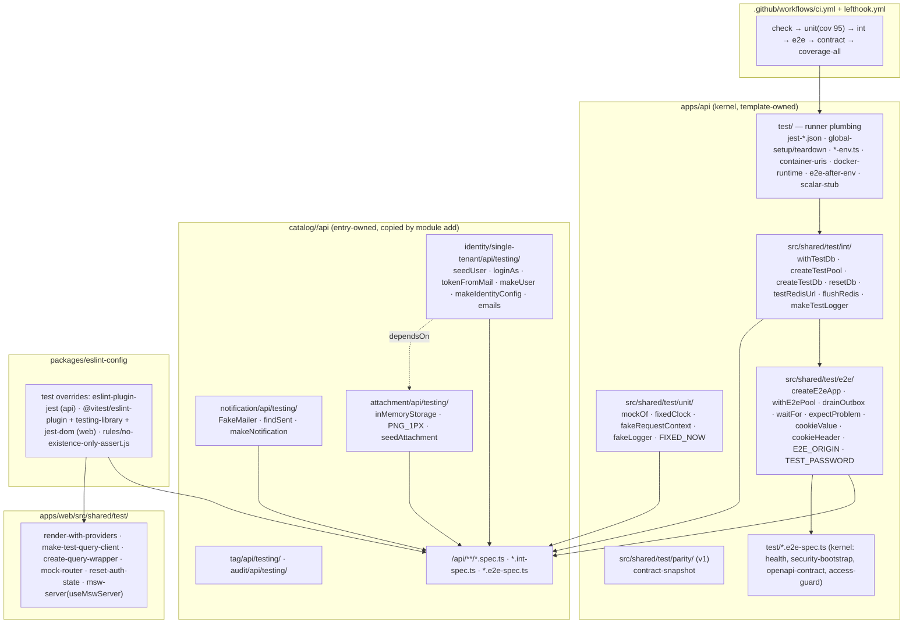

# Test suite refactor — Design

**Spec**: `.specs/features/test-suite-refactor/spec.md`
**Context**: `.specs/features/test-suite-refactor/context.md` (GA-1..GA-7 locked as defaults)
**Status**: Draft
**Decisions loaded**: `.specs/STATE.md` AD-006, AD-012 (95% pre-push bar, api unit + web only), AD-013/AD-017/AD-018/AD-020 (v1 planned — kernel-only template, RULE C, entry anatomy, raw web). No active decision is superseded; AD-023 is appended (below; renumbered from AD-021 on 2026-08-21 — v1 took AD-021).
**Lessons**: `scripts/lessons.py` not present at HEAD; `docs/test/testing.md` § "O que conta como prova" (L-004, L-007, L-010, L-013) applied as confirmed lessons.

---

## Approaches considered

| | A — Layered helper library (kernel `shared/test` + entry `testing/`) ★ | B — One `apps/api/test/helpers` folder, module vocabulary allowed | C — DI-based harness (Nest `TestingModule` + in-memory fakes for every port) |
| --- | --- | --- | --- |
| Fits v1 (RULE C, entries copied with helpers) | yes — kernel helpers are module-agnostic; entry helpers travel in `module.json.files` | no — `seedUser`/`truncateIdentity` in a kernel folder; entries cannot be copied self-contained | yes, but every entry ships a fake per port |
| Migration cost | medium — mechanical per file | low | high — rewrites 33 `makeDeps`, new fake layer |
| Risk of weakening | low (same asserts, fewer lines) | low | medium (fakes hide SQL/tx behaviour the int tier must still cover) |
| Reuse of what exists | `app-factory.ts`, `test-db.ts`, `cookies.ts`, `seed-user.ts`, `fake-mailer.ts`, `identity.config.fixture.ts`, web `render-with-providers`, `msw-server` | same | little |

**Recommendation: A.** B is what exists today minus the duplication and breaks the moment identity is an entry. C is the "right" long-term shape for unit tests but is a parallel implementation per entry — GA-3 limits stateful fakes to where state is asserted.

---

## Architecture Overview



Two import rules, both enforced by tests:
1. `shared/test/**` imports kernel code only (RULE A/C unchanged; `module-boundaries.spec.ts` already scans `shared/**`).
2. `catalog/<x>/api/**` may import `catalog/<y>/api/testing` only if `y ∈ x.module.json.dependsOn` — new rule in the v1 catalog boundaries test (`catalog-lint`, T13 of v1) — ENT-03.

---

## Code Reuse Analysis

### Existing components to leverage

| Component | Location (today) | How to use |
| --- | --- | --- |
| `createE2eApp`, `allowAllRateLimiter` | `apps/api/test/setup/app-factory.ts:14,26` | move to `shared/test/e2e/app.ts`; extend options (`rateLimiter`, `overrides`, `middleware`) |
| `createTestPool`, `createTestDb`, `truncateKernel`, `flushRedis`, `testRedisUrl`, `seedEmail` | `apps/api/test/setup/test-db.ts` | move to `shared/test/int/db.ts`; generalize `truncate*` into `resetDb(pool, schemas)` |
| `makeTestLogger` | `apps/api/test/setup/test-logger.ts` | move to `shared/test/int/logger.ts` (unit `fakeLogger` wraps it) |
| `setCookies` | `apps/api/test/setup/cookies.ts` | becomes `cookieHeader`/`cookieValue` in `shared/test/e2e/http.ts` |
| `seedUser`, `seedEmail` | `apps/api/test/setup/seed-user.ts` | move to identity entry `testing/seed-user.ts`; add master demotion (from `access-link-activation:138-141`) |
| `FakeMailer` | `apps/api/test/setup/fake-mailer.ts` | move to notification entry `testing/fake-mailer.ts` (+ `findSent`) |
| `makeInMemoryStorage`, `PNG_1PX`, `seedAttachment` | `attachment-download.e2e-spec.ts:34-101` (fullest impl) | extract to attachment entry `testing/` |
| `linkFromHtml`, `waitFor` | `create-user-flow.e2e-spec.ts:31-48` | `waitFor` → kernel e2e; `linkFromHtml` → inside `tokenFromMail` (identity testing) |
| poll loops | `notifications-inapp.e2e-spec.ts:41-58`, `notifications-email:88-110` | `drainOutbox` in kernel e2e (calls `OutboxDispatcher.poll()` + `DeliveryDispatcher.poll()`; delivery dispatcher is notification-owned after v1 → `drainOutbox` accepts `{ dispatchers?: Array<{ poll(): Promise<unknown> }> }` so the kernel helper stays module-agnostic; default = outbox only) |
| `makeIdentityConfig` | `apps/api/src/modules/identity/identity.config.fixture.ts` | move into identity `testing/`; pattern for other entries' config fixtures |
| captured-entity assert pattern | `archive-notification.use-case.spec.ts:28` | the model for UNT-04 |
| `expectContractSubset` | `apps/api/src/shared/test/parity/contract-snapshot.ts` (v1 T30) | untouched; same folder confirms `shared/test` as the home |
| `renderWithProviders`, `makeTestQueryClient`, `msw-server` | `apps/web/src/shared/test/*` | keep; add siblings |
| local eslint rule + `node --test` | `packages/eslint-config/rules/sr-only-requires-positioned-ancestor.{js,test.js}` | template for `no-existence-only-assert` |
| coverage merge | `apps/api/scripts/coverage-all.sh`, `test/tools/normalize-coverage.ts` | CI job `coverage-all` calls it unchanged |
| lefthook pre-push | `lefthook.yml` | only the api `test` → `test:cov` switch (COV-11 ratchet) |

### Integration points

| System | Integration |
| --- | --- |
| jest configs (`package.json` jest, `test/jest-integration.json`, `test/jest-e2e.json`) | `roots` already `src`+`test`; `collectCoverageFrom` gains `!src/shared/test/**`, `!src/modules/*/testing/**`; `setupFilesAfterEach` unchanged |
| tsconfig(s) | `apps/api/tsconfig.build.json` must exclude `src/shared/test/**` and `src/**/testing/**` from the Nest build (verify at T1; `identity.config.fixture.ts` in `src` today proves specs-adjacent files compile — the build exclude is the open check) |
| v1 `module.json.files` | each entry lists `api/testing/**` so `module add` copies it (ENT-04) |
| v1 `catalog-lint` (T13) | gains the `testing/` ⇒ `dependsOn` rule (ENT-03) |
| `packages/eslint-config/base.js:125-139` test override | extended with plugin configs; `fsd.js:26` boundary ignore unchanged |
| turbo.json | declare `test:cov`, `test:cov:all`, `test:watch` |

---

## Components

### 1. `shared/test/unit` — doubles

- **Location**: `apps/api/src/shared/test/unit/{mock-of,clock,request-context,logger,constants}.ts` + `index.ts`
- **Interfaces**:
  - `mockOf<T>(partial?: Partial<jest.Mocked<T>>): jest.Mocked<T>` — Proxy-backed; any property not provided is a `jest.fn()` whose default implementation throws `Error("<name> não stubado")` (spec edge case); `partial` values that are functions are wrapped with `jest.fn(impl)` so `toHaveBeenCalledWith` works.
  - `fixedClock(iso: string = FIXED_NOW): Clock` — `{ now: () => new Date(iso) }` typed against the kernel `Clock` port.
  - `fakeRequestContext(partial?: Partial<RequestContextStore>): RequestContext` — a real `RequestContext` instance pre-seeded through its public `run`/`get` API (no private poking), defaults `correlationId: "c1"`, `requestId: "r1"`, `userAgent: "jest"`, `ip: "127.0.0.1"`, `actor: null`.
  - `fakeLogger(): { logger: Logger; loggerFactory: LoggerFactory; lines: LogLine[] }` — captures lines (replaces stdout capture in `auth-reset-token-logging`).
  - `FIXED_NOW = "2026-01-15T12:00:00.000Z"`, `TEST_PASSWORD = "Senha-Forte-Teste-2026!"`.
- **Dependencies**: kernel `Clock`, `RequestContext`, `LoggerFactory` types.
- **Reuses**: defaults measured in the audit (`correlationId "c1"` 34×).

### 2. `shared/test/int` — database harness

- **Location**: `apps/api/src/shared/test/int/{db,redis,logger,with-test-db}.ts`
- **Interfaces**:
  - `createTestPool(): Pool`, `createTestDb(pool): TestDb` (moved).
  - `resetDb(pool, schemas: readonly string[]): Promise<void>` — validates each schema against `information_schema.schemata` (throws listing known schemas), then one `TRUNCATE <all tables of schemas> RESTART IDENTITY CASCADE`. `truncateKernel(pool) = resetDb(pool, ["_kernel"])` kept as sugar.
  - `withTestDb(opts: { schemas: readonly string[] }): { pool: Pool; db: TestDb; txm: TransactionManager; logger: LoggerFactory }` — registers `beforeAll` (pool/db/txm), `beforeEach(resetDb)`, `afterAll(pool.end)`; returns a live holder object whose fields are set in `beforeAll` (pattern already used by 21 specs manually).
  - `testRedisUrl(): string`, `flushRedis(): Promise<void>` (moved; `e2e-after-env.ts` calls `flushRedis`).
  - `makeTestLogger()` (moved).
- **Reuses**: `test/setup/test-db.ts`, `container-uris.ts`.

### 3. `shared/test/e2e` — app harness

- **Location**: `apps/api/src/shared/test/e2e/{app,http,outbox,wait-for,problem,constants}.ts`
- **Interfaces**:
  - `createE2eApp(opts?: { rateLimiter?: "allow-all" | "real"; overrides?: Array<[InjectionToken, unknown]>; extraModules?: Type[]; middleware?: "full" | "none" }): Promise<{ app: INestApplication; http: Server; close(): Promise<void> }>`.
  - `withE2ePool(): { pool: Pool }` — `beforeAll`/`afterAll` owner for e2e specs needing SQL asserts (HRN-05).
  - `drainOutbox(app, opts?: { dispatchers?: Pollable[]; until?: () => Promise<T | undefined>; timeoutMs?: number; intervalMs?: number }): Promise<T | void>` — default `dispatchers = [app.get(OutboxDispatcher)]`; entries pass `[…, app.get(DeliveryDispatcher)]`; rejects `Error("drainOutbox: timeout após <ms>ms")`.
  - `waitFor<T>(fn: () => Promise<T | undefined>, opts?): Promise<T>`.
  - `expectProblem(res, expected: { status: number; type?: string; title?: string; detail?: string }): void`.
  - `cookieValue(res, name): string | undefined`, `cookieHeader(res): string[]` (the `Cookie` header array supertest accepts).
  - `E2E_ORIGIN = process.env.WEB_ORIGIN!`, re-export `TEST_PASSWORD`.
- **Reuses**: `app-factory.ts`, `cookies.ts`, `e2e-env.ts` (sets `WEB_ORIGIN`).

### 4. Entry `testing/` barrels (one per entry)

- **Location**: `catalog/<entry>/api/testing/index.ts` (+ files); listed in `module.json.files`.
- **identity/single-tenant**: `seedUser(pool, opts: { email?, password?, accessProfile?, verified?, … }): Promise<SeededUser>` (demotes previous master when `accessProfile: "master"`), `loginAs(http, email, password = TEST_PASSWORD): Promise<string[]>`, `tokenFromMail(mailer: FakeMailer, to: string, opts?: { subject?: RegExp }): Promise<string>` (uses `waitFor` + `linkFromHtml` + `URL`), `makeUser(overrides?: Partial<UserProps>): User` (the one `fromProps` literal), `aUser(overrides?)` (`createActive`), `makeIdentityConfig` (moved), `emails = { ana: "ana@example.com", … }`, `seedEmail(suite, local)`.
- **notification**: `FakeMailer` (moved), `findSent(mailer, { to, subject? })`, `makeNotification(overrides?)`, `DELIVERY_DISPATCHERS(app)` helper returning the pollables for `drainOutbox`.
- **attachment**: `inMemoryStorage(): ObjectStoragePort & { objects: Map<string, Buffer> }`, `PNG_1PX`, `seedAttachment(pool, storage, opts)`, `makeAttachment(overrides?)`.
- **tag**, **audit**: `makeTag`, `seedTag`, `makeAuditEntry`, `seedAuditEntry` (from `audit-product-extension:seedThingAndAuditEntry`).
- **Dependencies**: kernel `shared/test/{unit,int,e2e}`; dependents via `dependsOn`.

### 5. Web harness additions

- **Location**: `apps/web/src/shared/test/{create-query-wrapper,mock-router,reset-auth-state,msw-server}.ts(x)`
- **Interfaces**: `createQueryWrapper(qc = makeTestQueryClient())`, `mockRouter(opts?: { navigate?: Mock; pathname?: string; outlet?: ReactNode })` — one `vi.hoisted` shape covering `RouterProvider`, `Outlet`, `useNavigate`, `useLocation`; `resetAuthState()`; `useMswServer(...handlers)` registering `beforeAll/afterEach/afterAll`.
- **Reuses**: existing three helpers; deletes `fixed-clock.ts`.

### 6. Lint

- **Location**: `packages/eslint-config/base.js` (api test override), `react.js`/web config (vitest + testing-library + jest-dom override), `rules/no-existence-only-assert.{js,test.js}`.
- **Rule semantics**: in a `it`/`test` callback, collect `expect(...)` call chains; if ≥1 `expect` and every chain's terminal matcher ∈ {`toBeDefined`, `toBeUndefined`, `toBeTruthy`, `toBeFalsy`, `toBeNull`?—no (null is a value), `not.toThrow` with 0 args, `resolves.toBeDefined`, `rejects.toBeDefined`} → report. `expect.assertions(n)` counts as non-existence. Tested with `node --test`.
- **Plugins**: `eslint-plugin-jest` (`recommended` + `no-focused-tests`, `no-disabled-tests`, `expect-expect`, `no-conditional-expect`, `valid-expect`, `no-standalone-expect` as error), `@vitest/eslint-plugin` (equivalents), `eslint-plugin-testing-library` (`react` preset), `eslint-plugin-jest-dom` (`recommended`). Versions: resolve at T-time from the registry (no version assumed here).

### 7. CI

- **Location**: `.github/workflows/ci.yml` (or extend v1's).
- **Jobs**: `check` (pnpm check); `unit` (turbo `test:cov` both apps, uploads `coverage/` summary); `int` / `e2e` (needs Docker — ubuntu runner has dockerd; testcontainers Ryuk OK); `contract` (`pnpm contract && git diff --exit-code openapi.json`); `coverage-all` (runs `apps/api/scripts/coverage-all.sh`; needs Docker). Concurrency group per ref; Node from `.nvmrc` via `actions/setup-node`, pnpm via `corepack` + `packageManager`.

---

## Data Models

No persistent data. Harness types:

```typescript
type Pollable = { poll(): Promise<unknown> }
type SeededUser = { id: string; email: string; password: string; accessProfile: string }
type E2eApp = { app: INestApplication; http: import("http").Server; close(): Promise<void> }
```

---

## Error Handling Strategy

| Scenario | Handling | Author sees |
| --- | --- | --- |
| `mockOf` method called without stub | throws `"<method> não stubado"` | failing test with the method name, not `undefined is not a function` three frames down |
| `drainOutbox`/`waitFor` timeout | rejects with named timeout | explicit timeout message |
| `resetDb` unknown schema | throws before SQL, lists known schemas | typo surfaced in `beforeEach` |
| `createE2eApp` boot failure | propagates; `close` not registered | jest hook error |
| lint rule false positive (e.g. `toBeDefined` as a guard before a value assert) | only reports when *every* chain is existence-only | none |

---

## Risks & Concerns

| Concern | Location | Impact | Mitigation |
| --- | --- | --- | --- |
| Nest build might compile `src/shared/test/**` and `src/**/testing/**` into `dist` | `apps/api/tsconfig.build.json` / `nest-cli.json` | jest/supertest types in prod build | T1 verifies `pnpm --filter api build` output has no `shared/test`; add `exclude` if needed (precedent: `identity.config.fixture.ts` already in `src`) |
| `drainOutbox` needs `DeliveryDispatcher` which is notification-owned after v1 | `shared/test/e2e/outbox.ts` | kernel helper importing an entry (RULE A/C) | `dispatchers` option; kernel default = outbox only |
| Ordered `it` chains hide setup that other `it`s rely on | `create-user-flow`, `authz`, `access-link-activation` | splitting may expose missing seeds | `--randomize` gate per file in the migrating task; `beforeEach` seeds via entry barrel |
| `it` count equality across split files | all migrated e2e | Verifier cannot map counts | titles preserved (spec edge case); count table by file group |
| v1 wave 3 writes entries with today's patterns before this feature | `catalog/*/api/**` | double touch | accepted (GA-1); entry migration tasks are per entry |
| Two Redis-booting int-specs rely on a fresh DB index | `realtime.int-spec.ts:18`, `redis-rate-limiter.int-spec.ts:16` | flaky cross-test state on the shared container | `flushRedis()` in their `beforeEach`; they run in int tier with 4 workers — use per-worker key prefix if collisions appear (decide at T10) |
| eslint plugin versions vs ESLint major in repo | `packages/eslint-config/package.json` | install failure | resolve at T5 against the repo's ESLint version (Context7/npm) — no version fixed in design |
| Coverage 95% on the post-T22 denominator is unknown today | `apps/api/src/shared/**`, `apps/web/src/**` | fills size unknown | COV-11 task measures first, then fills; ratchet last (inherited default) |
| `pool-saturation regression` test opens raw `Pool` deliberately | `attachment-download:337 region`, `application-pool.int-spec.ts` | `no createTestPool in it` rule false positive | rule scoped to `createTestPool`; raw `new Pool` stays allowed with a comment-free justification via test title |

---

## Tech Decisions

| Decision | Choice | Rationale |
| --- | --- | --- |
| Harness home | `apps/api/src/shared/test/{unit,int,e2e}` + entry `testing/` | GA-2; `shared/test/parity` precedent; copied with entries |
| `drainOutbox` dispatcher injection | option `dispatchers`, default outbox only | RULE A/C |
| `mockOf` strictness | unstubbed call throws | L-007: a passing test must be explained by a stub, not by `undefined` |
| Stateful fakes | entry-owned, only where specs assert state | GA-3 |
| Lint rule for existence-only asserts | local rule in `packages/eslint-config/rules` | no upstream rule covers the pattern; precedent exists |
| CI as one workflow | single `ci.yml`, jobs in parallel after `check` | simplest; catalog-check from v1 extends it |
| Web session fixtures | live in identity entry `web/testing` | AD-018 raw web: fixture is pure TS |

**Project-level decision appended to `.specs/STATE.md`:**

> **AD-023 (planned)** — **Test harness layering.** Runner plumbing (jest configs, containers, env) lives in `apps/api/test/`; everything a spec imports lives in `apps/api/src/shared/test/{unit,int,e2e,parity}` with kernel vocabulary only; each catalog entry ships `api/testing/` (seed, login, fakes, fixtures) listed in `module.json.files`, importable by dependents only through `dependsOn`. Web mirrors it in `apps/web/src/shared/test/`. Test files may not define local copies of harness helpers; lint forbids `.only`/`.skip`/assertion-less/existence-only tests. Supersedes nothing; constrains v1 entry anatomy (README § Tests) and `docs/test/testing.md`.
