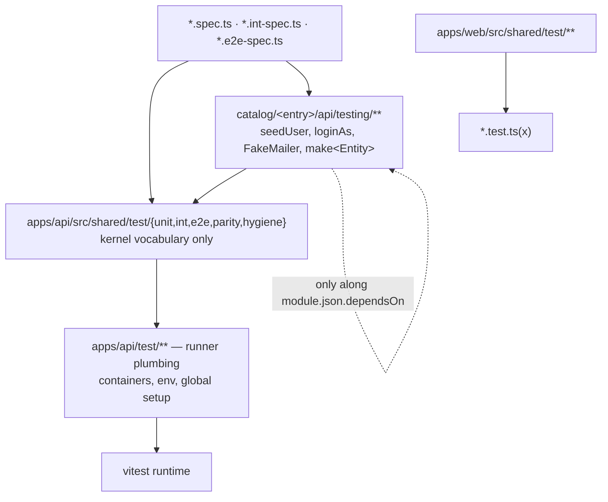

# Test Suite Refactor Design

**Spec**: `.specs/features/test-suite-refactor/spec.md`
**Context**: `.specs/features/test-suite-refactor/context.md`
**Status**: Draft
**Decisions loaded**: AD-012 (95 % pre-push bar), AD-013 (catalog model, RULE C), AD-016 (entry versions), AD-019 (advisories), AD-021/AD-024/AD-025 (entry-to-entry coupling), AD-026 (a cross-entry e2e lives in the dependent) — this design **conforms** to all of them and adds AD-023 (§ *Tech Decisions*).

## Architecture Overview

Three layers, one direction of import. Nothing below imports from anything above it.



Two import rules, both enforced by a spec rather than by review:

- **RULE C (existing)** — `apps/api/src/shared/**` carries no module vocabulary. The kernel harness therefore knows schemas as strings, dispatchers as a `Pollable[]` option and users not at all.
- **RULE D (new, this feature)** — a test file may import another entry's `testing/` barrel only when that entry is in its `module.json.dependsOn`, and only when the edge keeps the `dependsOn` graph acyclic (AD-025). `apps/api/src/modules/module-boundaries.spec.ts` gains the rule; `catalog-lint` reports it for an uninstalled entry.

## Code Reuse Analysis

### Existing components to leverage

| Component | Location (today) | How to use |
| --- | --- | --- |
| App bootstrap | `apps/api/test/setup/app-factory.ts` | becomes the body of `createE2eApp`, moved into the kernel harness; the module-aware bits become the `overrides`/`extraModules` options |
| Pool + truncate | `apps/api/test/setup/test-db.ts` | split: generic pool/reset into `shared/test/int/db.ts`, the module-named truncations deleted in favour of `resetDb(pool, schemas)` |
| Cookie readers | `apps/api/test/setup/cookies.ts` | becomes `cookieValue`/`cookieHeader` in `shared/test/e2e/http.ts`; the five ad-hoc styles in specs collapse onto it |
| Silent logger | `apps/api/test/setup/test-logger.ts` | `makeTestLogger()` in `shared/test/int/logger.ts`, reused by `fakeLogger()` |
| Seeds and mailer already in an entry | `catalog/identity/single-tenant/api/testing/{seed-user.ts,fake-mailer.ts,allow-all-rate-limiter.ts,seeds/**}` · `catalog/notification/api/testing/fake-mailer.ts` | already in the right place, wrong shape — no `index.ts`, and `FakeMailer` is duplicated across the two entries; the barrel task adds the index and leaves one owner (notification) with identity importing it along its existing `dependsOn` edge |
| Contract snapshot | `apps/api/src/shared/test/parity/contract-snapshot.ts` | precedent that `shared/test/**` is an allow-listed home; the new folders sit beside it |
| Local ESLint rule precedent | `packages/eslint-config/rules/sr-only-requires-positioned-ancestor.{js,test.js}`, registered in `react.js:9,13,66` | copy the registration shape for `no-existence-only-assert` |
| Web harness | `apps/web/src/shared/test/{render-with-providers.tsx,msw-server.ts}` | kept and extended; `fixed-clock.ts` has no consumer and is deleted |
| Boundaries spec | `apps/api/src/modules/module-boundaries.spec.ts` | host for RULE D |
| Entry install gate | `scripts/platform/catalog-check.mjs` (`pnpm catalog:check`) | proves `module.json.files` really ships `testing/**` — the entry is installed into a scratch child and its tests run there |
| Coverage merge | `vitest.coverage.mts` (one run over the four projects, v8) | unchanged; only the denominator excludes change (`coverage-all.sh` and nyc no longer exist — AD-027) |

### Integration points

| System | Integration |
| --- | --- |
| vitest (api) | new `exclude` entries for `**/shared/test/**` in `vitest.coverage.mts`; `sequence.shuffle` becomes the default for the `api-e2e` project in CI |
| vitest (web) | harness exports only; thresholds raised by the ratchet task |
| lefthook | pre-push is `migrations → typecheck → catalog-typecheck → test-coverage` (AD-027, needs Docker); this feature only raises the floors in `vitest.coverage.mts` |
| turbo | untouched — `turbo.json` carries no `test*` task, tests run outside Turbo (AD-028) |
| GitHub Actions | `.github/workflows/ci.yml` added beside the existing `catalog.yml`; both use `.nvmrc` + `packageManager` |
| copier | `apps/api/src/shared/test/**` ships with the template; entry `testing/**` ships through `module.json.files` |

## Components

### 1. Unit harness — `apps/api/src/shared/test/unit/`

**Purpose**: typed doubles with no module vocabulary.
**Files**: `mock-of.ts`, `clock.ts`, `request-context.ts`, `logger.ts`, `constants.ts`, `index.ts`.
**Interfaces**:

- `mockOf<T>(partial?: Partial<Mocked<T>>): Mocked<T>` (`Mocked` from `"vitest"`) — every method not supplied is a `vi.fn()` that **rejects** with `Error("<method> not stubbed")`.
- `fixedClock(iso = FIXED_NOW): Clock`
- `fakeRequestContext(partial?: Partial<RequestContextStore>): RequestContext` — kernel defaults `correlationId: "c1"`, `userAgent: "jest"`, `actor: null`.
- `fakeLogger(): { logger, loggerFactory, lines }`
- `FIXED_NOW`, `TEST_PASSWORD`.

**Dependencies**: kernel types only (`Clock`, `RequestContextStore`, logger port).
**Reuses**: `test/setup/test-logger.ts`.

### 2. Int harness — `apps/api/src/shared/test/int/`

**Purpose**: one database and one Redis per suite, owned by the harness.
**Files**: `db.ts`, `with-test-db.ts`, `redis.ts`, `logger.ts`, `index.ts`.
**Interfaces**:

- `createTestPool(): Pool` · `createTestDb(pool): TestDb`
- `resetDb(pool, schemas: readonly string[]): Promise<void>` — one `TRUNCATE`, schema names validated against `information_schema` first.
- `truncateKernel(pool)` = `resetDb(pool, ["_kernel"])`
- `withTestDb(opts: { schemas: readonly string[] }): { pool, db, txm, logger }` — registers its own `beforeAll` / `beforeEach(resetDb)` / `afterAll(pool.end)`.
- `testRedisUrl(): string` · `flushRedis(): Promise<void>` · `makeTestLogger()`

**Dependencies**: `pg`, drizzle, the global container URIs from the runner plumbing.
**Reuses**: `test/setup/test-db.ts`, `test/setup/container-uris.ts`.

### 3. E2E harness — `apps/api/src/shared/test/e2e/`

**Purpose**: the only app bootstrap and the only assertion vocabulary for HTTP.
**Files**: `app.ts`, `http.ts`, `outbox.ts`, `wait-for.ts`, `problem.ts`, `constants.ts`, `index.ts`.
**Interfaces**:

- `createE2eApp(opts?: { rateLimiter?: "allow-all" | "real"; overrides?: Array<[token, value]>; extraModules?: Type[]; middleware?: "full" | "none" }): Promise<{ app, http, close }>`
- `withE2ePool(): { pool }` — suite-scoped, closed in `afterAll`.
- `drainOutbox(app, opts?: { dispatchers?: Pollable[]; until?: () => Promise<T | undefined>; timeoutMs?: number; intervalMs?: number }): Promise<T | void>` — default dispatcher is the kernel `OutboxDispatcher`; an entry passes its own (`DELIVERY_DISPATCHERS(app)`) so the kernel never names a module's dispatcher. Rejects with a message naming the timeout.
- `waitFor<T>(fn, opts?): Promise<T>` · `expectProblem(res, expected: { status; type?; title?; detail? }): void`
- `cookieValue(res, name): string | undefined` · `cookieHeader(res): string[]`
- `E2E_ORIGIN` (reads `process.env.WEB_ORIGIN`), re-export of `TEST_PASSWORD`.

**Dependencies**: Nest testing module, supertest, kernel middleware from `main.ts`.
**Reuses**: `test/setup/app-factory.ts`, `test/setup/cookies.ts`.

### 4. Guard spec — `apps/api/src/shared/test/hygiene/harness-hygiene.spec.ts`

**Purpose**: make the duplication bans executable and permanent instead of grep-in-a-review. This is what keeps the refactor from decaying and what keeps the feature inside the ≤3-probe budget.
**Interfaces**: a single spec file with one `it` per ban, each reporting `file:line` for every hit:

- exactly one file matching `Test.createTestingModule`;
- no local definition of the banned helper names (`allowAll`, `login`, `loginAndGetCookie`, `extractCookieValue`, `parseSetCookie`, `linkFromHtml`, `waitFor`, `pollUntil`, `findSent`, `makeInMemoryStorage`, `seedUser`) outside the harness and the entry barrels;
- no `PNG_1PX` byte literal, no literal web origin, no password literal outside those homes;
- no `createTestPool(` inside an `it`/`test` body;
- no `Record<string, any>` in a spec; `as never` / `as unknown as` only under `shared/test/**`;
- no `<Aggregate>.fromProps({` in a spec outside a `testing/` barrel;
- no `GenericContainer` in an `*.int-spec.ts`;
- `apps/api/test/setup/` contains only the runner-plumbing allow-list.

**Scan scope**: `apps/api/**` and `catalog/**` when both exist, `apps/api/**` alone in a child; `node_modules`, `dist`, `coverage` and **`apps/api/.catalog-stage/**`** (the staging mirror of the entries) are excluded — scanning the mirror would double every hit.
**Dependencies**: `fast-glob` (already a dev dependency of the scripts) and `node:fs`; no runtime code.
**Reuses**: the file-walk shape of `module-boundaries.spec.ts`.

### 5. Entry testing barrels — `catalog/<entry>/api/testing/index.ts`

**Purpose**: module vocabulary lives with the module and travels with it into the child.
**Interfaces**:

| Entry | Exports |
| --- | --- |
| `identity/single-tenant` | `seedUser(pool, opts): Promise<SeededUser>`, `loginAs(http, email, password?): Promise<string[]>`, `tokenFromMail(mailer, to, opts?)`, `makeUser(overrides?)`, `makeIdentityConfig`, `emails`, `seedEmail(suite, local)`, `allowAllRateLimiter`, re-export of notification's `FakeMailer` |
| `notification` | `FakeMailer` (single owner), `findSent(mailer, { to, subject? })`, `makeNotification(overrides?)`, `DELIVERY_DISPATCHERS(app): Pollable[]` |
| `attachment` | `inMemoryStorage(): ObjectStoragePort & { objects }`, `PNG_1PX`, `seedAttachment(pool, storage, opts)`, `makeAttachment(overrides?)` |
| `tag` | `makeTag(overrides?)`, `seedTag(pool, opts)` |
| `audit` | `makeAuditEntry(overrides?)`, `seedAuditEntry(pool, opts)` |

**Dependencies**: the entry's own domain plus, along `dependsOn` only, another entry's barrel (identity → notification for `FakeMailer`; attachment/tag/audit → identity for `loginAs`).
**Reuses**: the files already sitting in `catalog/identity/.../testing/` and `catalog/notification/api/testing/`; `identity.config.fixture.ts` moves into the identity barrel.

### 6. Web harness — `apps/web/src/shared/test/`

**Purpose**: the same idea, one layer thinner (the template web is a shell).
**Interfaces**: `renderWithProviders` (existing), `makeTestQueryClient`, `createQueryWrapper(qc?)`, `mockRouter(opts?: { navigate?; pathname?; outlet? })` as one `vi.hoisted` shape, `resetAuthState()`, `useMswServer(...handlers)`. `fixed-clock.ts` is deleted.
**Dependencies**: vitest, testing-library, msw.

### 7. Test lint — `packages/eslint-config/`

**Purpose**: the mechanical half of "every test proves a value".
**Interfaces**: `@vitest/eslint-plugin` already covers the api and web test globs (vitest-migration); this feature adds `eslint-plugin-jest-dom` on the web test globs (`eslint-plugin-testing-library` is already there); the local rule `rules/no-existence-only-assert.js` registered the way `sr-only-requires-positioned-ancestor` is (`react.js:9,13,66`), with a `RuleTester` suite beside it.
**Rule semantics**: report when **every** `expect` chain in the test body ends in an existence-only matcher (`toBeDefined`, `toBeUndefined`, `toBeTruthy`, `toBeFalsy`, `resolves/rejects.toBeDefined`, argument-less `not.toThrow`); exempt a body that also asserts a concrete value, that declares `expect.assertions(n)`, or that passes a matcher to `not.toThrow(...)`.
**Proof that the plugin set is active**: a config test resolving `calculateConfigForFile` for one api and one web test file and asserting the four rule severities — a rule that is configured but not reachable would otherwise pass unnoticed.

### 8. Runner plumbing — `apps/api/test/`

**Purpose**: what the runner needs and no spec imports.
**Allow-list after the refactor**: `global-setup.ts`, `global-teardown.ts`, `e2e-env.ts`, `int-env.ts`, `unit-env.ts` (importing the shared env block instead of duplicating it), `e2e-after-env.ts`, `container-uris.ts`, `docker-runtime.ts`, `global.d.ts`, the `vitest.*.mts` configs and the two kernel e2e specs (`openapi-contract`, `security-bootstrap`).
**Removed from here**: `app-factory.ts`, `cookies.ts`, `test-db.ts`, `test-logger.ts` (moved into the harness).

### 9. Gates — `.github/workflows/`, `turbo.json`, `lefthook.yml`

**Purpose**: run what the handbook claims is run.
**Interfaces**: `ci.yml` already exists (vitest-migration) — this feature only extends it where a job is missing; `catalog.yml` untouched except where a job would be duplicated. Pre-push is the AD-027 gate (`pnpm test:coverage`, Docker). Turbo declares no test task (AD-028).

### 10. Count baseline — `scripts/platform/it-count.mjs`

**Purpose**: STR-04's proof, and the only probe in the api half of the feature.
**Interfaces**: `--write <file>` records `{ file, title[], count }` per test file; `--check <file>` compares the current tree against it and exits non-zero on any file (or split group, matched by preserved `it` title) whose total dropped. Baseline lives at `.specs/features/test-suite-refactor/baseline.json`.

## Data Models

```ts
type Pollable = { poll(): Promise<unknown> };

type SeededUser = { id: string; email: string; password: string; accessProfile: string };

type E2eApp = { app: INestApplication; http: Server; close: () => Promise<void> };

type HygieneViolation = { rule: string; file: string; line: number; snippet: string };

type ItBaseline = Record<string, { titles: string[]; count: number }>;
```

No persistence, no migration: every model above lives for the duration of a test run.

## Error Handling Strategy

| Scenario | Handling | Author sees |
| --- | --- | --- |
| `resetDb` gets an unknown schema | throws before executing, listing the schemas found in `information_schema` | a typo fails the suite immediately instead of silently truncating nothing |
| `drainOutbox` never satisfies `until` | rejects after `timeoutMs` with the timeout in the message and the dispatchers it polled | a flaky sleep becomes a named failure |
| A `mockOf` method is called but was not stubbed | the mock rejects with `"<method> not stubbed"` | the spec cannot pass on an accidental `undefined` |
| `createE2eApp` fails to boot | the error propagates; `close()` is safe to call on a partially built app | no orphan container or pool between files |
| The guard spec finds violations | fails with one line per hit (`rule · file:line · snippet`), never a bare count | the author fixes the exact site |
| The `it`-count probe finds a drop | exits non-zero naming file, expected and actual counts | a silently deleted test cannot pass as a "simplification" |

## Risks & Concerns

| Concern | Location | Impact | Mitigation |
| --- | --- | --- | --- |
| The guard spec scans the staging mirror | `apps/api/.catalog-stage/src/modules/**` | every violation counted twice, and fixes in `catalog/` never clear the mirror hits | the scan excludes `.catalog-stage`, `dist`, `coverage`, `node_modules` — asserted by a unit test of the scanner itself |
| `drainOutbox` must not name a module dispatcher | `shared/test/e2e/outbox.ts` | a `DeliveryDispatcher` import in the kernel harness breaks RULE C | dispatchers are a `Pollable[]` option; the entry passes `DELIVERY_DISPATCHERS(app)` |
| `FakeMailer` exists twice today | `catalog/identity/.../testing/fake-mailer.ts` and `catalog/notification/api/testing/fake-mailer.ts` | two behaviours drift; identity's tests assert on a mailer notification never sends | notification is the single owner; identity imports it along the `dependsOn` edge it already declares (AD-025) |
| RULE D could invert an existing edge | attachment/tag/audit e2e need identity's `loginAs` | a `testing/` import that closes a cycle would violate AD-021/AD-025 | the DAG is `notification → identity → {audit, attachment}`, `tag` isolated; the four `notifications-*` e2e already live in identity (AD-026), so no new edge is needed |
| Enabling the lint plugins turns existing files red | `packages/eslint-config` | a wave lands with a repo-wide red lint | the lint wave runs **after** the migration and strengthening waves; no allow-list, no `eslint-disable` |
| Child repositories run the guard spec too | installed entries at `apps/api/src/modules/<entry>/testing/**` | the template's own paths do not exist in a child | the scan globs both layouts and asserts on whichever is present |
| Coverage bar and the shrinking denominator | `vitest.coverage.mts` | excluding the harness raises the effective bar on real code | the fills (COV-11) run before the ratchet, never the other way around |
| ESLint flat-config compatibility of the four plugins | `packages/eslint-config/{base,react}.js` | a plugin without flat-config support blocks the lint wave | the lint wave's first task pins versions and proves resolution with the config test (component 7) before any rule is switched on |
| `.only` could still reach `main` between waves | any test file | the ban is not active until the lint wave | the guard spec (wave 3) and CI (`--sequence.shuffle` + lint) both fail on it; the window is inside the feature branch only |

## Tech Decisions

| Decision | Choice | Rationale |
| --- | --- | --- |
| Harness home | Kernel `src/shared/test/**` + entry `api/testing/**` (approach A) | B (everything under `apps/api/test/`) breaks the moment module vocabulary is needed — RULE C; C (a full in-memory fake layer per entry) is the right long-term shape but a parallel implementation to maintain per entry, deferred |
| Doubles | `mockOf<T>()` typed mocks, stateful fakes only where state is asserted | avoids a second repository implementation per entry (GA-3) |
| Fixtures | one `make<Entity>` per aggregate plus named constants in the entry barrel | replaces 21 local `makeUser` definitions and the literal e-mail/date sprawl (GA-4) |
| Enforcement | a committed guard spec, not greps in acceptance criteria | greps in a spec die with the feature; a spec is a gate that runs in every child and keeps the probe budget at 2 of 3 |
| Bans on the mirror | exclude `.catalog-stage` | it is generated by `catalog:check`, not source |
| `FakeMailer` owner | notification | identity already depends on notification in production code (AD-025); the reverse edge would close a cycle |
| Lint plugin proof | a config test asserting resolved severities, not a fixture file that fails lint | a fixture that must fail lint cannot live inside the linted tree |
| GAP-02 (facade shape specs) | write the four missing facade specs (`user-directory`, `permission-catalog`, `tag-directory`, `audit-registry`); `attachment.facade.spec.ts` already exists | the handbook rule is cheap to satisfy and the facades are exactly the surface a child depends on — retiring the rule would remove the only check on cross-entry shape |
| CI file layout | one new `ci.yml`, `catalog.yml` left alone | the catalog workflow has a different trigger surface; merging them would run entry installs on every push |

> **AD-023 (planned, to append to `.specs/STATE.md` § Decisions on approval)** — **Test harness layering.** Runner plumbing lives in `apps/api/test/`; everything a spec imports lives in `apps/api/src/shared/test/{unit,int,e2e,parity,hygiene}` with kernel vocabulary only; each catalog entry ships `api/testing/` (seed, login, fakes, fixtures) listed in `module.json.files`, importable by another entry only along `dependsOn` and only where the graph stays acyclic (RULE D). Web mirrors it in `apps/web/src/shared/test/`. Test files may not define local copies of harness helpers — enforced by `harness-hygiene.spec.ts`, not by review. Lint forbids `.only`/`.skip`, assertion-less and existence-only tests. Constrains the entry anatomy (README § Tests) and `docs/test/testing.md`.

## Spike results

Audit of 2026-08-19, re-measured against `main` after the v1 merge (`8bb606d`). Scope: `apps/api/**` + `catalog/**` + `apps/web/**`, excluding `node_modules`, `.catalog-stage`, `dist`, `coverage` — 268 test files.

### Duplication and typing

| Measure | Count | Where it lands |
| --- | --- | --- |
| Files containing `Test.createTestingModule` | 25 | HRN-01 → 1 |
| `createTestPool(` call sites | 89 | HRN-05 |
| mock-factory sites (`jest.fn(` at audit time, `vi.fn(` after vitest-migration) | 736 | UNT-01 (`mockOf` covers the port mocks, not all of them) |
| `Record<string, any>` in `*.spec.ts` | 24 | UNT-01 → 0 |
| `as unknown as` + `as never` in test files | 166 | UNT-01 → only under `shared/test/**` |
| `User.fromProps({` in specs | 45 | UNT-03 → 0 |
| Local `makeUser` definitions (all in identity) | 21 | UNT-03 → 1 |
| `http://localhost:5173` literal in test files | 48 | HRN-06 → 0 |
| `@example.com` literals | 288 | GA-4 named constants |
| `toBeDefined()` in api test files | 41 | LNT-02 / STR-01 |
| Bare `not.toThrow()` | 27 | LNT-02 / STR-01 |

### Current homes

- `apps/api/test/setup/` — 13 files; `app-factory.ts`, `cookies.ts`, `test-db.ts`, `test-logger.ts` move to the harness, the rest stay.
- `apps/api/src/shared/test/` — only `parity/contract-snapshot.{ts,spec.ts}` exist today.
- `catalog/identity/single-tenant/api/testing/` — `fake-mailer.ts`, `allow-all-rate-limiter.ts`, `seed-user.ts`, `seeds/{types,bootstrap-master,master-user.seed,run}.ts`; **no `index.ts`**.
- `catalog/notification/api/testing/` — `fake-mailer.ts`, `sample-templates/`; **no `index.ts`**.
- `catalog/{attachment,tag,audit}/api/testing/` — do not exist yet.
- `apps/web/src/shared/test/` — `render-with-providers.tsx`, `fixed-clock.ts` (no consumers), `msw-server.ts`.
- e2e distribution — 3 kernel files in `apps/api/test/`, the rest in `catalog/<entry>/api/__e2e__/`; the four `notifications-*` files live in **identity** (AD-026).

### Weak spots to strengthen (STR-01), current paths

| File | What must be asserted |
| --- | --- |
| `apps/api/src/shared/kernel/clock/bucket-sql.spec.ts` | the generated SQL text |
| `apps/api/src/shared/infra/database/pool-metrics.spec.ts` | the metric values, not their existence |
| `apps/api/src/shared/infra/database/application-pool.int-spec.ts` | pool state after each transition |
| `apps/api/src/shared/config/load-dotenv.spec.ts` | the loaded value, not "did not throw" |
| `catalog/audit/api/infrastructure/trail/audit-trigger.int-spec.ts` | the trail row written by the trigger |
| `catalog/notification/api/application/templates/notification-template-registry.spec.ts` | the resolved template and subject |
| `catalog/identity/single-tenant/api/__e2e__/create-user-flow.e2e-spec.ts` | the created user's fields, not `cookie toBeDefined` |
| `catalog/identity/single-tenant/api/__e2e__/auth-rate-limit.e2e-spec.ts` | numeric `retry-after` and the problem `type` suffix |
| `catalog/identity/single-tenant/api/__e2e__/authz.e2e-spec.ts` | a positive 200 + body, in place of "not 401" |
| `catalog/identity/single-tenant/api/__e2e__/access-catalog.e2e-spec.ts` | the 403 body through `expectProblem` |
| `catalog/tag/api/__e2e__/tags.e2e-spec.ts` | the 403 body, and the persisted row after a trash |
| `catalog/audit/api/__e2e__/audit.e2e-spec.ts` | the 403 body through `expectProblem` |
| `catalog/identity/single-tenant/api/__e2e__/user-trash.e2e-spec.ts` | the persisted row after each mutation |
| `apps/web/src/app/router/router.test.tsx` | the redirect target |
| `apps/web/src/app/router/shell.integration.test.tsx` | the rendered outlet, not its existence |
| `apps/web/src/app/config/transport.test.ts` | the thrown problem and the cleared session |

Two files named by the original audit no longer exist and are dropped from scope: a `docs-login` e2e and `maintenance-schedule.spec.ts` (the latter was folded into the maintenance registry work by v1 T22d).

### Ordered chains and container boots (STR-02, UNT-02)

- Order-dependent e2e: `create-user-flow`, `authz`, `access-link-activation` (identity). The "seed master" pseudo-test in `create-user-flow` asserts `toBeTruthy` only and is the single removal the spec allows.
- Int-specs booting their own `GenericContainer`: `catalog/notification/api/infrastructure/realtime/realtime.int-spec.ts` and `catalog/identity/single-tenant/api/infrastructure/rate-limit/redis-rate-limiter.int-spec.ts` — both move to the global Redis.

### Gaps (GAP-01, GAP-02)

- `catalog/tag/api/application/use-cases/{create-tag,get-tag,restore-tags,stash-tag,update-tag}` — no spec for any of the five.
- `catalog/notification/api/infrastructure/repositories/drizzle-delivery.repository.ts` — no int-spec.
- Facades without a spec: `user-directory`, `permission-catalog` (identity), `tag-directory` (tag), `audit-registry` (audit). `attachment.facade.spec.ts` exists.

### Sensor candidates (input to the Verifier)

Behaviour-level mutants in production code, scratch only — the Verifier picks and sizes its own set; these are the eight the audit says the refactored suite must be able to kill: (1) `applySecurity` CSRF check inverted; (2) `AccessGuard` fails open when no policy is bound; (3) the outbox dispatcher skips delivery on the second poll; (4) login returns the session cookie without `HttpOnly`; (5) the problem-details filter drops `correlationId`; (6) trash purge ignores the cutoff; (7) web `requireAccess` returns `"allow"` for a null user; (8) the transport 401 interceptor does not clear the session.
