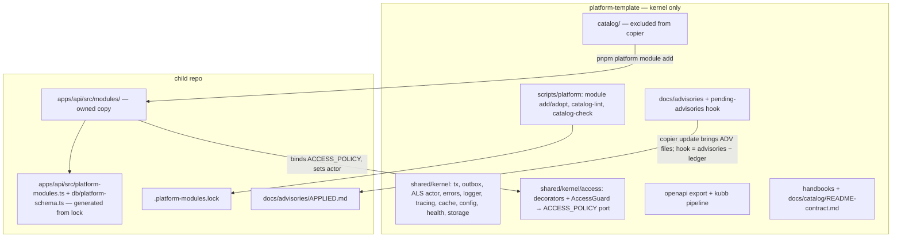

# v1 — Kernel-only template + module catalog — Design

**Spec**: `.specs/features/v1-kernel-only-module-catalog/spec.md`
**Context**: `.specs/features/v1-kernel-only-module-catalog/context.md` (GA-1..7 locked)
**Status**: Approved for Execute (sequencing reversed 2026-08-19: this feature ships first; RituaaliOS#92 = Rituaali adopts v1)
**Decisions recorded**: AD-013..AD-020 in `.specs/STATE.md` (supersession table below)

---

## 0. Rituaali adoption (RituaaliOS#92, after v1.0.0)

No execution prerequisite. Rituaali is the first real consumer: `copier copy` kernel-only → `pnpm platform module add identity attachment audit notification` → port its product code over the copies → run parity. Findings become kernel v1.x ports, entry CHANGELOG entries and advisories — never a blocker for this feature. The table below is what the adoption is expected to report back; each row names the design section it re-checks afterwards.

| Adoption finding | Re-checks |
| --- | --- |
| Kernel file Rituaali still had to edit | § 2 — becomes a new port in kernel v1.x |
| Module copy diverging from the entry | § 4 / § 7 — `port-module-update` exercised on real code; possible new variant |
| `module add` friction on an existing database | § 5.2 step 6 / § 8 — `adopt` path |
| Reuse of `web/core` + recipes vs rewrite | § 3 — recipe quality |
| Kernel consumer of `shared/kernel/audit` | § 2.3 — would move the trail back to the kernel in v1.x |

---

## 1. Architecture Overview

Three approaches were weighed for the *kernel access seam* (the only architectural fork not already locked by the owner's direction or context.md):

| Approach | Shape | Verdict |
| --- | --- | --- |
| **A. Kernel guard + policy port (chosen)** | Kernel ships `AccessGuard` (global `APP_GUARD`) reading `@RequirePermission` / `@Public` metadata and delegating to an `ACCESS_POLICY` provider; no provider bound → 403 `access-policy-missing` on every non-public route. Identity entry binds the provider + its own `AuthGuard` that sets the actor. | Fail-closed by default: a kernel-only child with a product route is safe before identity is added; guard logic written once; identity stays a module. |
| B. No guard in kernel | Kernel ships only decorators; identity ships the guard. | Simpler kernel, but a product route decorated before `module add identity` is silently open; two guards to keep aligned later (multi-tenant variant). |
| C. Kernel guard + in-kernel permission evaluation over a registry | Kernel evaluates `permissions ⊇ requirement` itself from an actor's permission set. | Drags the permission model (profiles, catalogs, master bypass) back into the kernel — the coupling this feature removes. |



---

## 2. Kernel ports (API)

### 2.1 Access

- **Location**: `apps/api/src/shared/kernel/access/`
- **Keep**: `decorators.ts` — `@RequirePermission(key: string)` (metadata `ACCESS_REQUIREMENT` = `{ kind: "permission", key }`), `@Public()` (`{ kind: "public" }`), new `@Authenticated()` (`{ kind: "authenticated" }`). `PermissionKey` becomes `string` in the kernel (the typed registry `PermissionKeyRegistry` + `declare module` augmentation moves to the identity entry, which re-exports a typed wrapper for its own use).
- **New**: `access-policy.port.ts`
  ```ts
  export const ACCESS_POLICY = Symbol("ACCESS_POLICY");
  export type AccessRequirement = { kind: "public" } | { kind: "authenticated" } | { kind: "permission"; key: string };
  export interface AccessPolicy { can(actor: Actor | null, requirement: AccessRequirement): Promise<boolean> | boolean; }
  ```
- **New**: `access.guard.ts` — global guard (registered by `SharedKernelModule` via `APP_GUARD`): reads metadata (default when absent = `{ kind: "authenticated" }` — fail closed); `public` → allow; otherwise resolves `ACCESS_POLICY` with `@Optional()`; missing → throw `AccessPolicyMissingError` (RFC 7807, status 403, `type: .../access-policy-missing`); else `can(getActor(), requirement)` false → 403 `forbidden`.
- **Delete**: `access-profile.types.ts`, `define-access-profiles.ts`, `define-permission-catalog.ts`, `permission.types.ts` (→ identity entry `api/domain/access/*`), slot files `product-access-profiles.ts`, `product-permission-catalogs.ts` (AD-001 retired).
- **Identity entry side**: `AuthGuard` (session cookie/CSRF) runs before `AccessGuard` (guard order: identity registers its guard with `APP_GUARD` too; NestJS runs global guards in registration order — kernel module imported first → `AccessGuard` first. Fix: identity's auth runs as **middleware** (`NestMiddleware` on `*`) that sets the actor, so ordering is by construction; `PermissionsGuard` logic becomes the `AccessPolicy` implementation. Rate-limit guard stays an identity guard on its own routes.)

### 2.2 Actor in ALS

- `shared/kernel/context/request-context.ts`: replace `RequestAccess`/`setAccess`/`setUserSession` with
  ```ts
  export type Actor = { id: string; kind: string; tenantId?: string };
  setActor(actor: Actor): void   // one-shot, throws on second call (keeps today's semantics)
  getActor(): Actor | null
  setExtension<T>(key: symbol, value: T): void; getExtension<T>(key: symbol): T | undefined
  ```
  `extensions` is the module-owned bag (identity caches its resolved permission set under its own symbol; nothing in the kernel reads it).
- `job-context.ts`: `userId` → `actorId: string | null`; outbox/job dispatch copies `actor?.id`.
- `shared/kernel/idempotency/*`: **no column rename.** An earlier draft promised `user_id` → `actor_id` here; that column never existed — `idempotency_keys` is keyed `(scope, key)` and the actor lives inside the stored command payload, not in a column of its own. § 8 was corrected on main at `d92f9c7`; this line was missed by that correction and is fixed here. **No changelog line, no `ALTER TABLE … RENAME COLUMN`, no migration step may mention it.**
- `tenantId` is stored and propagated only (KRN-07).

### 2.3 Leaves the kernel

| From | To |
| --- | --- |
| `shared/kernel/upload/**` | `catalog/attachment/api/domain/upload/**` |
| `shared/kernel/audit/**` (`AuditTrailModule`, repository, purge job) | `catalog/audit/api/infrastructure/trail/**` (no kernel consumer in the template) |
| `app.module.ts` imports of `AttachmentModule`, `IdentityModule.forRoot()`, `NotificationModule`, `TagModule`, `AuditModule`, `AuditTrailModule` | `...PLATFORM_MODULES` from the generated registry (§ 5.3) |
| `db/schema.ts` module `export *` | `export * from "./platform-schema"` (generated) |
| `StorageModule` | **stays kernel** (`shared/infra/storage`, single bucket) |

### 2.4 `module-boundaries.spec.ts`

- RULE A kept. RULE B + `BASE_SET` + the attachment/identity `SAME_MODULE_ALLOWLIST` rows removed (entries carry their own boundaries spec copy scoped to themselves; cross-entry rule = facades/events only, `dependsOn` only).
- **RULE C (new, kernel vocabulary)** over `apps/api/src/shared/**`, `apps/api/src/app.module.ts`, `apps/api/src/db/schema.ts`, `apps/web/src/app/**`, `apps/web/src/shared/**`: forbidden tokens `identity`, `IdentityModule`, `accessProfile`, `access_profile`, `AccessProfile`, `PermissionsGuard`, `permissionCatalog`, `uploadProfile`, `UploadProfile`, `auditTrail`, `audit_trail`, `AuditRegistry`, `NotificationModule`, `notification_`, `TagModule`, `tag.` (as schema prefix). Allow-list: `docs/**`, test fixtures under `shared/test/**` named `*.fixture.ts`. Case-sensitive regexes listed in the spec file header.

---

## 3. Kernel web (raw)

- **Removed from template**: `apps/web/src/entities/session/**`, `features/login/**`, `app/router/guards.ts`, `pages/login/**` (if present), `shared/config/route-access.ts` content beyond types.
- **Kept**: router shell, `product-routes.tsx` (child-owned slot stays as the child's route list — it is composition root, not a platform slot), `authenticated-layout.tsx` → renamed `app-layout.tsx` without session dependency, `route-pending.tsx`, `shell.tsx`, `shared/config/route-access.types.ts` (`RouteAccess = { kind: "public" } | { kind: "authenticated" } | { kind: "permission"; key: string }`), `shared/{config,store,lib,test}`, transport/CSRF client in `shared/lib/http` stays (CSRF header name is a kernel HTTP convention consumed by identity).
- **Identity entry web part** (`catalog/identity/single-tenant/web/`):
  - `core/session.types.ts` (`CurrentUser` from generated DTO), `core/permissions.ts` (`can(user, key)`), `core/route-access.ts` (`IDENTITY_ROUTE_ACCESS` data), `core/resolve-access.ts` (`resolveAccess(user, access) → "allow" | "anon" | "forbidden"`), `core/*.test.ts` (vitest, pure).
  - `react/session.queries.ts` (`sessionQueryOptions`, `useLogin`, `useLogout` over `@platform/api-client` hooks), `react/use-can.ts`.
  - README § Web part: TanStack `beforeLoad` recipe (from today's `guards.ts`), Next `middleware.ts`/layout recipe, login form recipe (from today's `login-form.tsx`).
- **Catalog lint** for `web/**`: imports limited to `zod`, `@platform/api-client`, relative; `web/react/**` additionally `react`, `@tanstack/react-query`. Anything else (`@tanstack/react-router`, `next/*`, component libs) fails.
- Default `--web-root` = `apps/web/src/entities/<module>/` (so `core/` → `entities/<module>/core/`, `react/` → `entities/<module>/react/`); Next children pass their `src/` root.

---

## 4. Catalog structure

```
catalog/
  README.md                       # index: entries, versions, how to add/author (pt-BR)
  schema/module.schema.json       # JSON schema for module.json
  identity/single-tenant/
    module.json  README.md  CHANGELOG.md
    api/         # mirrors apps/api/src/modules/identity/** (code + *.spec.ts + *.int-spec.ts + *.e2e-spec.ts)
    web/core/  web/react/
    migrations/custom/NN_<slug>.sql   # hand-written SQL steps only (triggers, functions); tables come from api/**/tables
    parity/      # *.parity.spec.ts (copied next to the module, run by the child's jest) + contract.snapshot.json
  attachment/ … audit/ … notification/ … tag/ …   (same layout, no web/ where none)
```

**`module.json`** (validated by `schema/module.schema.json`):
```json
{
  "name": "identity", "variant": "single-tenant", "version": "1.0.0",
  "description": "…",
  "kernelRange": ">=1.0.0 <2.0.0",
  "dependsOn": [],
  "apiModule": { "export": "IdentityModule", "path": "modules/identity/identity.module" },
  "schemaExports": ["modules/identity/infrastructure/tables/users.table", "…"],
  "customMigrations": ["01_auth_events_append_only.sql"],
  "env": [{ "name": "IDENTITY_SESSION_TTL_SECONDS", "example": "86400", "required": false, "doc": "…" }],
  "web": { "defaultRoot": "apps/web/src/entities/identity", "react": true },
  "absorbs": ["#4", "#7"]
}
```
Convention over config: `api/**` → `apps/api/src/modules/<name>/**`; `web/core|react` → `<webRoot>/core|react`; `parity/*.parity.spec.ts` → `apps/api/src/modules/<name>/__parity__/`; `parity/contract.snapshot.json` → same dir. Only the fields above are explicit.

**README contract** (`docs/catalog/README-contract.md`, enforced by catalog-lint — H2 headings must exist in this order): `## Contrato` (routes table with operationId, events, facades), `## Portas do kernel consumidas`, `## Dados` (schema, tables, custom migrations), `## Decisões` (ADR-style list; entry-local successors of AD-003/004/007/008/009/010 live here), `## Paridade` (how to run, what it asserts), `## Dependências` (entries + env), `## Parte web` (core/react + recipes), `## Follow-ups absorvidos` (issues from the v0.2 sweep).

**CHANGELOG**: keep-a-changelog; every version heading that ships code also lists the advisory ids it carries.

**Entry versioning**: `module.json.version`; git tag `catalog/<name>[-<variant>]@x.y.z` on the template repo when a version is cut (AD-016).

**Entry-to-entry coupling (AD-021, added during Execute).** Every entry must install alone into a kernel-only child. `dependsOn` is a **DAG** — `resolveDeps` topo-sorts it and rejects cycles (exit 5, naming the chain). Where one entry needs another's behaviour, the **consumer declares a port and the provider binds it**, the same shape as the kernel's `ACCESS_POLICY`: resolution is `@Optional()`, a missing provider degrades that one feature with an RFC 7807 problem, and module construction never fails. Bundles / joint install are not an option (AD-013 forbids bundles), and tolerating cycles in `resolveDeps` is not either — it would defeat install ordering and push the breakage into the child.

Discovered in wave 3: `identity` imported `AttachmentModule` unconditionally and injected `AttachmentFacade` in `upload-avatar`, `upload-access-link-avatar` and `set-password`, while `attachment` injects identity's `UserDirectoryFacade` — a real `identity ↔ attachment` cycle inherited from v0.2, invisible while everything shipped together. Resolved by inverting the identity side to a file-storage port (T17c). The illustrative `dependsOn` above is `[]` for exactly this reason.

---

## 5. Tooling — `scripts/platform/`

Node ESM (`.mjs`), no build step, dependencies already in root (`semver`, `yaml` added as root devDependencies if absent — Tasks T-check). Tests: `scripts/platform/__tests__/*.test.mjs` with `node --test`, run by root script `test:scripts` (added to `turbo test` pipeline root task) — precedent: none in repo; chosen because root scripts have no jest/vitest project and `node --test` needs no config.

### 5.1 CLI

`pnpm platform <cmd>` → `scripts/platform/cli.mjs`:

| Command | Behaviour |
| --- | --- |
| `module add <name> [--variant v] [--catalog-ref <path\|git-url#ref>] [--with-deps] [--dry-run] [--force] [--rollback] [--web-root p] [--no-web-react] [--skip-tests]` | § 5.2 |
| `module adopt <name> [--variant v] [--version x.y.z]` | writes the lock entry for a module already present (v0.2 child); `files[]` computed from the entry's file list at that version; no copy |
| `module list` | prints lock vs catalog HEAD versions |
| `module update <name>` | **not implemented** — prints the `port-module-update` skill instructions (the port is an agent task by design) |

### 5.2 `module add` pipeline (pure functions in `lib/`, each unit-tested)

1. `resolveCatalog(ref)` — local path, or `git clone --depth 1 --filter=blob:none --sparse <url> && sparse-checkout set catalog/<name>` into `$TMPDIR/platform-catalog/<sha>`; default ref from `.copier-answers.yml` (`_src_path` + `_commit`). Network/ref failure → exit 3 before any write.
2. `readManifest` + schema validation; `checkKernelRange(manifest, .copier-answers.yml._commit → tag)`; `checkLock` (present → exit 4 `already installed`); `resolveDeps` (missing → exit 5 with list, or topo-install with `--with-deps`).
3. `planCopy` → list `{ from, to }` by convention; conflicts with existing files → exit 6 unless `--force`.
4. `--dry-run` prints the plan (files, migrations, env, registrations) and exits 0.
5. `copyFiles`; `writeEnv` (§ context.md Env); `writeRegistry` (§ 5.3); `writeLock`.
6. `generateMigrations`: run `pnpm --filter api exec drizzle-kit generate --name <module>_baseline` (tables diff → proper snapshot chain, index and `when` from drizzle); then for each `customMigrations` entry: `drizzle-kit generate --custom --name <module>_<slug>` and write the shipped SQL into the created file. `db:check:journal` afterwards. (AD-015 — entries never ship numbered SQL for tables; the child's drizzle owns numbering.)
7. `runContract`: `pnpm contract`.
8. `runTests` unless `--skip-tests`: `pnpm --filter api test -- modules/<name>` (+ web `vitest run entities/<name>` when web copied); failure → exit 7, files stay, message names `--rollback`.
9. `--rollback`: removes every path in the lock's `files[]` for that module, the generated migrations (journal entries appended by this run, recorded in the lock under `migrations[]`), registry lines, env block; lock entry removed.

Exit codes are part of the contract (tests assert them).

### 5.3 Generated registries (AD-020)

- `apps/api/src/platform-modules.ts` — generated from the lock: imports + `export const PLATFORM_MODULES = [AttachmentModule, IdentityModule] as const;` header `// gerado por \`pnpm platform module\` — não edite à mão`. Kernel `app.module.ts` does `imports: [...kernelModules, ...PLATFORM_MODULES, ...productModules]`. Template ships the file with an empty array.
- `apps/api/src/db/platform-schema.ts` — generated `export *` lines from every installed entry's `schemaExports`; `db/schema.ts` has `export * from "./platform-schema"`. Template ships it empty.
- Web: nothing generated (raw web).
- `schema-completeness.spec.ts` keeps working: tables reach `schema.ts` through the generated file.

### 5.4 Catalog lint + check

- `scripts/platform/catalog-lint.mjs` (`pnpm catalog:lint`, lefthook **pre-commit** on `catalog/**` and `docs/advisories/**`): `module.json` schema; README contract headings; `web/**` import allow-list; CHANGELOG has a heading for `module.json.version`; advisory frontmatter schema (also a jest spec in the template: `docs/advisories/advisories.spec.ts`? — no: keep it in the lint + `node --test`, the api jest suite must not read docs).
- **Advisory-required rule** (ADV-04): lefthook **commit-msg** hook `scripts/platform/advisory-required.mjs`: staged paths under `catalog/<entry>/(api|web|migrations|parity)/**` ⇒ a staged `docs/advisories/ADV-*.md` with `module: <entry>` must exist, or the message carries trailer `Advisory: none — <reason>`; otherwise exit 1 with the rule.
- `scripts/platform/catalog-check.mjs` (`pnpm catalog:check [entry…]`): renders a kernel-only child via copier into the scratch dir, `pnpm install`, then for every entry in topological order `module add` (cumulative) + scoped tests; at the end `pnpm check && pnpm test` + parity. Not a git hook (minutes); documented as the **pre-tag gate** in `docs/dev/template.md` (no `.github/` in this repo — CI is lefthook; CAT-02 is satisfied by this script).

### 5.5 Template smoke

`scripts/template-smoke.mjs`: remove the `fake-product` overlay; assert `pnpm check && pnpm test`, `db:migrate` on a testcontainers Postgres → only `_kernel` + `drizzle` schemas, `GET /health` 200, RULE C spec passes. `scripts/smoke/fake-product/` deleted.

---

## 6. Advisories

- `docs/advisories/ADV-YYYYMMDD-NN.md`, frontmatter:
  ```yaml
  id: ADV-20260901-01
  kind: bug | security | breaking
  module: identity/single-tenant
  affects: ">=1.0.0 <1.2.0"
  severity: low | medium | high | critical
  detect: "pnpm platform advisory detect ADV-20260901-01"   # or a shell one-liner; exit 1 = affected
  fix: "summary + link to CHANGELOG heading"
  parity: "apps/api/src/modules/identity/__parity__/sessions.parity.spec.ts"
  ```
  Body (pt-BR): context, impact, steps. Files are immutable once tagged; header line states the child must never delete/move them.
- Ledger: `docs/advisories/APPLIED.md` in the child — `- ADV-… — YYYY-MM-DD — <commit>`; listed in `copier.yml` `_skip_if_exists`. `.platform-modules.lock` also `_skip_if_exists`.
- Hook `.claude/hooks/pending-advisories.mjs`: events `SessionStart` and `UserPromptSubmit` (first prompt only — state file under the session scratch dir keyed by session id); reads lock + advisories + ledger; `semver.satisfies(lock[module].version, affects)`; prints `pending advisories: ADV-… <kind> <severity> <module>` lines; no lock → single `no .platform-modules.lock — run pnpm platform module adopt`; no advisories dir → silent. Registered in `.claude/settings.json` (shipped to children as platform file). Pure function `computePending(lock, advisories, ledger)` unit-tested in `scripts/platform/__tests__` (hook imports it from `scripts/platform/lib/advisories.mjs`).
- `pnpm platform advisory detect <id>`: runs the advisory's `detect` in the child (default detect = parity file listed in `parity:` fails ⇒ affected).

---

## 7. `port-module-update` skill

`.agents/skills/port-module-update/SKILL.md` (+ `.claude/skills` symlink via `skills:sync`; shipped to children): inputs `<module>`; steps: read lock version; resolve catalog ref; diff `catalog/<entry>` between `catalog/<entry>@<lock>` and HEAD; read CHANGELOG headings in range (missing heading for lock version → stop); for each changed file: child file unchanged since install (hash in lock `files[].sha256`) → apply the catalog version; changed → stop for that file, list; run `drizzle-kit generate` when tables changed; run parity; bump lock + append advisory ids in range to the ledger. Companion skill `catalog-modules` (how to use `module add/adopt/list`, when to port) — both English frontmatter, pt-BR body per repo rule for skills? (skills here are English-bodied — keep English, consistent with `.agents/skills/*`).

Lock shape (final):
```json
{ "catalog": { "source": "gh:EmanuelVogt/platform-template", "ref": "v1.0.0" },
  "modules": { "identity": { "variant": "single-tenant", "version": "1.0.0", "installedAt": "2026-…", "catalogRef": "v1.0.0",
     "files": [{ "path": "apps/api/src/modules/identity/identity.module.ts", "sha256": "…" }],
     "migrations": ["0003_identity_baseline", "0004_identity_auth_events_append_only"], "webRoot": "apps/web/src/entities/identity" } } }
```

---

## 8. Migrations (AD-015)

- Template: `apps/api/drizzle/migrations/` = `0000_kernel_baseline.sql` (+ snapshot) and `0001_kernel_outbox_notify.sql`; journal rebuilt; `db:check:journal` unchanged. Kernel numbering continues `NNNN_kernel_<slug>`.
- Entries ship **tables as TS** + `migrations/custom/*.sql`; the child generates (§ 5.2 step 6). Product migrations keep `1000_` prefix convention (documented).
- v0.2 children: changelog v1.0.0 step — run `pnpm platform module adopt` for each module present; nothing else re-runs.
- ~~rename `idempotency_keys.user_id → actor_id` via a provided SQL snippet~~ — **corrected during Execute (T22, wave 4).** No such column ever existed: `idempotency_keys` is keyed `(scope, key)` and the actor lives inside the composite `scope` text. Carry-forward note 5 predicted this at T4 and T22 confirmed it against the baseline SQL. **T25 must not put this rename in the v1.0.0 changelog.**

---

## 9. Handbooks & docs

| File | Change |
| --- | --- |
| `docs/catalog/README-contract.md` (new) | the README contract (§ 4) |
| `docs/catalog/catalog.md` (new) | how the catalog works: entries, versions, lint, check, advisories rule, authoring a new entry, raw-web rule |
| `docs/dev/template.md` | platform/product table → kernel/catalog/child table; slots table replaced by `module add/adopt`, lock, advisories, `port-module-update`; migrations section rewritten |
| `docs/dev/template-changelog.md` | `## v1.0.0` — breaking list + child steps |
| `docs/back/back-arch.md` | kernel ports (access, actor, extensions), module anatomy as a catalog entry, facades/events rule, `PLATFORM_MODULES` registry |
| `docs/front/front-arch.md` | raw web part, recipes location, no session in kernel |
| `docs/test/testing.md` | parity suites, `__parity__` dir, contract snapshot, `node --test` for scripts |
| `AGENTS.md.jinja`, `README.md.jinja` | mention catalog + advisories hook |
| `copier.yml` | `_exclude` += `catalog/`; `_skip_if_exists` += `.platform-modules.lock`, `docs/advisories/APPLIED.md` |
| `TEMPLATE.md`, `CLAUDE.md` (repo) | kernel-only statement, catalog rule "fix without advisory does not merge" |

---

## 10. Code Reuse

| Component | Location | Use |
| --- | --- | --- |
| `module-boundaries.spec.ts` scanner | `apps/api/src/modules/module-boundaries.spec.ts` | extend with RULE C; copy a scoped version into each entry |
| `scripts/template-smoke.mjs` | root | reuse render + run logic for `catalog-check` |
| `scripts/sync-agent-skills.mjs` | root | new skills symlinked by it |
| `check-journal.ts` | `apps/api/src/db/check-journal.ts` | called after generation |
| drizzle-kit `generate` / `--custom` | api devDependency | migration generation in the child |
| `.claude/hooks/lib/*` | hooks | hook plumbing (stdin JSON, session id) |
| existing guards/decorators | `shared/kernel/access/decorators.ts`, identity `permissions.guard.ts` | decorator kept; guard logic becomes the identity `AccessPolicy` |

---

## 11. Error Handling (tooling)

| Scenario | Handling | Exit |
| --- | --- | --- |
| catalog ref unreachable / entry absent | stop before any write, message with ref + path | 3 |
| already installed | stop, `already installed <name>@<v>` | 4 |
| missing deps | list, suggest `--with-deps` | 5 |
| destination file exists | list, suggest `--force` | 6 |
| tests/parity fail after copy | keep files, suggest `--rollback` | 7 |
| kernelRange unsatisfied | stop, print required range | 8 |
| drizzle generate / journal check fails | keep copied files, print drizzle output, suggest `--rollback` | 9 |
| advisory frontmatter invalid | catalog-lint fails at the template | 1 |

---

## 12. Risks & Concerns

| Concern | Location | Impact | Mitigation |
| --- | --- | --- | --- |
| Global guard ordering (auth must set actor before `AccessGuard`) | `shared/kernel/access/access.guard.ts`, identity auth | 403 on every route if identity's auth runs as a later guard | identity auth = middleware (sets actor), not guard; parity test `auth-before-access` |
| drizzle `generate` diff includes unrelated child schema drift | `module add` step 6 | migration with extra statements | step 6 runs `drizzle-kit check` first and aborts (exit 9) if the child schema already has pending drift; documented |
| `pnpm contract` reorders ~749 generated files | `module add` step 7 | noisy commit in the child | `module add` prints "commit contract regen separately" (workflow rule) |
| RULE C false positives (`tag`, `notification` are common words) | boundaries spec | flaky lint | token list is identifier-exact (`TagModule`, `tag.` schema prefix), not bare words; allow-list file |
| `node --test` is a new runner in the repo | `scripts/platform/__tests__` | unfamiliar to workers | Test Coverage Matrix names it; one example test in T-first task |
| Template web skeleton loses its only real feature (login) | `apps/web` | smoke web tests shrink | keep router/shell tests; README recipe + identity `web/core` tests carry the behaviour |
| Catalog entries are not typechecked in the template repo | `catalog/**` | drift undetected until `catalog:check` | `catalog:check` is the pre-tag gate; catalog-lint (cheap) on every commit; entries' own jest/vitest run inside the rendered child |
| Pre-push coverage bar AD-012 (95%) | api/web | module code leaving `apps/` changes the denominator; `scripts/platform` is not under the bar | bar applies to api unit + web only; scripts tests run via `node --test`, not counted — noted in AD-012 scope |

---

## 13. Tech Decisions

| Decision | Choice | Rationale |
| --- | --- | --- |
| Access seam | kernel `AccessGuard` + `ACCESS_POLICY` port, fail closed | § 1 table |
| Identity auth placement | middleware sets actor; policy evaluates | guard ordering by construction |
| Module-owned request state | `RequestContext.extensions` (symbol-keyed) | kernel holds no permission model |
| Entry migrations | tables as TS + custom SQL; generated in the child by drizzle-kit | snapshot chain integrity, numbering owned by the child |
| Registrations | generated `platform-modules.ts` / `platform-schema.ts` from the lock | no markers, no hand edits, idempotent regeneration |
| Tooling runtime | Node ESM + `node --test` | zero config in root |
| Advisory-required enforcement | lefthook `commit-msg` | needs staged files + message together |
| Catalog CI | `pnpm catalog:check` script = pre-tag gate | no `.github/` in repo; lefthook is the CI |
| Web default root | `apps/web/src/entities/<module>/` | FSD-neutral, Next-overridable |

---

## 14. AD supersession table (recorded in `.specs/STATE.md`)

| New | Supersedes / amends | Summary |
| --- | --- | --- |
| AD-013 | AD-001, AD-011 | Catalog model: template kernel-only; modules are copyable entries in `catalog/` (in-repo, copier-excluded), child-owned after `module add`; slot files retired; sweep follow-ups are absorbed by entries |
| AD-014 | AD-002, AD-003, AD-004, AD-007, AD-008, AD-009, AD-010 | Those become entry-local decisions (README § Decisões of identity/attachment/notification/audit); STATE.md no longer governs module internals |
| AD-015 | AD-005 | Migrations: kernel `NNNN_kernel_*` from 0000; entries ship tables as TS + custom SQL, generated in the child; products from `1000_` |
| AD-016 | amends AD-006 | Version truth adds entry versions (`module.json`, `catalog/<name>@x.y.z` tags); template tag + changelog stay the kernel truth |
| AD-017 | — | Kernel access seam: `AccessGuard` + `ACCESS_POLICY` port, fail closed; actor + extensions in ALS; `tenantId` seam |
| AD-018 | — | Raw web rule for entries |
| AD-019 | — | Advisories channel + "no module fix without advisory" |
| AD-020 | — | Generated registries from the lock (`platform-modules.ts`, `platform-schema.ts`) |
