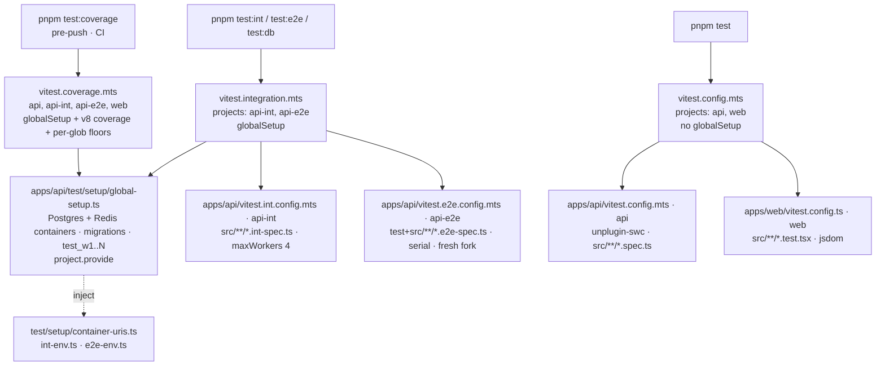

# Vitest Migration Design

**Spec**: `.specs/features/vitest-migration/spec.md` · **Evidence**: `spike.md` (measured 2026-08-21) + § *Spike results* below
**Status**: Draft (Design 2026-08-21; awaiting Tasks)

---

## Architecture Overview

One runner, driven from the repo root. Vitest `projects` replace the three Jest configs and the web's standalone run;
the root config picked by the script decides which projects run and whether the Docker `globalSetup` starts.



Verified against the installed `vitest@4.1.7` (template) and `4.1.10` (ailapidus), see § *Spike results*:

- `globalSetup` on the root config runs once on the root project; a value passed to `project.provide()` there is
  merged into every child project's `inject()` context (`TestProject.getProvidedContext()` merges the root's map).
- `coverage` is a root-only option (`NonProjectOptions`): the web's current `coverage` block is ignored under
  `projects` and moves to `vitest.coverage.mts`. `maxWorkers`, `fileParallelism`, `isolate`, `pool`, `testTimeout`,
  `hookTimeout`, `globalSetup` are per-project.
- `VITEST_POOL_ID` is a slot id `1..maxWorkers`, reused across files, allocated from **one pool shared by every
  project of the run** — so the int tier's DB name `test_w${VITEST_POOL_ID}` can reach the *root* `maxWorkers`
  when `api`, `web`, `api-int`, `api-e2e` run together. The `globalSetup` therefore clones
  `max(root.maxWorkers, every project's maxWorkers)` databases, not the int project's 4.
- `isolate: true` (default) with `pool: "forks"` (default) forks a new OS process per test file → the e2e tier gets
  a fresh heap per file without `workerIdleMemoryLimit`.

---

## Code Reuse Analysis

### Existing Components to Leverage

| Component | Location | How to Use |
| --- | --- | --- |
| `runMigrations`, `createWorkerDatabases`, container flags (tmpfs, `fsync=off`) | `apps/api/test/setup/global-setup.ts:18-103,125-138` | Keep verbatim; only the entry point signature and the handshake change |
| `ensureDockerRuntimeEnv()` | `apps/api/test/setup/docker-runtime.ts` | Called first in the new `globalSetup`; its Colima/Desktop socket logic is unchanged |
| Env files `unit-env.ts`, `int-env.ts`, `e2e-env.ts` | `apps/api/test/setup/` | Become Vitest `setupFiles`; same variables (spike § *Template today*) |
| `e2e-after-env.ts` (Redis `flushall` per test) | `apps/api/test/setup/e2e-after-env.ts` | Second `setupFiles` entry of `api-e2e`; gains `import { afterAll, afterEach, beforeAll } from "vitest"` |
| `test-db.ts` helpers (`testDatabaseUrl`, pools, truncates) | `apps/api/test/setup/test-db.ts:14-20` | `JEST_WORKER_ID` → `VITEST_POOL_ID`; 16 int-spec call sites untouched |
| `swcPlugin`, `vitest.shared.mts`, three api configs, three root configs | `~/Developer/ailapidus` (spike § *Reference repo*) | Copy the shape; adapt names, includes, timeouts, and add `useDefineForClassFields` to match `apps/api/.swcrc` |
| `packages/eslint-config/vitest.js` | `~/Developer/ailapidus/packages/eslint-config/vitest.js` | Copy; widen `TEST_FILES` to the template suffixes; drop the `sonarjs` lines (plugin not installed here) |
| `RuleTester` + `node:test` style | `packages/eslint-config/rules/sr-only-requires-positioned-ancestor.test.js` | Model for `packages/eslint-config/vitest.test.js` (lint a fixture string, assert `messageId`) |
| Temp-fixture style (`mkdtempSync` + `writeFileSync`) | `scripts/platform/__tests__/plan.test.mjs:156` | Model for `jest-to-vitest.test.mjs` and `gates.test.mjs` |
| `typescript` (root devDep `~6`) | root `package.json` | The codemod parses with the TS compiler API — no new dependency |
| Advisory format + `lintAdvisoryFrontmatter` | `docs/advisories/README.md:10-21`, `scripts/platform/catalog-lint.mjs:73-84` | First five `ADV-*.md` files of the repo follow it |

### Integration Points

| System | Integration Method |
| --- | --- |
| Root scripts (`package.json`) | `test`, `test:watch`, `test:coverage`, `test:int`, `test:e2e`, `test:db` call `vitest run` with the matching `--config`/`--project`; `turbo.json` loses every `test*` task; app manifests lose `test*` scripts |
| lefthook `pre-push` (piped) | `migrations` → `typecheck` → `catalog-typecheck` → `test-coverage: pnpm test:coverage` |
| CI `ci.yml` | `test-unit`: `pnpm test`; `test-coverage`: `pnpm test:coverage` (ubuntu-latest ships Docker) |
| CI `catalog.yml` | `gates` keeps `pnpm test` + `pnpm test:scripts`; `catalog` matrix unchanged — `catalog-check` now also runs `pnpm test:db` in the child |
| `scripts/platform/lib/commands/add.mjs:216,226` | `pnpm vitest run --project api apps/api/src/modules/<name>` / `--project web apps/web/src/entities/<name>` |
| `scripts/platform/catalog-check.mjs:205` → `lib/child.mjs:70-76` | `runGates` = `check`, `test`, `test:db` |
| `scripts/template-smoke.mjs:248-251` | `pnpm vitest run --project api apps/api/src/modules/module-boundaries.spec.ts` |
| Children (`copier update`) | Root `vitest.*.mts` and `apps/api/vitest.*.mts` travel with the template (not in `copier.yml` `_exclude`); the codemod lives in `scripts/platform/` and reaches every child |

---

## Components

### 1. `apps/api/vitest.shared.mts`

- **Purpose**: one SWC plugin instance and the defaults every api project shares.
- **Interfaces**: `swcPlugin()` → `unplugin-swc` Vite plugin with `swcrc: false`, `module.type: "es6"`,
  `jsc: { target: "es2023", parser: { syntax: "typescript", decorators: true, dynamicImport: true }, transform:
  { legacyDecorator: true, decoratorMetadata: true, useDefineForClassFields: true }, keepClassNames: true }`
  (mirrors `apps/api/.swcrc` except the module type — Vite needs ESM); `apiDefaults: InlineConfig =
  { environment: "node", globals: false }`; `dbTierDefaults = { ...apiDefaults, testTimeout: 120_000,
  hookTimeout: 120_000 }` (Jest's `testTimeout: 120000` also covered hooks; Vitest's `hookTimeout` defaults to 10 s).
- **Dependencies**: `unplugin-swc ^1.5.11`, `@swc/core` (already `^1.15.43`), `vitest` as api devDeps (the config
  imports `vitest/config` from `apps/api`, so pnpm must resolve it there).
- **Reuses**: ailapidus `vitest.shared.mts`. Sibling configs import it as `./vitest.shared.mjs` (NodeNext).

### 2. The three api project configs

| File | `name` | `include` | `setupFiles` | Parallelism |
| --- | --- | --- | --- | --- |
| `apps/api/vitest.config.mts` | `api` | `src/**/*.spec.ts` (also matches `*.parity.spec.ts`; `*.int-spec.ts`/`*.e2e-spec.ts` end in `-spec.ts` and do not match) + `exclude` `**/if-else.sample.uncovered.spec.ts` | `./test/setup/unit-env.ts` (gains `import "reflect-metadata"` as first line) | `maxWorkers: 4` (A5) |
| `apps/api/vitest.int.config.mts` | `api-int` | `src/**/*.int-spec.ts` | `./test/setup/int-env.ts` | `maxWorkers: 4` |
| `apps/api/vitest.e2e.config.mts` | `api-e2e` | `test/**/*.e2e-spec.ts`, `src/**/*.e2e-spec.ts` | `./test/setup/e2e-env.ts`, `./test/setup/e2e-after-env.ts` | `fileParallelism: false`, `maxWorkers: 1`, default `isolate: true` |

- All three: `plugins: [swcPlugin()]`, `globals: false`, `restoreMocks`/`clearMocks`/`mockReset` left at their
  `false` defaults (Jest's defaults — the 419 migrated specs were written against them; turning `restoreMocks` on is
  a `test-suite-refactor` candidate, not a migration change).
- No `moduleNameMapper`: `@scalar/nestjs-api-reference` is ESM and loads natively under Vite SSR;
  `test/setup/scalar-stub.ts` is deleted and `test/openapi-contract.e2e-spec.ts` loses its reference.
- No `transformIgnorePatterns`: Vite externalises `node_modules` (puppeteer included).
- `apps/api/.catalog-stage/**` (generated by `catalog-stage.mjs`) sits outside `src/**`, so no include or coverage
  glob reaches it; `vitest.config.mts` still lists it in `exclude` for safety.

### 3. Root configs and scripts

- `vitest.config.mts`: `projects: ["apps/api/vitest.config.mts", "apps/web/vitest.config.ts"]` — no `globalSetup`,
  no coverage → `pnpm test` is Docker-free (GAT-01).
- `vitest.integration.mts`: `projects: [api-int, api-e2e]`, `globalSetup: ["apps/api/test/setup/global-setup.ts"]`.
- `vitest.coverage.mts`: the four projects + `globalSetup` + `coverage`:
  `provider: "v8"`, `reporter: ["text", "json-summary", "html", "lcov"]`, `reportsDirectory: "coverage"`,
  `include: ["apps/api/src/**/*.ts", "apps/web/src/**/*.{ts,tsx}"]` (explicit `include` is what makes untested
  files count in v4 — `coverage.all` no longer exists),
  `exclude: ["**/*.spec.ts", "**/*.int-spec.ts", "**/*.e2e-spec.ts", "**/*.test.{ts,tsx}", "**/*.d.ts",
  "**/*.fixture.ts", "apps/api/src/main.ts", "apps/api/src/db/**", "apps/web/src/main.tsx", "**/shared/test/**",
  "apps/api/test/**"]`, `thresholds: { "apps/api/src/**": <calibrated, A4>, "apps/web/src/**": { statements: 64,
  branches: 56, functions: 61, lines: 64 } }` — per-glob only, no global bar (AC2). The three retired
  `product-*.ts` exclusions of the Jest block are dropped if the files no longer exist (worker verifies).
- Root `package.json`: `test: "vitest run"`, `test:watch: "vitest"`, `test:coverage: "vitest run --config
  vitest.coverage.mts --coverage"`, `test:int: "vitest run --config vitest.integration.mts --project api-int"`,
  `test:e2e: … --project api-e2e`, `test:db: "vitest run --config vitest.integration.mts"`; devDeps add
  `vitest ^4.1.10`, `@vitest/coverage-v8 ^4.1.10` (provider resolves from the root where `--coverage` runs).
- `apps/web/vitest.config.ts`: add `name: "web"`, delete the `coverage` block (root-only), keep plugin/alias/jsdom/
  `setupFiles`/`testTimeout: 15_000`/`env`; `apps/web/package.json` drops `test*` scripts and
  `@vitest/coverage-v8`, bumps `vitest` to `^4.1.10`. Web test files stay `*.test.{ts,tsx}` (24 files, already on
  Vitest — only the include differs from the api).
- `turbo.json`: delete `test`, `test:cov`, `test:int`, `test:e2e`. `apps/api/package.json`: delete the seven
  `test*` scripts, the inline `jest` block, `jest`, `@swc/jest`, `@types/jest`, `nyc` (keep `ts-node` —
  `db:check:journal` uses it). Delete `apps/api/scripts/coverage-all.sh`, `apps/api/test/tools/normalize-coverage.ts`,
  `apps/api/test/jest-e2e.json`, `apps/api/test/jest-integration.json`, `apps/api/test/setup/global.d.ts`,
  `apps/api/test/setup/global-teardown.ts`, `apps/api/test/setup/scalar-stub.ts`.
- `apps/api/tsconfig.json`: `types: ["node", "multer"]`; `include` adds `"*.mts"` so `tsc` checks the configs;
  `tsconfig.build.json` `exclude` adds `"*.mts"`. `apps/api/tsconfig.catalog.json` inherits the change (catalog specs
  type-check with `vitest` imports).

### 4. `apps/api/test/setup/global-setup.ts` (port)

- **Purpose**: start Postgres **and** Redis once per run, migrate, clone worker DBs, hand URIs to workers by
  `provide`, stop everything in the returned teardown (A6: no e2e-mode detection).
- **Interface**:

```ts
declare module "vitest" {
  interface ProvidedContext { postgresUri: string; redisUri: string }
}
export default async function setup(project: TestProject): Promise<() => Promise<void>>
```

- **Flow**: `ensureDockerRuntimeEnv()` → `PostgreSqlContainer("postgres:16-alpine")` with the current tmpfs/`fsync`
  flags → `runMigrations(pool, <apps/api>/drizzle/migrations)` (path from `project.config.root` of the api project
  or `__dirname`, both CommonJS-safe) → `createWorkerDatabases(uri, db, workerDbCount)` → `GenericContainer("redis:7-alpine")`
  with `Wait.forListeningPorts()` → `project.provide("postgresUri", uri)`, `project.provide("redisUri", …)` →
  return `async () => { await redis.stop(); await pg.stop() }`. Any failure after a container started stops the
  started containers before rethrowing (today's `try/catch`, no `globalThis` handles).
- `workerDbCount = Math.max(1, root.maxWorkers, ...project.vitest.projects.map(p => p.config.maxWorkers ?? 0))`
  where `root = project.vitest.config` — the shared slot pool (§ Architecture). Falls back to
  `os.availableParallelism()` if every value is unset. `CREATE DATABASE … TEMPLATE` stays sequential.
- **Fail fast without Docker**: the first `.start()` is wrapped; on error the setup throws
  `Docker runtime unavailable (<cause>). Start Docker Desktop/Colima — test:int, test:e2e and test:coverage need it; pnpm test does not.`
  so a missing daemon is a message, not a hang (edge case 5).

### 5. Worker-side handshake

- `container-uris.ts`: `containerPostgresUri()` → `inject("postgresUri")`, `containerRedisUri()` → `inject("redisUri")`;
  the existing "URIs come from the globalSetup — run test:int / test:e2e" error stays, reworded to name
  `vitest run --project api-int|api-e2e`. `POSTGRES_URI_ENV`/`REDIS_URI_ENV` constants and the `process.env`
  channel are removed (AC5: `provide`/`inject` only).
- `test-db.ts:14-20`: `test_w${process.env.VITEST_POOL_ID ?? "1"}` when `TEST_DB_PER_WORKER === "1"` (int); the
  e2e tier keeps the template DB (serial files, as today).
- `int-env.ts`: unchanged (`TEST_DB_PER_WORKER=1`, Docker env). `e2e-env.ts`: unchanged variables; `DATABASE_URL`
  and `REDIS_URL` come from the `inject` calls. `e2e-after-env.ts`: hooks imported from `vitest`, registered in a
  `setupFiles` entry (Vitest applies hooks declared in setup files to every test file — the `setupFilesAfterEnv`
  distinction does not exist).
- New proof specs (spec traceability): `apps/api/test/setup/test-db.int-spec.ts` (DB name = `test_w${VITEST_POOL_ID}`,
  injected URI is the connection target) for RUN-02; `apps/api/test/runner-env.e2e-spec.ts` (`MAIL_TRANSPORT=log`,
  `RESEND_API_KEY` undefined, Redis empty at test start) for RUN-03; `apps/api/src/openapi/docs-reference.spec.ts`
  (imports the real `@scalar/nestjs-api-reference`) for RUN-04.

### 6. Codemod `scripts/platform/jest-to-vitest.mjs`

- **Purpose**: rewrite a tree of Jest specs to Vitest (`globals: false`) idempotently; CAT-01.
- **CLI**: `node scripts/platform/jest-to-vitest.mjs <path…> [--check] [--quiet]`. Directories are walked for
  `**/*.{ts,tsx}` excluding `node_modules`, `dist`, `.catalog-stage`; a file with no Jest API and no free test global
  is left byte-identical, so running it over `apps/api/src/**` or `apps/web/src/**` is safe. `--check` exits 1 when
  any file would change (CAT-02 style probe, usable in CI). Exit 1 also on a TypeScript parse error (file:line).
- **Engine**: `typescript` compiler API (`ts.createSourceFile`, `ts.forEachChild`) — no regexes over code, no new
  dependency. Each rule yields text edits `{ start, end, text }`; edits are applied from the highest `start` down
  (ties: the one ending later first) so nested edits (an inner `jest.fn()` inside a wrapped initializer) compose.
- **Rules** (all on the AST, comments untouched):
  1. `jest.<m>(…)` → `vi.<m>(…)` for every member except the three below (`fn`, `spyOn`, `mock`, `unmock`,
     `doMock`, `mocked`, `restoreAllMocks`, `resetAllMocks`, `clearAllMocks`, `useFakeTimers`, `useRealTimers`,
     `advanceTimersByTime`, `advanceTimersByTimeAsync`, `runAllTimers`, `runOnlyPendingTimers`, `setSystemTime`,
     `getRealSystemTime`, `isMockFunction`, `resetModules`, …). An unknown member still maps to `vi.<m>` and is listed
     in the report as `unmapped member`.
  2. `jest.requireActual<T>(x)` → `await vi.importActual<T>(x)`, `jest.requireMock<T>(x)` → `await vi.importMock<T>(x)`;
     the nearest enclosing function/arrow gets `async` if it lacks it; with no enclosing function the edit is still
     made and the file is reported under `manual review: top-level await` (one known site, `tracing.setup.spec.ts:7`).
  3. `jest.setTimeout(n)` → `vi.setConfig({ testTimeout: n })`.
  4. Type references `jest.Mock | Mocked | MockedFunction | MockedClass | MockedObject | MockInstance | SpyInstance`
     → `Mock | Mocked | MockedFunction | MockedClass | MockedObject | MockInstance | MockInstance`, imported as
     inline `type` specifiers.
  5. `jest.mock(path, factory)` whose factory body references a top-level `const X = <init>` of the same file →
     that declaration becomes `const X = vi.hoisted(() => <init>)`; a referenced `let`/`var`/function/import is
     reported under `manual review: vi.mock factory closes over <name>` (Vitest hoists `vi.mock` above imports).
  6. Free identifiers among `describe | it | test | expect | beforeAll | beforeEach | afterAll | afterEach` used
     as values (not declared or imported in the file), plus `vi` when any rule above emitted it, plus the type names
     from rule 4, are merged into one `import { … } from "vitest"` — existing `vitest` import extended in place,
     otherwise inserted after the last leading side-effect import (`reflect-metadata`) or at the top. Specifiers are
     sorted; `pnpm lint:fix` afterwards settles `import-x/order` placement.
- **Report**: per file `changed | unchanged`, edit count, and the manual-review list; summary line with totals.
- **Tests** (`scripts/platform/__tests__/jest-to-vitest.test.mjs`, `node --test`): one fixture per rule, the
  `traced.decorator` shape (outer `mockSpan` + `requireActual` inside the factory → `vi.hoisted` + `async` factory
  + `await vi.importActual`), `it.each` untouched, a production file untouched, a file already on Vitest untouched,
  idempotency (second run → zero edits, `--check` exits 0), and `--check` exits 1 on a Jest file.

### 7. `packages/eslint-config/vitest.js`

- **Exports**: `vitestNodeConfig` (api) and `vitestConfig` (web = node config + Testing Library), same rule list as
  the spec's LNT-01 (`@vitest/eslint-plugin` `recommended` + the twelve error rules; `max-nested-callbacks: 4`).
- `TEST_FILES = ["**/*.{spec,int-spec,e2e-spec,test}.{ts,tsx}"]` (covers `*.parity.spec.ts`);
  `TEST_SUPPORT_FILES = ["**/vitest.setup.ts", "**/shared/test/**/*.{ts,tsx}", "test/**/*.ts"]` (the last one is
  `apps/api/test/**` when ESLint runs from `apps/api`).
- `expect-expect` uses `assertFunctionNames: ["expect", "expect*", "**.expect"]` so supertest chains
  (`request(app).get(…).expect(200)`) count as assertions.
- `nest.js` drops `globals.jest` from `languageOptions.globals`; `base.js` drops the `**/jest.config.*` ignore and
  adds `**/vitest.*.mts`; `package.json` adds the `./vitest` export, `@vitest/eslint-plugin ^1.6`,
  `eslint-plugin-testing-library ^7.16`. `apps/api/eslint.config.mjs` spreads `vitestNodeConfig` (+ `import-x/no-default-export`
  off for `test/**`, which holds the `globalSetup` default export); `apps/web/eslint.config.js` spreads `vitestConfig`.
- **Test**: `packages/eslint-config/vitest.test.js` (`node:test` + ESLint `Linter`/`RuleTester`): a fixture with
  `it.only(` and an `it` without `expect` reports `vitest/no-focused-tests` and `vitest/expect-expect`; a clean
  fixture passes; the web config reports `testing-library/prefer-user-event` on `fireEvent`.
- LNT-03: existing violations in the tree are fixed in place, never disabled.

### 8. Gates spec `scripts/platform/__tests__/gates.test.mjs`

- Parses root `package.json`, `turbo.json`, `lefthook.yml` (`yaml` devDep), `.github/workflows/{ci,catalog}.yml`,
  `apps/api/package.json`, `apps/web/package.json` and asserts GAT-03/05/06/07 literally: script strings, the piped
  pre-push order, job names and their commands, no `test*` task/script left.

### 9. Catalog entries and the child path

- Run the codemod over `catalog/` (719 sites, 5 entries); run `pnpm lint:fix` for import order.
- Each entry: `module.json.version` `1.0.0` → `2.0.0`; CHANGELOG `## [2.0.0]` with a *Breaking* bullet naming the
  codemod; advisory `docs/advisories/ADV-20260821-0N.md` (N = 1..5 in entry order attachment, audit,
  identity/single-tenant, notification, tag): `kind: breaking`, `module: <entry>[/<variant>]`, `affects: ">=1.0.0 <2.0.0"`,
  `severity: high`, `detect: rg -l 'jest\.' apps/api/src/modules/<name>`, `fix: node scripts/platform/jest-to-vitest.mjs apps/api/src/modules/<name> apps/web/src/entities/<name>`,
  `parity: catalog/<entry>/parity/` (the linter requires the key; the worker confirms what `lintAdvisoryFrontmatter`
  accepts). These are the first advisories of the repo.
- `add.mjs:216,226`, `template-smoke.mjs:248-251`, `template-smoke.test.mjs:285,308`, the fixture child
  `apps/api/package.json` (drop `"test": "jest"`), `.claude/hooks/delegate-to-subagent.mjs:81` (`RUN_CMDS` without
  `jest`), `scripts/token-report.mjs:38` — all switch to the Vitest commands.
- `catalog-check` gate order: `check` → `test` → `test:db`; `template-changelog.md` gains the migration note (CAT-06):
  run the codemod on `apps/api/src/**` and `apps/web/src/**`, `pnpm lint:fix`, drop `jest`/`@swc/jest`/`@types/jest`/`nyc`,
  take the root configs from `copier update`.

### 10. Docs and harness cards

`docs/test/testing.md` rewritten in the ailapidus section order with the kernel specifics (worker DBs, Redis, mail/R2
locks, Docker runtime, the `--project` commands); `docs/back/back-arch.md:49,612`, `docs/catalog/catalog.md:21`,
`docs/agents/harness.md:21,147,186`, `AGENTS.md.jinja`, catalog READMEs (`attachment:77`,
`identity/single-tenant:218`, `notification:85`, `tag:71`), `.claude/agents/shell-runner.md:46`,
`.agents/skills/tlc-spec-driven/references/cards/orchestrator.md:72` name Vitest and the root commands. History lines
in `docs/dev/template-changelog.md` stay (DOC-02 excludes that file).

---

## Data Models

```ts
// apps/api/test/setup/global-setup.ts — shared by every project through inject()
interface ProvidedContext { postgresUri: string; redisUri: string }

// scripts/platform/jest-to-vitest.mjs
interface Edit { start: number; end: number; text: string }
interface FileReport { file: string; changed: boolean; edits: number; review: string[] }
```

---

## Error Handling Strategy

| Error Scenario | Handling | User Impact |
| --- | --- | --- |
| No Docker daemon on `test:int`/`test:e2e`/`test:coverage` | `globalSetup` rethrows with the Docker-runtime message | Clear failure in seconds; `pnpm test` unaffected |
| Spec run outside its tier (`--project api` on an int-spec) | `inject()` returns `undefined` → `container-uris.ts` throws the "run via test:int / test:e2e" message | Same guidance as today |
| Codemod parse error / unmapped construct | File skipped, listed under `manual review`, exit 1 on parse error | The maintainer fixes the listed sites by hand |
| Coverage metric under its floor | Vitest exits non-zero with the threshold table | Pre-push/CI abort (GAT-05) |
| Child on the previous tag without the codemod | First `jest is not defined` | Changelog note names the command (edge case 6) |

---

## Risks & Concerns

| Concern | Location (file:line) | Impact | Mitigation |
| --- | --- | --- | --- |
| `VITEST_POOL_ID` slots are shared by every project of a run | `vitest/dist/chunks/cli-api.*.js:3396-3540` | `test_w7` requested when only 4 clones exist | `workerDbCount = max(root, projects)` in component 4 |
| Uncommitted work on `main` (`catalog-stage.mjs`, `catalog:typecheck` script, `apps/api/src/shared/test/unit/`, `lib/child.mjs`…) is not part of a worktree cut from HEAD | `git status` at Design time | Pre-push chain (`catalog-typecheck`) and six specs importing `shared/test/unit/source-survey` behave differently in the worktree | Owner commits or branches that work **before** `git worktree add`; T1 pre-flight asserts `scripts/platform/catalog-stage.mjs` is tracked |
| `restoreMocks: true` (ailapidus) resets spies before each test | 419 specs written against Jest defaults | `mockResolvedValue` set in `beforeAll` silently wiped | Keep all three mock-reset flags `false` (component 2) |
| `hookTimeout` default 10 s | e2e `beforeAll` boots the Nest app, slower under coverage | Flaky timeouts | `hookTimeout: 120_000` in `dbTierDefaults` |
| `coverage` ignored at project level | `apps/web/vitest.config.ts` coverage block | Web floors silently unenforced | Move to `vitest.coverage.mts` per-glob; `gates.test.mjs` asserts the web glob is present |
| `expect-expect` vs supertest chains | e2e specs ending in `.expect(…)` | Hundreds of false lint errors | `assertFunctionNames` incl. `**.expect` |
| Top-level `jest.requireMock` | `apps/api/src/shared/kernel/tracing/tracing.setup.spec.ts:7` | Top-level `await` in a CommonJS-typed file | Codemod reports it; the worker rewrites that one spec to `vi.mocked(import)` |
| Catalog int-spec imports a kernel test helper | `catalog/attachment/api/…/drizzle-attachment-access-log.repository.int-spec.ts:194` → `apps/api/test/setup/test-db` | Cross-boundary import survives the migration | Out of scope — AD-023 (`test-suite-refactor`) relocates helpers |
| `@scalar/nestjs-api-reference` under Vite SSR | `apps/api/src/openapi/*` | If Vite cannot externalise it, the e2e app fails to boot | RUN-04 spec is written first; fallback `server.deps.inline: ["@scalar/nestjs-api-reference"]` in `vitest.e2e.config.mts` |
| `catalog-check` now runs `test:db` in the child | `scripts/platform/lib/child.mjs:70-76` | Needs Docker locally; +2–4 min per matrix job | Same requirement as pre-push (A3); CI `ubuntu-latest` has Docker |
| Advisory `parity` key for a runner change | `docs/advisories/README.md:10-21` | `catalog:lint` rejects the five advisories | Point at the entry's `parity/` dir; adjust to what `lintAdvisoryFrontmatter` accepts |
| Coverage floors move with the provider | `apps/api/scripts/coverage-all.sh:73-74` (85/54.5/81.5/87.5 today) | A floor could be set from a flaky first measurement | Calibrate from a full `test:coverage` run on the migrated tree, record the raw numbers in § *Spike results*, apply −1.5 pt, ratchet-only afterwards (A4, AD-027) |

---

## Tech Decisions (only non-obvious ones)

| Decision | Choice | Rationale |
| --- | --- | --- |
| Where api configs live | `apps/api/vitest.{config,int.config,e2e.config}.mts` + `vitest.shared.mts`; setup files stay in `apps/api/test/setup/` | Vitest resolves `include` against the config's dir; ailapidus convention; AD-023's "jest configs" wording is re-baselined at closeout |
| Mock reset flags | all `false` | Behaviour parity with Jest for the migrated suite |
| Worker DB count | `max(root.maxWorkers, projects' maxWorkers)` | Shared slot pool (verified in `cli-api.*.js`) |
| Handshake | `provide`/`inject` keys `postgresUri`, `redisUri`; env channel removed | AC5 — nothing on disk, nothing inherited |
| Redis in every DB-tier run | always started (A6) | One setup for `test:int`, `test:e2e`, `test:db`, `test:coverage`; ~1 s cost |
| Coverage thresholds | per-glob only, no global | Each app keeps its own bar (AC2); web unchanged 64/56/61/64 |
| Codemod engine | TypeScript compiler API | Already a root devDep; AST-exact for rules 2, 5, 6; regexes cannot see "outer binding referenced by a factory" |
| Codemod scope | any `.ts`/`.tsx` path, no-op on non-test files | Children run it on whole `src/**` trees |
| `catalog-check` gates | `check`, `test`, `test:db` | AC3 demands int/e2e green in the rendered child |
| Entry version bump | `2.0.0` for all five + one `breaking` advisory each | AD-016/AD-019: child copies of the entries carry Jest specs |
| Unit `api` `maxWorkers` | 4 | A5; same as the Jest block |

> **Project-level decisions appended to `.specs/STATE.md`**: AD-027 (pre-push gate = `pnpm test:coverage`, per-glob
> floors, one-time calibration then ratchet; supersedes AD-012 when this feature lands) and AD-028 (Vitest root
> `projects` is the only runner: tests outside Turbo, no `test*` in app manifests, suffixes unchanged, `globals: false`).

---

## Spike results

Long evidence lives in `spike.md`. Added at Design (2026-08-21, from the installed packages and scouts):

- Vitest `4.1.7` installed (web), `@vitest/coverage-v8 4.1.9`; ailapidus `4.1.10`/`4.1.10`, `unplugin-swc 1.5.11`,
  `@swc/core 1.16.0` (template `1.15.43`). Both versions agree on every semantic below.
- Root-only options (`NonProjectOptions`, `reporters.d.*.d.ts:3572`): shard, watch, run, cache, update, reporters,
  outputFile, teardownTimeout, silent, forceRerunTriggers, testNamePattern, ui, open, uiBase, snapshotFormat,
  resolveSnapshotPath, passWithNoTests, onConsoleLog, onStackTrace, dangerouslyIgnoreUnhandledErrors,
  slowTestThreshold, inspect, inspectBrk, **coverage**, watchTriggerPatterns, tagsFilter.
- `TestProject.getProvidedContext()` (`cli-api.*.js:10650-10656`) merges the root project's `_provided` into every
  child; `globalSetup` receives `(project: TestProject)` and returns the teardown.
- Pool: one `Pool` per run (`createPool(this)`, `:13566`), `VITEST_POOL_ID` from a slot map `1..maxWorkers`
  (`:3396`, `:3529-3540`), `VITEST_WORKER_ID` a monotonic counter; `resolveMaxWorkers` (`:3750`) reads the project
  value first, then root. Forks pool + `isolate: true` → `child_process.fork` per file (`:3071-3075`).
- Coverage v4: untested files reported only when `coverage.include` is set (`coverage.*.js:696-699`);
  `thresholds` accept `{ [glob]: Thresholds } & Thresholds` (`reporters.d.*.d.ts:780-783`).
- Exports confirmed in `vitest/dist/index.d.ts`: `vi.hoisted`, `vi.importActual`, `vi.setConfig`, `inject`,
  `Mock`, `Mocked`, `MockedFunction`, `MockedClass`, `MockedObject`, `MockInstance`; async `vi.mock` factories.
- Template facts not in `spike.md`: web tests are `*.test.{ts,tsx}` (24 files, 25 import `vitest`);
  `nest.js` wires `globals.jest`; `base.js` ignores `**/jest.config.*` and relaxes `**/*.spec|*-spec|*.test`;
  `tracing.setup.spec.ts:7` uses `jest.requireMock`; `add.mjs:216,226` **execute** the post-install tests;
  `catalog-check` gates are `check` + `test` (`lib/child.mjs:70-76`); `docs/advisories/` holds no `ADV-*` file yet;
  `apps/api/tsconfig.catalog.json` extends `tsconfig.json` (so `types` propagates); `copier.yml` `_exclude` does not
  touch root `vitest.*` files.
- **Coverage calibration (A4)** — filled by the calibration task: measured `apps/api/src/**` S/B/F/L on the migrated
  tree = `__ / __ / __ / __` → floors `__ / __ / __ / __` (measured − 1.5). Web stays 64/56/61/64.

---

## Execute notes (for Tasks)

- Worktree: `git worktree add .worktrees/vitest-migration -b feat/vitest-migration main` after the dirty tree is
  committed/branched; `pnpm install` there; Docker running for every DB-tier gate.
- Natural clusters: (1) api runner vertical (shared/config/int/e2e configs, `global-setup` port, handshake, env files,
  proof specs, tsconfig, api manifest) — exclusive with (2) root gates (root configs/scripts, turbo, web config,
  lefthook, CI, `gates.test.mjs`, lockfile); (3) codemod + its tests; (4) lint package + app eslint configs;
  (5) catalog ×5 (codemod run, version/CHANGELOG/advisory per entry) in parallel once (3) is merged;
  (6) scripts (`add.mjs`, `catalog-check`, `template-smoke`, hook, fixtures); (7) calibration (exclusive, after
  everything runs green); (8) docs/cards; closeout re-baselines `test-suite-refactor` and flips AD-027/AD-028 to active.
